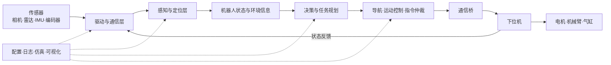

# 第1章 什么是算法组 

Robocon 机器人不是一台“装上电机就会动”的机器。它需要看见环境、判断自己在哪里、理解当前任务、规划下一步动作，再把动作准确地执行出来。算法组所做的工作，就是让这些原本互不认识的硬件和程序组成一套能够自主完成比赛任务的系统。在现在自动化和智能技术发展迅速的时代，自动化技术在RC比赛中占据着重要的地位

> 我们以前叫“视觉组”，但算法组的工作显然不只有视觉。目标识别只是感知环境的一种方法，定位、规划、决策、通信、调试和部署同样是算法组的重要职责。其实更重要的原因是怕被误以为是干视觉传达的。

## 本章学习目标

完成本章后，你应当能够：

- 说明算法组、机械组和电控组各自负责什么，以及它们如何协作；
- 区分上位机、下位机、传感器和执行机构；
- 说清楚机器人从“感知目标”到“完成动作”的完整数据流；
- 看懂一套 Robocon 上位机系统的基本模块和依赖关系；
- 使用规范的信息描述一个程序或机器人故障。

**✨有一些专业名词你们在阅读时可能会看不懂，但不用慌，暂时不必看懂，毕竟天才也没办法对新出现的概念瞬间了解，就看你们看得懂的，但随着阅读的深入我会在后续的章节给你们详细讲解**

## 1.1 什么是算法组

在 Robocon 中，**算法组负责开发机器人的上位机软件与自动化算法，使机器人能够根据比赛规则和现场信息自主完成任务。**

说得更直白一点：机械组给机器人制造身体，电控组让电机、气缸和各种执行机构能够可靠动作，算法组则负责让机器人知道“现在发生了什么”和“下一步应该做什么”。

算法组的工作可以概括为一个不断循环的过程：

```text
感知环境 -> 估计状态 -> 作出决策 -> 规划运动 -> 发送指令 -> 接收反馈 -> 再次判断
```

这不是一条只执行一次的流水线。机器人在比赛中会持续接收新的图像、雷达、里程计和下位机反馈，并不断修正自己的判断与动作。

算法组通常负责以下内容：

1. **感知**：处理相机、激光雷达、IMU 等传感器数据，识别目标、障碍物和场地特征。
2. **定位**：估计机器人在场地中的位置、朝向和运动状态。
3. **规划**：根据地图、目标位置和障碍物生成可执行的路线或动作序列。
4. **决策**：根据比赛阶段、传感器结果和其他机器人的信号决定下一项任务。
5. **控制指令生成**：把“前往某处”“对准目标”等高层目标转换为底盘速度或动作指令。
6. **通信**：设计并实现上位机、下位机和其他机器人之间的数据接口。
7. **工程保障**：完成日志、配置、仿真、数据记录、异常恢复、部署和现场调试。

因此，“算法组”并不等于“只训练一个 YOLO 模型”，也不等于“只写几个数学算法”。一套真正能上场的系统，往往需要更多软件工程工作：程序需要能够启动、通信、记录错误、处理设备掉线，并且在比赛压力下稳定运行。

## 1.2 上位机、下位机与执行机构 

在上面的算法组简介中我提到了一个很关键的名词：上位机、下位机；那到底什么是上位机下位机呢。

### 1.2.1 上位机

**上位机（Host Computer）** 是机器人中负责复杂计算、任务决策和系统管理的计算机。它通常是小主机、工控机、笔记本电脑或 Jetson 等嵌入式计算平台，通常需要较强大的计算能力的设备，常见运行环境为 Linux。

上位机适合处理：

- 图像、点云等计算量较大的传感器数据；
- 目标识别、定位、建图和路径规划；
- 比赛任务状态机；
- 多个软件模块之间的数据交换；
- 日志、配置、可视化和远程调试。

上位机可以理解为机器人的“决策大脑”：它关注的是去哪里、找什么目标、何时执行哪个动作，以及发生异常后如何处理。
举个例子：你口渴了，需要喝水，你面前有一块蛋糕和一杯果汁，你会选择哪个。正常人都会选择果汁吧，你做出决策，并下发指令让右手去拿桌上的果汁，喝完果汁后，你觉得不口渴了or你还觉得口渴，这个思想链路就是上位机干的活。当然，这只是个简单的例子，真正要干的没这么简单。

### 1.2.2 下位机

**下位机（Lower Computer）** 是靠近硬件执行端、负责实时采集和控制的计算设备，通常由 STM32 等微控制器承担。下位机接收上位机指令，读取编码器、限位开关等硬件反馈，并控制电机、舵机、气缸或机械臂动作。

下位机适合处理：

- 高频、实时的电机控制；
- 编码器和数字、模拟传感器采样；
- PWM、CAN、GPIO 等底层硬件接口；
- 执行机构保护和紧急停止；
- 将硬件状态反馈给上位机。

下位机不是“用来控制上位机”的计算机，也不是不重要的低级设备。它更像机器人的脊髓和反射系统：即使上位机负责整体决策，真正及时、稳定地驱动硬件仍然依赖下位机。 
举个例子：你口渴了，需要喝水，你面前有一块蛋糕和一杯果汁，你会选择哪个。你做出手去拿桌上的果汁，把果汁喝到嘴里，喉咙将“喝果汁完成”这个结果反馈发给大脑，这个动作链路就是下位机干的活。

### 1.2.3 两者的区别

| 对比项 | 上位机 | 下位机 |
| --- | --- | --- |
| 常见设备 | 小主机、工控机、Jetson、笔记本 | STM32 等 MCU |
| 常见系统 | Ubuntu、Windows | 裸机程序或 RTOS |
| 主要职责 | 感知、定位、规划、决策、管理 | 采样、实时控制、硬件驱动、保护 |
| 典型语言 | Python、C++ | C、C++ |
| 时间要求 | 更重视复杂计算和整体流程 | 更重视确定性和实时性 |
| 常见接口 | USB、以太网、ROS2、串口 | UART、CAN、SPI、I2C、PWM、GPIO |
| 典型输出 | 目标位姿、底盘速度、动作编号 | 电机电流、转速、位置和执行器信号 |

### 1.2.4 为什么要分成上下位机

一台计算机理论上可以负责所有工作，但在机器人上通常并不合适：

- 图像识别可能偶尔耗时增加，但电机控制不能因此暂停；
- Linux 适合复杂软件，不擅长直接保证微秒级硬实时控制；
- MCU 适合稳定控制硬件，却没有足够资源运行大型视觉和定位算法；
- 分层后可以分别测试算法、通信和硬件，故障也更容易定位。

> 各司其职，术业有专攻

可以用下面的类比建立初步认识，但不要把类比当成严格定义：

| 机器人组成 | 人体类比 |
| --- | --- |
| 上位机 | 负责理解和决策的大脑 |
| 下位机 | 脊髓与快速反射系统 |
| 相机、雷达、编码器 | 眼睛、耳朵和本体感觉 |
| 电机、气缸、机械结构 | 肌肉和身体 |
| 串口、CAN、网线 | 传递信息的神经通路 |

## 1.3 一套完整的机器人系统

完整的机器人系统不只有“上位机代码”和“下位机代码”，还包括传感器、执行机构、通信链路，以及贯穿整个开发过程的配置、日志和测试工具。



这张图中最重要的是两个闭环：

1. **信息闭环**：传感器和下位机不断向上位机反馈最新状态。
2. **控制闭环**：上位机根据反馈更新决策，再向下位机发送新的指令。

如果只有指令、没有反馈，程序就无法确认动作是否完成；如果只有感知、没有决策和执行，机器人即使“看见了”目标也不会产生有意义的行为。 
还是举上面喝果汁的例子：有指令、无反馈：肢体做了喝了果汁动作，但大脑不知道是否真的喝了还是撒了；有感知无决策执行：口渴不会找水喝，也不知道要找水喝。

### 1.3.1 一个具体的数据流示例

假设 R2 需要发现并拾取比赛目标 KFS方块，一次完整的信息流可能是：

1. 相机采集彩色图像和深度图像并将图像一帧帧传给视觉节点；（我的眼睛获取到图像信息，将图像信息传给大脑处理）
2. 视觉节点在图像中检测到 KFS；（我的大脑进行信息处理并在图像内容中识别到了KFS方块）
3. 程序结合传感器返回的深度信息，计算目标相对相机的三维位置；（那这个KFS离我远不远呢，近大远小）（但实际机器人用的另一种方式来判断远近）
4. 坐标变换模块把目标位置转换到机器人或场地坐标系；（我要到哪里去拾取这个KFS呢，左边？右边？前面？）（让机器人知道自己要到哪去拾取识别到的目标）
5. 滤波与多帧确认模块排除抖动和偶然误检；
6. 比赛状态机判断当前是否应该拾取这个目标；（判断这是真的KFS还是假的，假的or距离太远就不捡）
7. 导航或视觉伺服模块计算底盘移动指令；（我决定移动过去拾取这个KFS了，跟脚说一声我要过去）
8. 通信模块把速度和动作指令发送给 STM32；（为了尽快拾取到KFS，我一开始需要跑过去；快要靠近了，但为了不把KFS创飞，我决定要开始慢下来行走，然后停在KFS前面）
9. STM32 控制底盘和机械机构完成动作；（OK，停在KFS前面了，现在我要告诉手臂，把KFS捡起来）
10. 编码器、限位信号和动作完成信息返回上位机，状态机进入下一阶段。（捡起来了吗，还是手滑掉下去了；我的眼睛和手要把这些信息告诉我的大脑，以此来决定是否继续拾取还是执行下一个任务） 
> 笑死实际比赛我用的碳基识别。


任何一环出错，都可能表现为“机器人不动”。因此，调试时不能只盯着最后的电机，而要沿着数据流逐层确认输入和输出。

## 1.4 上位机系统究竟负责什么

### 1.4.1 传感器接入

程序首先要可靠地获得数据。这里不仅包括“能读到数据”，还包括时间戳是否正确、数据频率是否稳定、坐标系是否明确、设备断开后能否恢复等问题。

### 1.4.2 感知与定位

感知回答“周围有什么”，定位回答“机器人在哪里”。目标检测、颜色分割、点云处理、里程计融合和地图匹配都属于这一层。

### 1.4.3 决策与规划

决策回答“现在要做什么”，规划回答“怎样到达目标或完成动作”。比赛规则通常会被整理成有限状态机，路线搜索、路径点导航和动作编排则负责把任务变成可执行步骤。

### 1.4.4 指令生成与仲裁

同一时刻可能有多个模块想控制底盘，例如普通导航、目标精对齐和紧急避障。系统必须规定优先级并限制危险输出，避免多个节点同时争夺控制权。

### 1.4.5 通信与反馈

通信模块负责序列化数据、组帧、校验、收发、超时判断和断线恢复。通信正常并不只意味着“串口已经打开”，而是每条重要指令都有明确的数据格式、单位、取值范围和反馈方式。

### 1.4.6 工程保障

一套比赛系统还需要：

- 配置管理，避免每次调参都修改源码；
- 日志和数据记录，保留故障现场；
- 仿真和回放，在没有完整机器人时也能开发；
- 启动与部署脚本，保证不同成员使用相同步骤运行系统；
- 超时、重连、限幅和降级策略，避免单点故障拖垮整台机器人。

## 1.5 本教材的完整案例：RC2026 R2 上位机

本教材将结合 Artlnnov 战队的开源项目 [GAFA-Artlnnov.RC2026](https://github.com/HGZQ1/GAFA-Artlnnov.RC2026) 讲解一套真实的 Robocon 上位机系统。该项目是 RC2026 R2 全自动机器人的上位机，基于 Ubuntu 22.04 和 ROS2 Humble 构建，主要使用 Python 与 C++。

> 本章中的 R2 指 RC2026 赛题中的全自动机器人，KFS 是项目对比赛目标物的简称。这些名称会随赛题变化，但“感知—定位—决策—控制—反馈”的系统结构具有通用性。

项目不是为了展示某一个孤立算法，而是把视觉、定位、导航、决策、通信和仿真连接成完整系统。当前项目包含两个工作空间：

- `ros2_vision_project/ros2_ws`：真机工作空间，用于实际机器人部署；
- `ros2_vision_project/sim_ws`：仿真工作空间，用于 Gazebo 环境中的开发与测试。

系统主入口为 `ros2_vision_project/scripts/launch_rc2026.py`。它负责收集运行参数并启动所需模块，新生现阶段只需要知道它是“整套系统的启动入口”，不必立刻读懂其中每一行代码。

### 1.5.1 案例中的主要硬件

| 硬件 | 在系统中的作用 |
| --- | --- |
| AMD Ryzen 7 8845HS 小主机 | 运行 ROS2、视觉、定位、决策和导航节点 |
| Intel RealSense D435i | 提供 RGB-D 图像和 IMU 数据 |
| Livox Mid-360S | 提供激光点云，用于定位和地图匹配 |
| 外接 USB 相机 | 完成 KFS 末端精对齐 |
| STM32 下位机 | 接收底盘和动作指令，反馈里程计与机构状态 |
| 红外学习模块 | 接收机器人之间的比赛协作信号 |

### 1.5.2 案例中的主要软件模块

| 模块 | 采用的技术 | 解决的问题 |
| --- | --- | --- |
| 目标感知 | YOLOv8、OpenCV、RGB-D 反投影 | 识别武器头和 KFS，并计算目标位置 |
| 精确对齐 | 颜色与边缘检测、ArUco、`solvePnP` | 对准 KFS，以及完成 R1、R2 合体对齐 |
| 定位与坐标 | FAST-LIO2、EKF、TF2、Open3D ICP | 估计机器人位姿并统一各传感器坐标 |
| 导航 | 自研 WaypointNavigator、PID | 控制机器人到达指定路径点和朝向 |
| 路径规划 | 有向 BFS | 根据梅林区域目标和障碍分布生成路线 |
| 比赛决策 | GameController 有限状态机 | 编排武馆、梅林、对抗区和合体流程 |
| 速度仲裁 | `cmd_vel_bridge` | 处理导航与不同精对齐模块的控制优先级 |
| 下位机通信 | AutoSerialBridge、UART、CRC8 | 在 ROS2 与 STM32 之间传递命令和反馈 |
| 仿真 | Gazebo Classic | 在真机不可用时测试场地、定位和流程 |

### 1.5.3 真机的核心链路

```text
D435i / Mid-360S / USB相机 / STM32反馈
                    ↓
              传感器与驱动节点
                    ↓
         感知、定位、滤波和坐标变换
                    ↓
          GameController 比赛状态机
                    ↓
       路径点导航 / 视觉伺服 / 精对齐
                    ↓
             底盘速度与动作仲裁
                    ↓
          串口通信桥 -> STM32 -> 机构
```

后续章节会逐步拆解这条链路。学习时不要一开始就试图读完整个仓库，应先找到一个输入和一个输出，再沿着消息流追踪数据经过了哪些节点。

## 1.6 算法组与其他组如何协作

机器人问题很少能由一个组独立解决。一个“底盘走不准”的问题，可能来自机械轮组误差、电机控制参数、里程计计算、坐标变换、导航控制，甚至错误的长度单位。且RC比赛是一个考验团队合作的比赛，任何的各自为战都将被淘汰，要善于与其他组沟通协作！！！严禁相互甩锅！！！
 
笑死，虽然但是还是建议时不时去鞭挞一下机械。

### 1.6.1 典型职责边界

| 工作内容 | 主要负责 | 需要共同确认 |
| --- | --- | --- |
| 机构设计、安装与承载 | 机械组 | 尺寸、活动范围、碰撞边界 |
| 电机驱动和底层闭环 | 电控组 | 控制模式、频率、限幅、反馈精度 |
| 感知、定位、规划和决策 | 算法组 | 传感器安装、执行时间、动作条件 |
| 上下位机通信协议 | 算法组与电控组 | 字段、单位、字节序、校验、超时 |
| 整车联调与故障复现 | 三组共同参与 | 测试步骤、日志和验收标准 |

职责边界的目的不是“甩锅”，而是明确接口。接口越清楚，三组越能并行开发。

### 1.6.2 一份通信接口至少要写清楚什么

- 消息由谁发送、谁接收；
- 每个字段的类型、单位和取值范围；
- 发送频率，以及事件触发还是周期发送；
- 字节序、帧结构和校验方法；
- 超时后双方应该做什么；
- 如何确认动作完成，错误如何反馈；
- 协议版本发生变化时如何兼容。

例如“发送速度 100”是没有意义的描述：它可能是 `100 mm/s`，也可能是 `100 cm/s`，还可能是未经缩放的整数。工程中必须把约定写下来，而不是依赖某位成员记住。

## 1.7 上位机系统的开发流程

一个比较稳妥的开发顺序如下：

1. **阅读规则并拆分任务**：明确机器人要在什么条件下完成什么动作。
2. **定义输入和输出**：列出需要的传感器数据、下位机反馈和控制指令。
3. **划分模块与接口**：确定感知、定位、决策、控制和通信之间传递什么数据。
4. **先做最小闭环**：先让一条简单链路完整运行，例如发送速度并收到里程计反馈。
5. **使用仿真或录制数据测试**：尽量把不依赖真机的错误提前解决。
6. **分模块验证**：分别确认传感器、算法输出、通信和执行机构是否正确。
7. **整车联调**：按照比赛流程逐段测试，不要一开始就从头跑到尾。
8. **记录并复现问题**：保存日志、参数、代码版本和现场条件。
9. **形成验收标准**：用成功率、误差、耗时和连续运行时间判断是否完成，而不是凭感觉评价。

### 1.7.1 沿数据流排查问题

当机器人没有按预期工作时，可以按以下顺序检查：

```text
设备是否在线？
  ↓
原始数据是否存在且合理？
  ↓
算法有没有产生正确结果？
  ↓
状态机是否允许执行当前动作？
  ↓
控制指令是否生成、是否被仲裁？
  ↓
通信是否成功发送，下位机是否正确解析？
  ↓
执行机构是否动作，反馈是否返回？
```

这个方法比反复重启程序或随意修改参数更有效。

### 1.7.2 如何描述一个问题

向队友求助时，至少提供：

```text
目标：我原本希望机器人做什么？
现象：实际上发生了什么？
复现：按哪些步骤可以再次出现？
环境：代码版本、设备、系统和关键参数是什么？
证据：终端输出、日志、话题数据或视频是什么？
排查：已经检查过哪些环节，结果如何？
```

“程序炸了”“底盘有问题”“昨天还能跑”都不足以帮助别人定位故障。高质量的问题描述本身就是算法组成员必须掌握的工程能力。建议就是平时在调试时养成将可能会出问题的节点加入日志打印的习惯，并学会看日志。

## 1.8 如何阅读 RC2026 案例

对于第一次接触 ROS2 的新生，建议按以下顺序认识案例：

1. 阅读仓库 `README.md` 的项目概览、技术栈和系统链路；
2. 找到主入口 `scripts/launch_rc2026.py`，了解系统如何启动；
3. 学会使用 `ros2 node list`、`ros2 topic list` 和 `ros2 topic echo` 观察系统；
4. 在仿真中跟踪 `/vision/raw_target`、`/decision/state` 和 `/serial/chassis_cmd`；
5. 选择一个小模块阅读，先明确输入、输出，再研究内部算法；
6. 最后再阅读 `GameController`，理解多个模块如何组成完整比赛流程。

不要把“看懂全部代码”作为第一次阅读的目标。第一次只需要回答三个问题：这个模块接收什么、处理什么、输出什么。 

## 1.9 算法组学习路线 
既然你选择了加入RC队，且抱着学到东西的决心的话，准备好可以放弃寒暑假了。RC这个比赛是强度很大的比赛，需要全年备赛，不同于PPT大赛，这个比赛比拼的都是真才实学别想用AI凑数。
1. 通常打完比赛都是七月底了，大一八月的时候先开始根据该教材了解算法组的知识，配置好相应的开发环境（可以在windows上装个vscode来学习），接着就能去学习python或C++的语言基础了，学习编程可以上B站或者[菜鸟教程](https://www.runoob.com/)（特别是面向对象部分）（**这个必须要学，我不希望见到有人一问三不知，有的话可以直接退队了**） 
2. 大一在对于编程基础和算法组的学习上至少沉淀两个月再尝试加入开发（如果闲的没事或者感兴趣的可以将学到的东西融入到你们平时的课程作业当中），大二大三在暑假时就可以拆解规则开始进行第一代的基本功能开发了。
3. 大概到了十一月，算法组第一代的项目必须完成部署和开始调试，最久不能超过十二月。十一月时，大一同学必须全部完整安装Ubuntu系统（不装的自己退队），并开始学习和使用ROS（如果你能力可以也能在学习编程基础时顺便开始学习ROS和Linux了）。 
4. 在寒假时，大二大三继续开发，在次年二月完成第二代迭代，在寒假时大一可以开始接触学姐的代码了，拿到代码时大一的不要整篇通读，除非你是计算机，用AI来帮忙分析架构，分析结构，分析通信和信息链路等等，快速了解项目，不懂的问学姐，别社恐。
5. 在次年开学后，大二就是开发的主力了，大一的辅助大二的进行调车和完成简单模块，熟悉和开始上手开发，同时开始熟悉各种算法：slam，卡尔曼，导航等等；大三的可能会需要实习，将全部转入运营组（倒也不是说大三的此时就完全失去对项目的参与权限，只是也变为辅助和协作开发），直到七月份开始比赛。
6. 然后完成比赛后大三的估计就要退队了，不过倒也不是从此两清，可以继续进行指导和教学，但估计也要忙着搞毕设了。大一的升大二就要开始接过作为开发主力的权杖了，后续的开发就由你们安排了。 

**在学习时不要过度依赖本教材，必须要自己多问AI、老师、队友，多在菜鸟、CSDN、github、B站以及书籍上进行更深的学习！！！多动手去写代码操作实践，别怕写错，没人会骂你**

**记住了，比赛再忙也以学业为先，虽然广美课确实少；如果老师同意请假所有公共课，那就大胆往前冲吧！！！**

## 1.10 常见误区

### 误区一：算法组就是做目标识别

目标识别只是感知的一部分。其实目标识别这只占上位机内容很小一部分，识别结果还要经过定位、坐标变换、决策、控制和通信，才能真正让机器人完成任务。（根据比赛命题有时甚至可以找到不需要目标识别的办法）

### 误区二：上位机就是带按钮和曲线的帅气图形界面

监控界面是上位机的一种形式，但 Robocon 上位机的核心通常是后台运行的感知、决策和控制系统。即使没有图形界面，它依然是上位机。

### 误区三：程序能运行就代表系统可靠

能够成功启动只是最基本的要求。设备掉线、错误数据、目标丢失、通信超时和执行失败都必须被处理。

### 误区四：仿真正常，真机就一定正常

仿真无法完全还原光照、摩擦、机构间隙、通信延迟和传感器噪声，场地实际参数以及一系列奇奇怪怪的小问题。仿真适合尽早发现软件错误，但不能替代真机测试，仿真一般是用来验证算法的准确和合理性。

### 误区五：机器人不动就是电控的问题

机器人不动可能是没有检测到目标、状态机没有切换、坐标错误、速度被仲裁器覆盖、通信超时或机构故障。应沿数据链逐层检查，再判断问题属于哪一部分。 

## 上位机是最容易出现问题的，遇到问题优先考虑排查上位机

## 1.10 本章小结

算法组的核心任务，是建立从环境信息到机器人动作的完整闭环。上位机负责复杂感知、定位、规划和决策，下位机负责实时硬件控制与反馈，二者通过定义明确的通信协议协同工作。真正可用的上位机不仅要“有算法”，还必须具备可靠通信、状态管理、日志、仿真、测试和异常处理能力。

本教材后续将以 RC2026 R2 上位机为案例，从编程基础开始，逐步拆解通信、ROS2、视觉、定位、决策、控制、仿真和部署等内容。
