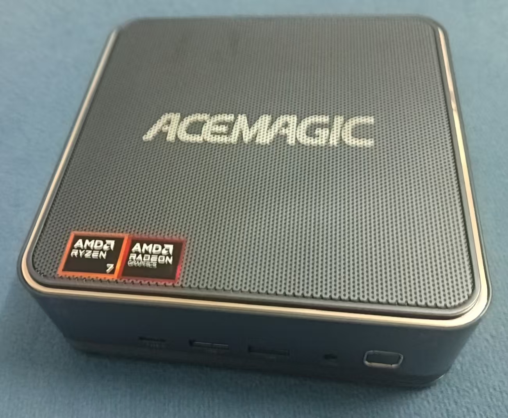
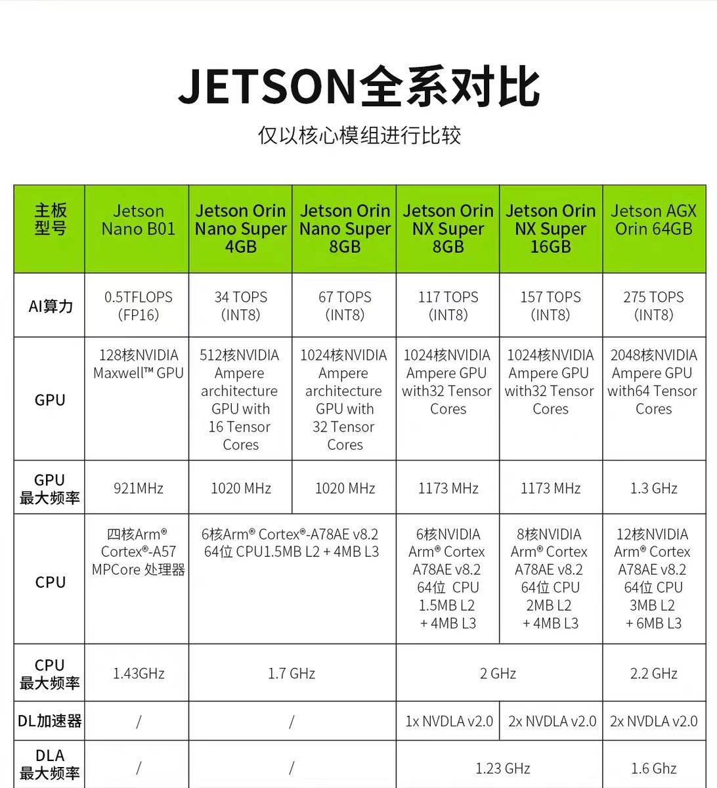
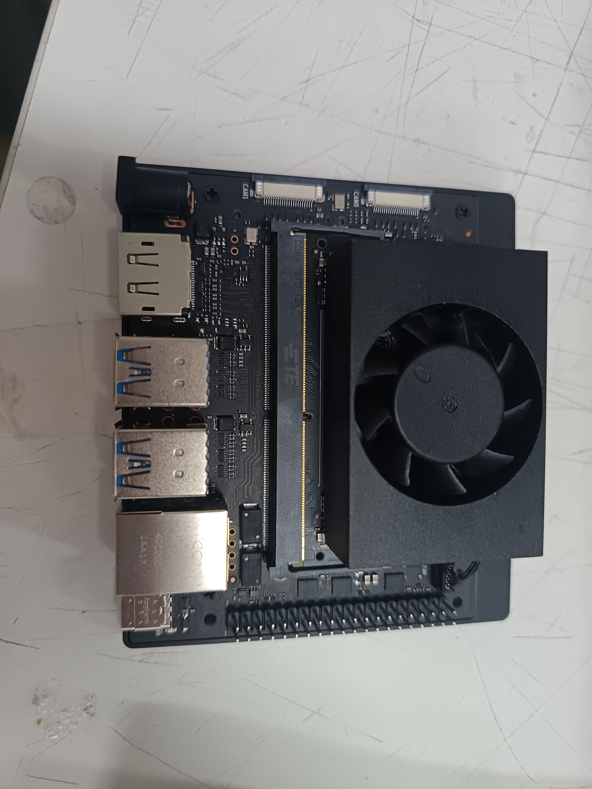
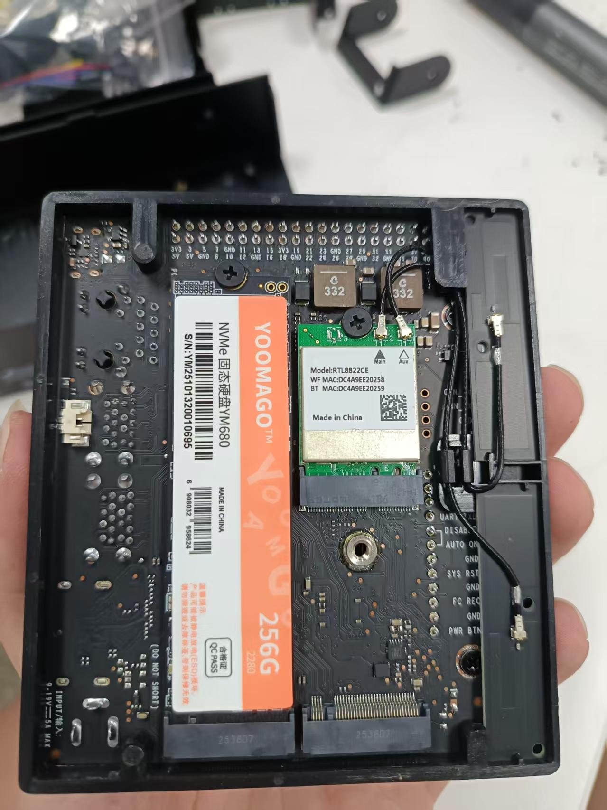
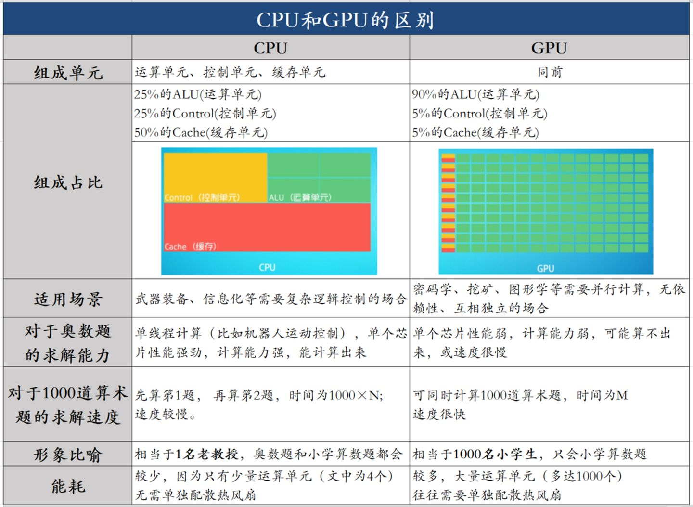

# 第三章 计算机基础硬件和传感器 

本章就主要来讲解算法组需要掌握的硬件方面的知识了。

我们算法组并不是纯粹坐在电脑前敲代码的程序员，也需要接触底层硬件和传感器。考虑到许多同学此前可能不了解电脑，本章在计算机硬件部分主要介绍 CPU、GPU、内存和存储（硬盘）这四个组件；传感器部分再结合实验室现有设备讲解。本章可能会涉及一些物理和数学知识，请认真阅读。

## 3.1 上位机--运算平台 
前面我们说了，**上位机其实简单来说就是一台电脑**，倒也不是说直接把开发用的电脑放上去（也不是不行）。常见的上位机会有：minipc（迷你主机），jetson系列，工控主机/工控主板。需要对于不同的需求和预算来选择上位机设备，但对于当前的RC来说，可以直接选7840h迷你主机，价格差不多的话可以考虑8745，h255，相比于7840h的性能会有10%的提升，跑模型和雷达都很稳且纯cpu也完全够用了。

> 如果你们闲的没事选jetson系列，jetson nano/orin/NX那些的话那你有福了，虽然说jetson原生系统就是Ubuntu，且配有完整的深度学习环境；但是有必要提醒一句，它跑模型顶多跑s，如果你想要部署更大的模型就别想了；还有当时找内核兼容的设备驱动和软件都快找死我了，什么叫内核版本太新驱动兼容不了；而且跑雷达容易漂，jetson的cpu相对较弱，在今年的比赛中就有队伍因为这个雷达飞走了；此外内存特别小，开个相机跑模型就已经飙到了6G（内存8G），直接卡飞老铁。（别问我为什么这么清楚，后面还是华工的救了我） 


此外，对于设备的选择也要清楚设备与你开发的项目的开发机的兼容度。例如笔者的开发机是 Ubuntu 22.04 LTS x86 的，如果你选的是 Jetson 系列，就要考虑它的系统是否与开发机兼容。Jetson Orin Nano（我们这一年的第一台上位机）使用的是 Ubuntu 22.04 L4T ARM。x86（一般是我们使用的电脑的 CPU 架构）和 ARM（常见于边缘计算设备）虽然都可以运行 Ubuntu 22.04，但架构不同，不代表开发机上的二进制程序能够直接在部署机运行。另一个例子是：PyTorch 可以使用 CPU，也可以通过 NVIDIA CUDA 或兼容的 AMD ROCm 使用 GPU；AMD 小主机不能直接使用 CUDA，ROCm 是否可用要看具体型号、驱动和软件版本，不能只看显卡品牌。

### MiniPC(迷你主机)：
迷你主机也就是我们今年上位机设备的最终版，迷你主机通常被开发者作为深度学习机器开发的算力设备；它体积小易于搭载在机器人上且性能强大，选择迷你主机的话主要还是看重它的cpu（如果你有钱也可以买到gpu同样强劲的小电脑，就像华工的雷神小主机）。

小主机在tb上就能找到一堆，但注意分辨：“那些搭载intel J系列和N系列的Genimi Lake架构的工控机、软路由、电脑棒、计算卡之类的玩意，是根本带不动神经网络的。”比赛时需要面对多变的灯光和环境，就需要模型在能正常识别运行的同时稳定跑高帧率，性能算力较差的机器是没办法完成任务的。建议选择intel 5-7代标准架构或者更高的版本的cpu。 

迷你主机一般情况下不搭载 NVIDIA 独立显卡（虽说可以自己装，但这是富哥的打法了），因此 CUDA 通常不可用；AMD 集成 GPU 是否能使用 ROCm 要单独验证。当前项目可以先把模型和雷达节点运行在 CPU 上，稳定性优先，但不建议用小主机训练大型模型。

选主机时注意看：
- cpu配置（当前使用的是AMD R7） 
- gpu配置（AMD 780M） 
- 接口数量和类型（USB-3.0以上才能适用于当前绝大多数设备，LAN接口接雷达）（当前小主机USB-3.2*4，LAN *1）
- 算力max约16TOPS 
- 内存和存储（16G+512G，可自己替换，但我没钱钱）

这是我们实验室的8845h 



> AMD锐龙的都比较推荐，参考配置为R7


### Jetson系列：
Jetson的小主机一般体积更小（一个巴掌大一点），背后搭载蓝牙、无线网卡和存储条（整个系统就装在里面，但小心被静电击穿）。

Jetson系列使用的话主要看重它的gpu,它的cpu能力相对孱弱，这是Nvidia自研的创客算力设备（所以它系统自带了一系列的深度学习环境和软件），但在国内基本买到的是国产复制版。但是如果要拿他来跑模型能力似乎还是有点欠缺，跑yolos模型的推理也并不能保证实时性，适合做标准卷积。

且它是ARM 64架构cpu，对于一些软件的兼容性不是特别好，你的开发机一般是x86架构的话，在jetson运行系统可能得使用docker并重新配置环境，以及有些设备驱动得自己去找jetson版本的补丁，否则无法运行。

当前神经网络神经网络检测达到实时性要求的设备，应该只有jetson tx 2（有些吃力）、jetson Xavier NX和jetson Xavier AGX。不建议买NX以下的。


> 还有是真的容易坏（裂

这是我们实验室的jetson orin nano super8GB 


 



> 一句话就是小主机能打游戏，jetson打不了，我今年打算再进货一个小主机放在R1上的说。只要你牛逼，甚至可以拿树莓派来当上位机 

## 3.2 CPU
**CPU（Central Processing Unit）中央处理器** ，是计算机的核心芯片

### 3.2.1 CPU 的工作原理

CPU 执行程序时，基本过程可以概括为“取指令、译码、执行、写回”：

1. **取指令**：根据程序计数器找到下一条机器指令，并从缓存或内存中取出（把指令从内存取出）。
2. **译码**：判断这条指令要做什么，例如加法、比较、跳转或读写内存（翻译这条指令是执行什么操作）。
3. **执行**：由整数运算单元、浮点运算单元或加载/存储单元完成操作（完成这个操作）。
4. **写回**：把结果写入寄存器或内存，并准备执行下一条指令（返回结果）。

现代 CPU 会把多条指令分散到流水线中同时处理，也会使用分支预测、乱序执行和缓存来减少等待。但这些机制不会改变一个基本事实：**CPU 主要负责通用、复杂、需要判断和调度的计算**。

一个 CPU 可以包含多个物理核心。每个物理核心都能独立执行指令，就像4核就可以同时执行视觉检测、雷达定位、决策、通信互不干扰；超线程（SMT）会把一个物理核心呈现为两个或多个逻辑线程，但逻辑线程仍然共享该核心的部分运算资源。因此“线程数是核心数的两倍”不代表性能也正好翻倍。

CPU 缓存通常分为 L1、L2、L3：

- **L1**：容量最小、速度最快，通常每个核心独享；
- **L2**：容量和速度居中，通常每个核心独享；
- **L3**：容量更大，常由多个核心共享；
- 缓存未命中时，CPU 需要访问内存，等待时间会明显增加。

### 3.2.2 CPU 的作用

在 Robocon 上位机中，CPU 通常负责：

- 运行 Ubuntu、ROS2 和各个节点；
- 调度传感器驱动、串口、网络和文件读写；
- 执行状态机、路径规划、PID 控制和坐标变换；
- 对相机、点云等数据进行预处理和后处理；
- 调用 GPU 或其他加速器，并负责不同模块之间的通信。

因此，即使设备有很强的 GPU，也不能忽视 CPU。GPU 负责计算，CPU 负责组织数据和流程；CPU 太弱时，GPU 也可能因为等数据而无法发挥性能。

### 3.2.3 CPU 的核心参数

| 参数 | 含义 | 对机器人程序的影响 |
| --- | --- | --- |
| 指令集架构（ISA） | 例如 x86-64、ARM64 | 决定程序和二进制库能否直接运行 |
| 物理核心数 | 真正的 CPU 核心数量 | 影响可同时运行的节点和多线程任务数量 |
| 线程数 | 操作系统看到的逻辑执行单元数量 | 影响并发调度，但不等于同数量的物理核心 |
| 基础/加速频率 | 核心的典型频率和短时最高频率 | 影响单线程响应和短时计算速度 |
| 缓存容量 | L1、L2、L3 的大小 | 影响重复访问数据时的等待时间 |
| IPC | 每个时钟周期平均完成的指令数 | 反映架构效率，不能只看 GHz |
| 主频 | 每秒能执行的时钟周期的次数| 代表芯片基础运算效率，越高执行单条指令时间越短|
| 功耗与散热 | TDP、温度和持续功耗 | 决定长时间运行时能否保持频率 |
| 内存支持 | DDR4/DDR5、通道数和最大容量 | 影响内存带宽与可扩展性 |
| 集成 GPU/NPU | CPU 芯片中附带的加速单元 | 可能占用系统内存，也可能承担图像或 AI 任务 |

选 CPU 时不要简单地把“核心数 × 频率”当作性能。单线程任务更看重 IPC 和加速频率，多线程任务更看重核心数、内存带宽和持续散热；最终应以自己的 ROS2、视觉和雷达程序实测为准。

在 Ubuntu 中可以用下面的命令查看 CPU 信息：

```bash
lscpu
nproc
```

## 3.3 GPU

### 3.3.1 GPU 的工作原理

**GPU（Graphics Processing Unit，图形处理器）** 最初用于绘制图像，现在也常被用作通用并行计算器。

CPU 通常只有少量但很强的通用核心，适合执行分支多、步骤复杂的程序；GPU 包含大量结构相似的计算单元，适合让许多数据同时执行相同或相近的运算。例如，一张图像中的每个像素、一个神经网络中的大量矩阵元素，往往可以并行处理，适合处理图形和显示渲染。也就是“cpu是几个教授做计算题，gpu是一群小学生做计算题” 

 

GPU 执行计算时，CPU 负责启动一个计算任务（kernel），GPU 再把任务分成许多线程组，让计算单元以 SIMT（单指令、多线程）方式处理数据：

1. CPU 准备输入数据和计算参数；
2. 数据被复制到显存，或由集成 GPU 直接访问共享内存；
3. GPU 中的大量线程并行执行加法、乘法、卷积等运算；
4. 结果写回显存或系统内存；
5. CPU 读取结果并继续进行控制和通信。

如果任务包含大量条件分支、数据量很小，或者 CPU 与 GPU 之间频繁复制数据，GPU 加速可能不明显，甚至会因为传输开销变慢。

### 3.3.2 GPU 的作用

在上位机中，GPU 常用于：

- YOLO 等神经网络的训练和推理；
- 图像缩放、颜色转换、卷积和矩阵运算；
- 点云处理、深度计算和三维可视化；
- 仿真和 RViz 等图形界面渲染；
- 视频编码、解码和其他并行任务。

**CUDA 是 NVIDIA 的软件平台，不是 GPU 的名称。** PyTorch 可以使用 CPU，也可以通过 NVIDIA CUDA、AMD ROCm 等后端使用不同厂商的 GPU；实际能否运行还取决于驱动、框架版本和算子支持。购买设备时不要只看“有 GPU”或“TOPS 很高”，应使用目标模型和目标框架实测。

GPU 有两种常见形式：

- **独立 GPU**：有自己的显存和散热系统，性能强，但功耗、体积和价格较高；
- **集成 GPU**：与 CPU 共用封装，通常共享系统内存，功耗较低，适合小型设备，但带宽和显存容量受限。

### 3.3.3 GPU 的核心参数

| 参数 | 含义 | 选型时要注意 |
| --- | --- | --- |
| GPU 架构 | NVIDIA、AMD、Intel 或 SoC 厂商的计算架构 | 决定驱动、CUDA/ROCm/OpenCL 等软件兼容性 |
| 计算单元数量 | CUDA Core、SM、Compute Unit 等不同厂商的指标 | 不同厂商的数量不能直接横向比较 |
| FP32/FP16/INT8 吞吐量 | 不同精度下每秒可完成的运算量 | 必须与模型实际使用的精度对应 |
| 显存容量 | GPU 可直接高速访问的内存大小 | 模型、输入图像和中间张量不能超过可用容量 |
| 显存带宽 | GPU 与显存之间的数据传输速度 | 影响大图像、点云和大模型的数据供给 |
| 显存类型/总线宽度 | 如 GDDR、HBM 及其位宽 | 共同决定理论带宽 |
| 功耗与散热 | GPU 长时间运行需要的电力和散热能力 | 机器人电源和机箱必须能够承受 |
| 软件接口 | CUDA、ROCm、OpenCL、TensorRT 等 | 决定已有 PyTorch、ROS2 节点能否使用 |
| 视频编解码能力 | 硬件编码/解码格式和路数 | 多相机或视频流项目尤其重要 |

TOPS、TFLOPS 等是理论峰值，不同精度、架构和软件实现下不能直接比较。**模型实际帧率、延迟和稳定性比宣传页上的单个数字更重要。**

在 Ubuntu 中可以使用以下命令查看 GPU：

```bash
lspci | grep -i -E "vga|3d|display"
```

NVIDIA 设备还可以使用 `nvidia-smi` 查看显存、温度和占用率。

## 3.4 内存（RAM）

### 3.4.1 内存的工作原理

这里说的“内存”通常指 RAM（Random Access Memory，随机存取存储器）。它是 CPU 和存储设备之间的高速工作区，程序运行时需要使用的指令和数据，通常会先从 SSD 或 HDD 读入内存。

普通电脑使用的 DDR 内存大多属于 DRAM。一个 DRAM 存储单元用电容保存电荷、用晶体管控制访问：

1. **寻址**：内存控制器按照地址选择某一行和某一列；
2. **读写**：读取或写入对应存储单元的电荷状态；
3. **刷新**：由于电容会漏电，内存需要周期性刷新；
4. **断电丢失**：断电后电荷消失，所以 RAM 是**易失性存储器**。

CPU 访问内存之前，会先查找寄存器和缓存。大致速度关系是：

```text
寄存器 → L1/L2/L3 缓存 → RAM → SSD/HDD
速度越来越慢，容量通常越来越大
```

现代内存通常支持双通道或多通道。多个通道可以同时传输数据，提高理论带宽；但只有在主板、CPU 和内存条都支持并正确安装时，通道才能正常工作。

### 3.4.2 内存的作用

在 Robocon 上位机中，内存主要用于：

- 保存正在运行的 Ubuntu、ROS2 节点和动态库；
- 缓存相机图像、深度图、点云和传感器消息；
- 存放神经网络模型及推理过程中的中间张量；
- 运行编译器、仿真器、RViz 和调试工具；
- 为 CPU 与集成 GPU 提供共享数据空间。

内存不足时，系统可能把暂时不用的数据写入磁盘，这叫 **swap（交换空间）**。磁盘远慢于 RAM，频繁使用 swap 会导致程序卡顿和传感器处理延迟增加。因此，swap 可以防止程序立刻崩溃，但不能替代真正的内存。

### 3.4.3 内存的核心参数

| 参数 | 含义 | 对上位机的影响 |
| --- | --- | --- |
| 容量 | 例如 8 GB、16 GB、32 GB | 决定能同时运行多少节点和缓存多少数据 |
| 类型/代际 | DDR4、DDR5、LPDDR4X、LPDDR5 等 | 决定接口、电压、带宽和是否可更换 |
| 数据传输率 | 例如 DDR5-5600，单位常写 MT/s | 影响理论内存带宽 |
| 通道数 | 单通道、双通道或更多 | 影响 CPU 和集成 GPU 的数据吞吐 |
| 时序/延迟 | 常见参数为 CL 等 | 影响一次访问需要等待的时间 |
| ECC | 是否支持错误检查与纠正 | 对长期运行和关键设备的稳定性有帮助 |
| 可升级性 | 插槽内存或板载内存 | 决定以后能否增加容量 |
| 功耗 | 标准 DDR、低功耗 LPDDR 等 | 影响电池设备和小型设备的续航、发热 |

理论带宽可以粗略估算为：

```text
带宽 = 数据传输率（MT/s）× 总线宽度（bit）÷ 8 × 通道数
```

例如单通道 64 bit 的 DDR5-5600，理论带宽约为 `5600 × 64 ÷ 8 = 44.8 GB/s`。实际程序速度还会受到缓存命中率、访问模式和内存控制器的影响。

容量、速度和延迟不是一回事：

- 容量不足会导致程序无法同时运行或频繁使用 swap；
- 速度和通道数影响数据搬运速度；
- 延迟影响单次访问的等待时间；
- 对上位机来说，先保证容量够用，再考虑速度和时序。

在 Ubuntu 中可以使用以下命令查看内存使用情况：

```bash
free -h
```

## 3.5 存储（SSD/HDD）

### 3.5.1 存储的工作原理

存储设备负责长期保存操作系统、程序、代码、模型、地图和日志。它属于**非易失性存储器**，断电后数据通常仍然保留。

#### HDD

HDD（机械硬盘）使用高速旋转的磁盘片保存磁性状态，磁头移动到指定位置后读写数据。它容量大、价格低，但有机械运动，随机访问延迟高，抗震和抗振动能力也较弱。

#### SSD

SSD（固态硬盘）没有机械磁头，主要由 NAND Flash 闪存颗粒、主控、缓存和固件组成。数据以电荷状态存放在闪存单元中，主控负责：

- 把操作系统看到的逻辑地址映射到闪存物理位置（FTL）；
- 使用 ECC/LDPC 等纠错机制提高可靠性；
- 进行磨损均衡，避免某些闪存单元被过度写入；
- 处理垃圾回收和 TRIM；
- 管理坏块、缓存和温度。

NAND 单元可以保存不同数量的比特，常见类型有 SLC、MLC、TLC 和 QLC。通常每个单元保存的比特越多，单位容量成本越低，但写入耐久度和持续写入性能往往更需要关注。

### 3.5.2 存储的作用

在机器人上位机中，存储主要用于：

- 保存 Ubuntu、ROS2、驱动和项目源码；
- 保存神经网络权重、数据集和标定文件；
- 保存地图、点云、rosbag 和运行日志；
- 提供编译空间和临时文件空间；
- 在开机时把程序和模型加载到内存。

存储容量不会直接让 CPU 计算更快，存储速度也不会直接等于模型推理速度；它主要影响开机、加载模型、编译、读取数据集和写入日志的时间。模型加载完成后，推理速度通常更多取决于 CPU、GPU、内存和算法本身。

### 3.5.3 存储的核心参数

| 参数 | 含义 | 选型时要注意 |
| --- | --- | --- |
| 容量 | 例如 512 GB、1 TB、2 TB | 需要同时容纳系统、源码、模型、地图和日志 |
| 接口与协议 | SATA、PCIe、NVMe、USB 等 | NVMe 通常比 SATA SSD 延迟低、带宽高 |
| 连续读写速度 | 大块连续数据的理论吞吐 | 影响拷贝大文件和加载数据集 |
| 随机读写/IOPS | 大量小文件访问能力 | 影响编译、系统启动和软件加载 |
| 延迟 | 发出请求到得到响应的时间 | 对大量小文件和实时日志更重要 |
| NAND 类型 | SLC、TLC、QLC 等 | 影响成本、耐久度和持续写入性能 |
| TBW/DWPD | 总写入量或每天允许写入量 | 评估长期记录 rosbag、日志时的寿命 |
| 缓存 | DRAM 或 HMB 等 | 影响映射表和突发写入性能 |
| 外形尺寸 | M.2 2230/2280、2.5 英寸等 | 要与设备插槽和固定方式匹配 |
| 温度与散热 | 高温时可能降速 | 机器人机箱中要考虑风道和持续写入 |
| 可靠性 | 掉电保护、坏块管理和厂商质保 | 真机部署不能只看峰值速度 |

要特别区分三个概念：

- **M.2** 是外形尺寸和插槽形式，不代表一定是 NVMe；
- **NVMe** 是运行在 PCIe 上的存储协议；
- **PCIe** 是连接设备的高速总线。

购买前要同时确认外形、插槽、协议和设备 BIOS/系统是否支持。对于机器人，通常优先选择有可靠主控和稳定持续写入性能的 NVMe SSD，而不是只看包装上的最高读取速度。

在 Ubuntu 中可以使用以下命令查看存储设备和剩余空间：

```bash
lsblk
df -h
```

## 3.6 CPU、GPU、内存和存储的区别

四者不是相互替代的零件，而是同一条数据流中的不同角色：

```text
SSD/HDD（长期保存）
        ↓ 读取
RAM（运行时工作区）
        ↓ 调度与供数
CPU（通用控制、判断和调度） ──→ GPU（大规模并行计算）
        ↑                              ↓
        └──────── 结果回到 RAM ────────┘
```

| 模块 | 是否断电保留数据 | 主要处理方式 | 主要作用 | 常见瓶颈 |
| --- | --- | --- | --- | --- |
| CPU | 不适用，主要执行程序 | 少量强核心的通用计算 | 控制、调度、分支、通信、规划 | 单线程性能、核心数、散热 |
| GPU | 显存通常断电丢失 | 大量线程的并行计算 | 神经网络、图像、点云和渲染 | 显存、带宽、软件兼容性 |
| RAM | 否 | 临时高速随机访问 | 保存运行中的程序和数据 | 容量、带宽、延迟 |
| SSD/HDD | 是 | 持久化块存储 | 保存系统、源码、模型、地图和日志 | 延迟、IOPS、持续写入、容量 |

可以用一个简单比喻理解：

- **CPU** 像总工程师，负责判断下一步做什么；
- **GPU** 像一组擅长重复工作的工人，能同时处理大量相似任务；
- **内存** 像工作台，当前要用的材料都放在这里；
- **存储** 像仓库，负责长期保存所有材料和成品。

## 3.7 Robocon 上位机的选型建议

选型时不要只比较某一个参数，而要把软件、传感器、供电、散热和体积一起考虑。对于本教材使用的 Ubuntu 22.04 + ROS2 Humble 环境，可按下面思路估算：

例如配置写成“R7 + 780M + 16 GB + 512 GB”时，通常依次表示 **CPU 型号、GPU 型号、内存容量和存储容量**。其中 `16 GB` 是运行时内存，`512 GB` 是长期保存文件的空间，两者不能互相替代。

| 模块 | 入门建议 | 说明 |
| --- | --- | --- |
| CPU | 现代 6～8 个物理核心起步 | 同时运行 ROS2、视觉、定位和控制节点时更从容 |
| GPU | CPU 推理或使用目标平台支持的 GPU | 需要实时神经网络时，优先选择驱动和 PyTorch 后端成熟的方案 |
| 内存 | 16 GB 起步，复杂仿真或多传感器建议 32 GB | 点云、相机、rosbag 和仿真会同时占用内存 |
| 存储 | NVMe SSD 512 GB 起步，推荐 1 TB | 模型、地图、数据集和日志很容易占用空间 |

实际部署前应做一次完整压力测试：

1. 同时启动相机、雷达、定位、视觉和决策节点；
2. 记录 CPU/GPU 利用率、内存占用、温度和运行帧率；
3. 检查是否出现 swap、GPU 显存不足、磁盘写满或降频；
4. 在连续运行一小时后再次检查延迟和丢帧情况。

只有在目标硬件、目标系统和目标软件栈上实测通过，才能把“理论参数”转换成可靠的机器人性能。 

## 3.8 传感器 

**接下来讲解本章的重头戏** 

在前面说了，传感器就像机器人身体上的眼睛，耳朵等等；传感器主要就是来帮助机器人感知周围和空间环境和自身状况，从而让大脑做出决策；机器人离不开传感器，就像一个人失去了眼睛耳朵触觉传感器等等，把人放到一个陌生的地方，那他能知道自己在哪吗，能知道自己下一步应该要怎么做吗，机器人同理。完成一个任务离不开各种传感器的协作，就像夹取矛头，雷达需要获取机器人自身位置从而与任务点的位置计算差值，深度相机需要返回看到的图像来进行目标识别和目标距离的获取；IMU需要返回线速度角速度来帮助稳定机器人自身移动。 

## 3.9 图像传感器
图像传感器就是机器人的眼睛，就像人的眼睛一样，获取图像和环境数据，帮助机器人完成目标识别等等任务，是当今自动化机器人不可或缺的一个部分。

图像传感设备通常以相机的形式使用。学习嵌入式时可能会接触 OV 系列摄像头模组或 USB 免驱相机，它们的主要作用是把环境中的光转换成数字图像，再传给开发板或上位机。

### 3.9.1 常见相机类型简介

相机可以按照**成像方式**分为单目和双目，也可以按照**使用场景或数据接口**分为工业相机和 USB 相机。这两种分类维度并不冲突：一台相机既可以是双目相机，也可以使用 USB 接口；“工业相机”也不一定只能使用某一种接口。

| 类型 | 基本原理或定义 | 优点 | 局限与 Robocon 中的用途 |
| --- | --- | --- | --- |
| 单目相机 | 只有一个镜头和一个图像传感器，输出普通二维图像 | 结构简单、体积小、价格低、数据量较小 | 单张图像不能直接得到可靠的绝对深度，适合颜色、形状、二维码和目标检测 |
| 双目相机 | 两个位置不同的镜头同时观察同一场景，通过左右图像的视差计算深度 | 能获得目标距离和三维信息 | 需要标定和同步，对纹理、光照和遮挡较敏感；适合测距、定位和三维感知 |
| 工业相机 | 面向连续运行和稳定采集设计的相机，通常支持手动曝光、硬件触发、外部同步或更稳定的机械接口 | 参数可控、延迟稳定、抗振动和可靠性通常较好 | 价格和配置差异较大，需要配合镜头、驱动和采集卡或网络；适合高速运动、精确测量和长期运行 |
| USB 相机 | 通过 USB 连接向上位机传输图像的相机，常见 UVC 免驱设备 | 即插即用、连接简单、开发成本低 | USB 版本、线缆长度、带宽和驱动会影响帧率与稳定性；USB 只表示接口，不代表画质或是否为工业相机 |

#### 单目相机

单目相机只提供一个视点的二维图像。算法可以根据目标的颜色、轮廓、纹理和已知尺寸完成识别，但同一个像素位置通常对应空间中的一条射线，不能仅凭一张普通图像确定目标的真实距离。若任务只需要识别目标或读取二维码，单目相机往往已经足够；如果需要测距，应额外使用已知尺寸、标记物、运动信息或其他深度传感器。

#### 双目相机

双目相机把两个相隔一定距离的镜头看作人的左右眼。同一个空间点在左右图像中的位置差称为**视差**，视差越大，目标通常越近；结合两个镜头之间的距离和相机标定参数，就可以估计深度。双目系统必须保持两个镜头的相对位置稳定，受到撞击或重新安装后可能需要重新检查标定。D435i 的深度部分属于双目深度系统，而它的 RGB 图像仍是独立的彩色图像通道。

#### 工业相机

工业相机强调稳定采集和可控性，常见功能包括全局快门、外部触发、硬件同步、较长时间连续运行和更丰富的手动参数。工业相机不等于“分辨率一定最高”，选型时还要看快门类型、帧率、接口、驱动、镜头匹配和机器人现场的抗振动要求。

#### USB 相机

USB 相机的“USB”描述的是数据传输接口，而不是镜头或成像方式。USB 相机可以是单目，也可以是双目；可以是普通消费级设备，也可以是工业级设备。使用时要确认 USB 2.0/3.x 版本、实际带宽、供电、驱动支持的分辨率和帧率，以及多台相机同时工作时是否会互相争用带宽。

### 3.9.2 图像传感器原理与快门

相机通常由**镜头、图像传感器、外围电路和数据接口**组成。镜头负责收集并汇聚光线，图像传感器负责把光转换为电信号，外围电路再把电信号转换成计算机可以处理的数字图像。

相机的图像曝光有**卷帘快门**和**全局快门**两种常见方式：

- **卷帘快门（Rolling Shutter）**：从第一行开始逐行曝光和读出，各行的曝光时刻不同。高速运动或相机快速转动时，物体可能出现倾斜、拉伸和“果冻效应”。
- **全局快门（Global Shutter）**：所有像素在同一时刻曝光，能减少高速运动造成的几何变形。但如果曝光时间过长，仍然会产生运动拖影。

D435i 需要按图像通道区分：双目红外深度传感器采用全局快门，RGB 彩色传感器采用卷帘快门，不能笼统地说 D435i 的所有图像都是全局快门。具体规格应以设备说明书为准。


图像传感器的核心是一块感光芯片，常见类型是 CMOS（互补金属氧化物半导体）。芯片表面由许多感光单元组成，每个感光单元对应一个像素。CMOS 把光转换为数字图像，主要经过以下过程：

1. **光电转换**：像素中的光电二极管接收光子并积累电荷，光子越多，产生的电荷通常越多。
2. **模数转换**：电荷被转换为电压，再由 ADC 转换为数字值；例如 8 位灰度图的取值范围是 `0~255`。
3. **读出图像**：读出电路按照像素的行列位置读取数据，组合成完整图像。

分辨率表示图像横向和纵向的像素数量。例如 `1280 × 720` 表示横向 1280 个像素、纵向 720 个像素。不同图像通道支持的分辨率和帧率可能不同。

### 3.9.3 镜头的基本参数

镜头负责收集光线并在图像传感器上成像。焦距决定视场和目标大小，对焦决定哪个距离的目标最清晰，光圈决定进光量和景深。焦距和对焦不是同一个参数：变焦环改变焦距，对焦环改变清晰距离。Robocon 中通常在装配后手动调好焦点并锁紧调节环。

| 参数 | 含义 | 对画面的影响 | 如何选择或调节 |
| --- | --- | --- | --- |
| 焦距（mm） | 镜头汇聚光线能力的特征参数 | 焦距短，视场宽、目标较小；焦距长，视场窄、远处目标占更多像素 | 先根据工作距离和观察范围选型；定焦镜头不能靠软件改变真实焦距 |
| 光圈/F 数 | 镜头通光孔径，常写作 `F1.8`、`F4` | F 数越小，进光量越大、景深通常越浅；F 数越大，画面更暗、景深通常越大 | 在亮度和景深之间折中；部分小型镜头的光圈不可调 |
| 视场角（FOV） | 镜头能够看到的水平、垂直或对角角度 | 视场越宽，能看到的范围越大，但同一目标占用的像素通常越少 | 必须区分水平、垂直和对角 FOV |
| 工作距离 | 正常任务中镜头到目标的距离 | 影响目标大小、视场范围和对焦位置 | 必须在真实安装距离下选镜头和调焦 |
| 最近对焦距离 | 镜头能够合焦的最短距离 | 目标太近时，无论怎样调软件锐化都不会真正清晰 | 近距离抓取应先确认镜头是否支持该距离 |
| 景深 | 对焦点前后仍可接受清晰的距离范围 | 景深过浅时，机器人稍微前后移动就会失焦 | 通常可通过缩小光圈、增加照明或选择合适焦距改善 |
| 畸变 | 实际投影偏离理想小孔模型的程度 | 广角画面边缘常出现桶形畸变，也可能有枕形或切向畸变 | 几何测量前进行相机标定和去畸变 |
| 靶面/成像圈 | 镜头能够覆盖的传感器尺寸 | 镜头成像圈太小会导致四角发黑，即暗角 | 镜头支持的靶面不能小于相机传感器靶面 |
| 镜头接口 | 镜头与相机之间的机械连接标准 | 接口或法兰距不匹配会无法安装或无法合焦 | 常见有 M12、C-Mount 和 CS-Mount |

光圈的 F 数可以简单理解为“焦距 ÷ 有效通光孔径”。例如 `F2` 的通光孔径比 `F8` 大。光圈不是越大越好：开得过大可能景深不足、边缘画质下降；收得过小虽然景深增加，但画面会变暗。

常见镜头接口如下：

| 接口 | 常见场景 | 注意事项 |
| --- | --- | --- |
| M12（S-Mount） | 板载相机、小型工业相机 | 体积小，常通过旋转镜头完成对焦 |
| C-Mount | 工业相机 | 镜头选择多，必须匹配靶面和法兰距 |
| CS-Mount | 小型工业相机、监控相机 | 螺纹外观与 C 口相近，但法兰距不同，混用时可能需要转接环 |

USB、GigE 和 MIPI 描述的是相机向上位机传输数据的接口，不是镜头接口。

### 3.9.4 相机参数及其含义

镜头参数和相机参数会共同影响最终图像。焦距、光圈和对焦通常属于镜头；曝光、增益、白平衡和帧率通常由相机或驱动控制。

| 参数 | 增大后的主要效果 | 过大或设置不当的后果 |
| --- | --- | --- |
| 曝光时间（Exposure） | 单帧接收更多光，画面更亮 | 运动拖影增加，高亮区域可能过曝；还会受到帧周期限制 |
| 增益（Gain） | 放大传感器输出，画面变亮 | 噪点增加，颜色和深度数据可能更不稳定 |
| 帧率（FPS） | 时间采样更密，运动响应更及时 | USB/网络带宽和算力占用增加，可用曝光时间可能缩短 |
| 白平衡 | 调整不同颜色通道的比例 | 自动白平衡变化会使同一物体颜色随环境改变 |
| ROI/裁剪区域 | 只读取或处理关注区域 | 视野变小，目标离开 ROI 后会丢失 |

曝光时间和帧率不是互相独立的。例如 30 FPS 的一帧周期约为 `1 / 30 s = 33.3 ms`，曝光时间通常不能无限超过这一周期。不同相机还会预留读出时间，因此应以驱动允许的实际范围为准。

### 3.9.5 Robocon 相机的完整调参顺序

相机调参应按固定顺序进行。一次同时改变多个参数，很难判断究竟是哪一个参数产生了效果。

1. **明确任务需求**：记录最近和最远工作距离、观察范围、最小目标尺寸、运动速度、最低帧率和现场明暗变化。
2. **固定相机位置**：安装好相机，撕掉保护膜并清洁镜片；确认支架不会明显弯曲或振动。
3. **选择镜头**：根据传感器尺寸、工作距离和所需视场选择焦距，确认接口和靶面匹配。
4. **确定分辨率、帧率和 ROI**：先固定最终运行模式，再调其他参数；更改分辨率或裁剪方式可能改变视野和数据量。
5. **在真实工作距离调焦**：把标定板、文字或真实目标放在最重要的工作距离，观察细线和边缘。可调光圈镜头可以先开大光圈，使景深变浅、焦点更容易判断，再调到最终光圈并复查。
6. **根据运动速度设置曝光**：让机器人或目标以比赛速度运动，逐步缩短曝光，直到拖影不再影响检测。
7. **调整光圈和照明**：在满足景深的前提下获得足够亮度。亮度不足时优先增加稳定照明或适当开大光圈，最后才提高增益。
8. **尽量降低增益**：只提高到满足识别所需的程度，并观察暗部噪声、颜色和检测框是否抖动。
9. **设置白平衡**：颜色参与识别时，应在比赛光源下确定白平衡；完成调试后通常锁定自动曝光、自动增益和自动白平衡。
10. **锁定、记录和复测**：确认最终焦距、对焦状态、分辨率和 ROI，锁紧镜头并记录全部参数。在明暗环境、远近目标、机器人振动和长时间运行条件下复测。

对于深度相机，RGB、左/右红外和深度流可能有各自的曝光或增益设置。调 RGB 参数不一定会改变深度图，因此调试时要先确认当前修改的是哪一路传感器。

如果赛场光照基本固定，手动参数通常最稳定。如果光照变化无法控制，可以保留自动曝光，但应尽量限制最大曝光时间和增益，防止相机为了变亮而产生严重拖影或噪声。不同驱动的曝光数值单位可能是微秒、毫秒或设备刻度，设置前必须查看相机说明和驱动参数范围。

### 3.9.6 常见图像问题及排查表

| 现象 | 常见原因 | 优先处理方法 |
| --- | --- | --- |
| 静止和运动目标都模糊 | 对焦不准、镜片脏污、保护膜未撕 | 清洁镜片，在实际工作距离重新对焦 |
| 静止目标清楚，运动目标拖影 | 曝光时间过长 | 缩短曝光并增加稳定照明，不要先提高锐化 |
| 近处清楚、远处模糊，或相反 | 焦点位置不合适、景深不足 | 重新选择对焦距离，适当缩小光圈并增加照明 |
| 中心清楚、四角模糊 | 镜头分辨能力不足、安装倾斜或光圈过大 | 检查安装，适当缩小光圈，必要时更换镜头 |
| 四角明显发黑 | 镜头成像圈小于传感器 | 更换支持更大靶面的镜头 |
| 画面噪点多、颜色不稳定 | 增益过高或照明不足 | 增加照明、适当开大光圈并降低增益 |
| 画面周期性出现明暗条纹 | LED PWM 或工频闪烁与曝光不同步 | 使用无频闪照明，或设置与当地电源匹配的 50/60 Hz 防闪烁模式并调整曝光 |
| 亮度反复跳变 | 自动曝光或自动增益持续调整 | 调试完成后切换到手动参数并保存 |
| 直线在画面边缘弯曲 | 径向畸变，广角镜头更常见 | 使用标定参数去畸变；精确测量时避开未校正图像 |
| 目标在图像中太小 | 视场过宽或工作距离过远 | 使用更长焦距、减小工作距离或提高有效分辨率；裁剪 ROI 本身不会增加真实细节 |
| 图像卡顿或丢帧 | 分辨率、帧率过高或传输带宽不足 | 确认 USB 3/GigE 连接，降低数据量并检查上位机负载 |
| 运行一段时间后失焦 | 对焦环松动、机械振动或温度变化 | 锁紧镜头，做振动和长时间运行测试 |


## 3.10 D435i深度相机
[喵](/1.%20基础篇/3.1%20D435i深度相机.md) 🐾！

## 3.11 激光雷达✨
**雷达是一种通过发射电磁波并根据回波强度和时间判断物体距离的一种传感器。** 

激光雷达（LiDAR，Light Detection And Ranging）通过发射激光并接收物体反射的光，测量周围物体的距离，再结合扫描角度输出距离数据或三维点云。它使用的是激光，不要与使用无线电波的毫米波雷达混淆。现在很多的自动驾驶的汽车就是装配了激光雷达，用于感知周围环境，且不受天气光照等等的干扰。

### 3.11.1 雷达作用

- **测距与避障**：获取机器人到墙面、障碍物或目标的距离，及时减速、绕行或停车。
- **定位与建图**：利用墙体、场地边界等几何特征估计机器人位置和姿态（重定位），根据存有的地图（3D点云地图or代价地图）使机器人知道自身处于哪里，周围环境如何，并可用于建图。【最重要的功能】✨
- **辅助控制**：为靠墙行驶、对准、入库和轨迹修正提供实时反馈。

### 3.11.2 Robocon 赛场应用

1. 检测场地边界、墙面和临时障碍物，作为安全保护和避障输入。
2. 测量机器人与墙面、得分区或任务点的相对距离，用于定位、对准和停车。
3. 多帧扫描配合里程计、IMU 或相机进行定位和地图匹配。

激光雷达主要提供**几何信息**，不能直接判断物体的颜色和类别，通常需要与相机、编码器等传感器融合。

### 3.11.3 基本原理

```text
发射激光 → 目标反射 → 接收回波 → 计算距离 → 输出距离、角度或点云
```

以脉冲飞行时间（ToF）为例，光往返一次的时间为 `Δt`，目标距离为：

$$d=\frac{c\Delta t}{2}$$

其中 `c` 为光速，除以 2 是因为激光走了“去程 + 回程”(初中物理)。扫描角度为 `θ` 时，二维坐标可写为 `x=d\cos\theta`、`y=d\sin\theta`；三维雷达再增加一个俯仰角即可得到 `z` 坐标。

### 3.11.4 常见分类

| 分类依据 | 类型 | 特点 |
| --- | --- | --- |
| 输出维度 | 二维（2D） | 在一个平面扫描，数据量小，常用于避障和定位 |
| 输出维度 | 三维（3D） | 同时获得水平和垂直方向信息，可输出点云，环境描述更完整 |
| 扫描方式 | 机械旋转式 | 通过电机带动光学部件扫描，视场大；结构有运动部件 |
| 扫描方式 | 固态/半固态 | 使用 MEMS、光学相控阵或 Flash 等方式，体积小、可靠性较高 |
| 测距方式 | 脉冲 ToF、相位式、FMCW | 分别依据飞行时间、相位差或频率差测距，量程和精度各有差异 |

### 3.11.5 使用要点

- 安装后固定雷达坐标系，完成外参标定，并检查时间同步。
- 根据量程、盲区、扫描频率和视场角选择型号；点云使用前应过滤离群点。
- 玻璃、镜面、黑色物体、强阳光、灰尘和其他雷达可能造成漏检或异常点，需在实车和赛场光照下测试。 
  

