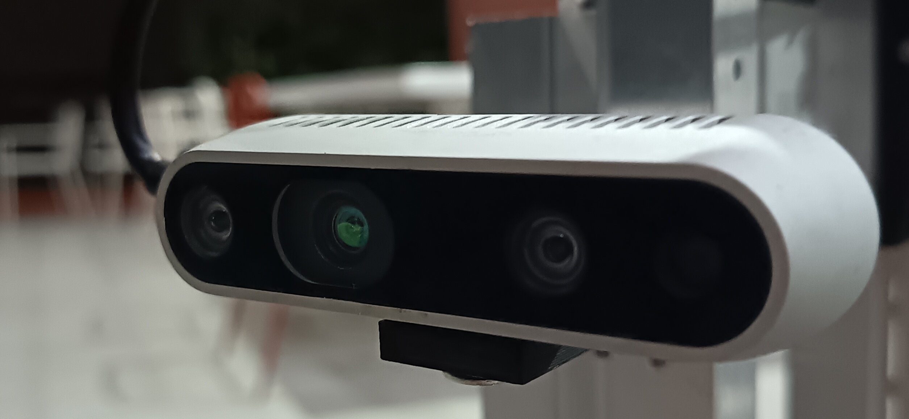
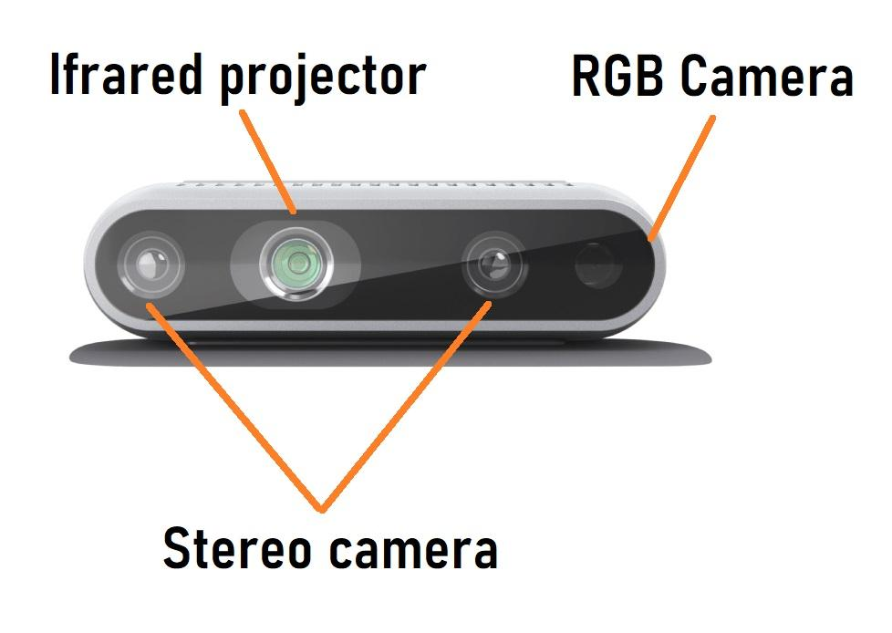

# 3.1 D435i深度相机 
由于传感器章节要详细讲的话太多了，所以单独开分章节，这几张可能都有点难哈，看不懂的把你马沙了喵  


在本次比赛中，我们使用了两个图像传感器，一个是D435i深度相机，另一个是USB免驱相机，主要用于目标识别和测距，以及Aruco二维码的识别。
接下来就着重讲解D435i深度相机，什么是深度相机呢，简单理解就是它不仅可以输出图像（RGB、灰度），它还可以输出每个像素画面对应的深度（距离）。而同时D435i它与D435最大的不同就是它自身还装配了IMU(惯性测量单元)，可以输出相机自身的6DoF位姿信息，这对于复杂的地形是有很大的帮助【本次比赛就是使用了D435i自带的IMU来判断R2自身是否处于平地或爬坡，下位机的IMU只能返回水平面（Z轴）的信息】。

图为装在R2上 Intel Librealsense D435i深度相机 

 

[D435i官网](https://www.realsenseai.com/cn/products/d435i/)

D435i 本质上是一个**主动双目立体视觉（Active Stereo）深度相机**，并额外集成了 6DoF IMU。官方资料明确说明，D435i 使用 D4 Vision Processor（视觉处理器）、双红外深度传感器、红外投影器、RGB 传感器和 IMU。 D435i 官方定义的深度技术就是 Active Stereoscopic，其深度视场约为 87° × 58°；官方页面给出的理想工作距离是约 0.3–3 m（实际我测过极限工作距离是约8cm~12m）。

## D435i基本认知 

图为D435i的几个镜头 

 

D435i 前面实际上不是“一个摄像头”，而是多个传感器组成的系统。
D435i 需要按图像通道区分：双目红外深度传感器采用全局快门，RGB 彩色传感器采用卷帘快门，不能笼统地说 D435i 的所有图像都是全局快门。具体规格应以设备说明书为准。

可以粗略理解成：
```text
                     D435i
                       │
       ┌───────────────┼────────────────┐
       │               │                │
   左红外相机       右红外相机        RGB相机
       │               │                │
       └───────┬───────┘                │
               │                        │
          双目立体视觉                   │
               │                        │
          D4 Vision Processor           │
               │                        │
          深度 Depth Frame              │
               │                        │
               ├───────────────┐        │
               │               │        │
             USB 3.0         上位机      │
               │                        │
               └────────────────────────┘

          另外还有：

                 IMU
                  │
          ┌───────┴───────┐
          │               │
       加速度计          陀螺仪
          │               │
          └───────┬───────┘
                  │
                IMU数据
```
## D435i 的核心硬件

左右两个**红外摄像头（Stereo）**，这是 D435i 测深度的核心。

注意：D435i 的深度不是 RGB 摄像头拍出来的。也不是单纯的红外测距（如果是这样得每个像素都配一个红外模块）。

而是：
```text
左 IR Sensor ─┐
              ├──→ 双目匹配 → 深度   就像人的两个眼睛一样，虽然人眼输出不了深度，但是也可以让你判断出物体远近和透视。
右 IR Sensor ─┘
``` 
### 测距原理--三角测量  
在上面我说过双目深度相机不仅可以输出RGB图像等图像信息，还可以输出具体某像素的现实深度。那么它是如何进行距离测量的呢。这最关键的就是我上面提到的两个左右红外摄像头。

如图上有一个物体P，
```text
                  物体 P 
                   ●
                  / \
                 /   \
                /     \
               /       \
              /         \
             /           \
            /             \
           /               \
          ●────────────────●
       左摄像头            右摄像头   
``` 
而两个摄像头它们之间还存在一段固定距离**基线距离（Baseline）**,这是一个重要的参数。
```text
          ←──── Baseline ────→

          L                    R
          ●                    ●
           \                  /
            \                /
             \              /
              \            /
               \          /
                \        /
                 \      /
                  \    /
                   \  /
                    ●
                    P
``` 
这是两个摄像头分别看到的物体的图像,就像你前面摆着一个物体，你两只眼睛看到的画面其实并不一样（自己睁一只眼闭一只眼看），因为两个摄像头的位置不同，所以同一个物体 P 在左右图像中的位置会发生偏移。这个偏移叫：**视差 Disparity** 

```text
左摄像头看到 P 的位置：

       左图
┌─────────────────┐
│                 │
│       ● P       │
│                 │
└─────────────────┘

右摄像头看到 P：

       右图
┌─────────────────┐
│                 │
│             ● P │
│                 │
└─────────────────┘
``` 
有公式：d = xL ​− xR ，即视差等于这个物体在左右两个摄像头画面的x轴之差。
经过双目标定以后，可以得到经典的三角测量公式：

```text
        fB      Z：物体距离相机的深度
   Z = ————     f：相机焦距
         d      B：左右相机之间的基线
                d：左右图像之间的视差
``` 
**D400 系列的数据表明确列出了 D4 Vision Processor，并说明左右成像器的数据送入视觉处理器，由其根据左右图像对应点之间的位移计算每个像素的深度。** 

以上的仅作了解详细的就不放在正文了，如果物理数学基础比较好的同学想要详细的可看[这](../神秘地方/D435i原理详细.md)
	​
## 红外投影器 
单单使用两个左右红外摄像头还不足已以完成完美的测距，当遇到一面纯白的墙壁，左右图像基本就没有纹理区别了。此时算法就很难判断左图里的这个像素，到底对应右图里的哪个像素？即无法完成**Stereo Matching（立体匹配）**。

而红外光就是在这种极端情况/平常情况帮助算法来分辨左图哪个像素点对应右图哪个像素点的,光打上去墙面的凹凸纹理就会立刻显现出来，算法再根据纹理来进行匹配。 
```text
        IR Projector
              │
              │ 红外光
              ↓
       . . . . . . . . .
     . . . . . . . . . . .
    . . . . . 物体 . . . . .
     . . . . . . . . . . .
       . . . . . . . . .
``` 
## RGB摄像头 
负责输出普通彩色图像。RGB 与深度来自不同传感器；深度来自左右 IR 传感器。 

RGB图：
开学提醒我补图 

深度图：这个也是

深度图不是传统意义的黑白照片，它的每一个像素实际上保存的是：**Z(x,y)**，这个像素对应的物体距离相机有多远。
例：
```text
Depth Image

x →
┌───────────────────────┐
│  800  805  810  815   │
│  800  803  812  818   │
│  950  960  970  980   │
└───────────────────────┘
          ↓
         y
``` 
可能代表着：
800 mm
805 mm
810 mm
...

## 输出 
对于上位机来说，最重要的是这几个 
```text
D435i
 │
 ├── Depth
 │
 ├── Color / RGB
 │
 ├── Infrared 1
 │
 ├── Infrared 2
 │
 └── IMU
       ├── Accelerometer
       └── Gyroscope
``` 
| 数据          | 用途             |
| ----------- | -------------- |
| RGB         | 目标检测、颜色识别、YOLO |
| Depth       | 测距、三维定位        |
| IMU         | 姿态、运动估计        |
| Point Cloud | 三维空间处理         | 


## 坐标系 
在学习坐标系前先复习一下初中物理学过的小孔成像模型，相机的成像模型可近似的将镜头等效为小孔，另外，在小孔模型下，像距$d$和焦距$f$相等。

 

为了计算方便，实物在像平面（相机的感光单元平面）上成倒像，将其竖直镜像后放置在光心前方一个焦距的位置。 

  

**相机主点即相机光心/镜头的光学中心** ，主点 ！= 透镜光心

### 图像坐标系（二维） 
表示物体在画面上的坐标/位置 
```text
        v

        ↓


(0,0)────────→u


``` 
输出：(u,v), 单位：px

### 相机坐标系（三维） 
**简单来说相机坐标系是一个以相机光心为原点描述物体相对于相机的位置的三维直角坐标系**。相机坐标系即相机是中心，物体坐标随相机的移动而变化，通常相机坐标系，和OpenCV的坐标系也是保持一致的。
- x轴：图像水平向右方向 
- y轴：图像垂直向下方向 
- z轴：镜头朝向方向，向外，上面说的深度Z即是Z轴
```text
               Y
               ↓
               |     Z
               |   /
               |  /
               | /
               |/
               O────────→ X 
``` 

而图像坐标（u,v）可以转换成相机坐标(X,Y,Z),通过反投影公式（针孔模型），想知道推导的看[这](../神秘地方\D435i原理详细.md)：

  

- u,v：像素坐标 
- cx,cy：主点 
- fx,fy:焦距
- Z：深度 
  
**用于计算像素点+该点深度在相机坐标系下的三维坐标**

核心关系
```text
图像坐标
(u,v)
    +
    |
    | Depth
    ↓
相机坐标
(X,Y,Z)
    +
    |
    | 外参
    ↓
机器人坐标
(X,Y,Z)

```
工作例子：机器人要抓一个球，D435i的RGB相机将图像传给上位机，上位机通过YOLO模型在这图像中识别到了一个球，然后获取该球的中心像素点 

```text          
          RGB
           │
           ↓
         YOLO
           │
           ↓
       球中心像素
       (u,v)

```

假设球的中心是（620，350），然后再从D435i获取到了该点像素对应的深度Depth(620,350)，Z等于1.25m（假设），然后再通过 
```text
(u,v,Z)
       │
       ↓
相机坐标系
       │
       ↓
(X,Y,Z)
```
得到：X = 0.18 m , Y = -0.12 m ，Z = 1.35 m，那么机器人就知道了球在相机坐标系前方 1.35m、右 0.18m、上下 -0.12m 的位置。 

## 内参矩阵 
D435i 的**内参矩阵（Camera Intrinsic Matrix）**是机器人视觉中非常核心的概念。它描述的是：**相机三维空间中的一点，如何投影到二维图像像素平面。** 
对于 D435i 来说，内参主要服务于：
- Depth 像素 → 三维坐标 XYZ 
- RGB-D 对齐 
- 点云生成 
- 目标三维定位 
  
通常写成↓
  
  

开学提醒补在哪调内参。 一般不建议自己测量修改，因为自己量的往往没原设定好的准。


| 参数      | 含义          |
| ------- | ----------- |
| \(f_x\) | x方向焦距（像素单位，水平方向的等效焦距） |
| \(f_y\) | y方向焦距（像素单位，水平方向的等效焦距） |
| \(c_x\) | 光心 x 坐标     |
| \(c_y\) | 光心 y 坐标     |

### 等效焦距 
f 不是实际焦距，而是等效焦距：

  

- F : 真实焦距(mm)
- px ：像素尺寸(mm/pixel) 

f_y同理。

### 主点  
简单来说就是**光轴（穿过光心且垂直于成像平面的线）与成像平面的交点。** 

 

理想情况:主点位于图像正中央（cx=width/2,cy=height/2）;现实情况：可能会由于相机镜头畸变或芯片安装误差，主点会有几十或几百个像素点的偏差（**内参标定就需要纠正这些问题**）。

## 内参使用 
**简单来说就是视差负责得到 Z，内参负责把二维像素 + Z 还原到三维空间。** 

当算法需要获取画面某像素点的三维相机坐标时，获取到（u,v）和该坐标深度Z后，获取到相机的内参矩阵，即可通过反投影公式获得该点的三维相机坐标点（X,Y,Z）。 

## 外参 
**它描述的是相机和外部世界之间的关系。** 相机坐标系里的点，怎么转换到机器人坐标系？这就是相机外参需要解决的问题。

简单来说就是相机位姿，相机位置+姿势。

简单的外参由 R(3x3旋转矩阵) + t (3x1平移向量) 来描述，这个6Dof矩阵后面会讲解。 
旋转矩阵可以由内置IMU直接返回得数，平移向量需要自己拿尺子量。

呃，不知道你们能看懂不... 

当你的相机拿到了该物体在相机坐标系里的坐标Pc = (Xc,Yc,Zc),然而机器人需要的是相对于机器人自身这物体的机器人坐标系里的坐标Pw,这时候就需要借助外参的帮助了。

```text
就可以：
Pc = RPw + t （世界->相机）
``` 

假设你现在由相机得到了Pc = (Xc,Yc,Zc),需要求Pw = (Xw,Yw,Zw) 

矩阵式为：

 

 


  

展开后得：Pc = RPw + t, 逆公式即Pw = R^-1*(Pc - t​) 【相机->世界】

 

注意： 
|内参|外参|
|---|---|
|描述3D->2D|描述坐标系变换|


## 简单总结 

机器人是如何知道需要拾取的物体离自己多远的 
```text
物体
 ↓
红外投影纹理
 ↓
左右IR相机
 ↓
左右图像
 ↓
寻找对应点
 ↓
视差 disparity
 ↓
三角测量
 ↓
Depth Z
 ↓
相机内参
 ↓
XYZ
 ↓
RGB/Depth对齐
 ↓
目标三维坐标（相机坐标系）
 ↓
外参 R,t
 ↓
机器人坐标系 XYZ
 ↓
机器人控制

``` 
# 使用 

D435i不像USB免驱相机插上USB就能直接用，它还是需要经过一些比较麻烦的步骤的。

## SDK（Software Development Kit） 
软件开发工具包，SDK 是给程序员使用的一套开发接口和工具。 
librealsense 提供的SDK就是把：USB协议、数据包、寄存器、传输协议、帧同步、时间戳这些底层工作全部包装起来，方便开发使用。 

先安装好SDK:

官方安装教程：https://github.com/realsenseai/librealsense/blob/master/doc/installation.md (这是Ubuntu_x86的) 

https://github.com/realsenseai/librealsense/blob/master/doc/installation_jetson.md (这是jetson系列的) 

https://jetsonhacks.com/2025/03/20/jetson-orin-realsense-in-5-minutes/ (jetson系列补丁)

全部搞好大概一个小时吧，安装完成后重新拔插相机，然后打开终端输入`realsense-viewer`,回车就可以见到Realsense界面了。 

 

另开一个终端，输入`lsusb`,即可查看是电脑是否识别到D435i。 
```text
Bus 001 Device 002: ID 8086:0b07 Intel Corp. Intel(R) RealSense(TM) Depth Camera 435i
```  
相机打开了的时候你可以在相机的镜头那里看到红光。

到这里你完成了D435i基本的认识和如何打开相机了。
至于如何获取深度，计算像素的相机坐标系，融合YOLO模型将在后续讲解。 

标定https://blog.csdn.net/NeoZng/article/details/122736567