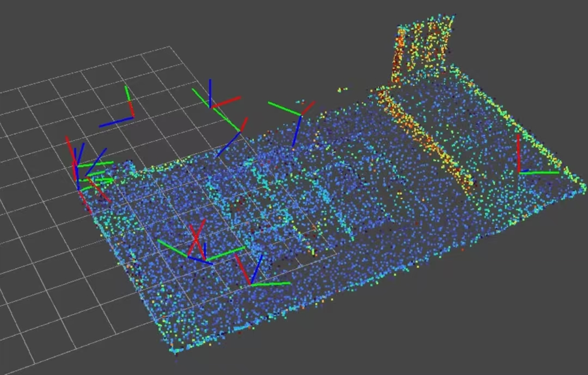

# 3.2 MID-360S 
在本次比赛中我们使用了mid-360s激光雷达，主要用来全局/局部定位、建图、重定位、位姿线路纠正。 

图为实验室里的mid_360S 
补图 

图为Rviz显示的雷达工作中 
  

图为建图模式下雷达扫描的实验室 
   

   

绿色的线是雷达的轨迹 

这是MID-360S的用户手册和开发资料：通过网盘分享的文件：MID-360S的开发资料.zip 链接: https://pan.baidu.com/s/17kniBEgbBarZjtuvZPW9-Q 提取码: geak  

   

内部包含mid-360s驱动和SDK，同学们可以先自行下载阅读Mid-360S用户手册，**了解mid-360需要如何接线，核心参数，使用教程(先不必上手，毕竟我也没多一个给你们实验)** 

## 核心参数 
| 参数     | Mid-360S            |
| ------ | ------------------- |
| 激光波长   | 905 nm              |
| 水平 FOV | **360°**            |
| 垂直 FOV | **-7° ~ 52°，共 59°** |
| 典型探测距离 | **40 m @ 10%反射率**   |
| 截止量程   | 100 m               |
| 最近探测距离 | 0.1 m               |
| 点频     | **200,000 点/s**     |
| 点云帧率   | 10 Hz               |
| 测距精度   | ≤2 cm @ 10 m        |
| 角度精度   | <0.15°              |
| 通信     | 100BASE-TX Ethernet |
| 同步     | PTPv2 / GPS         |
| IMU    | ICM40609            |
| 功耗     | 6.5 W               |
| 供电     | 9~27 V DC （不建议接24V以上，不然烫死你）           |
| 防护     | IP67                |
| 尺寸     | 65 × 65 × 60 mm     |
| 重量     | 265 g               | 

注意阅读这些参数以了解雷达的工作范围，雷达坐标系，以及明白知道如何摆放雷达才可以使比赛场地扫描完整。 

## 定位和重定位 
在学习雷达的过程中，明白和了解什么是雷达的定位和重定位是非常重要的。
简单来说，

- 定位（Localization）：我现在在哪里？ 
- 重定位（Relocalization）：我原来不知道/丢失了自己在哪里，现在重新找回我在哪里。 
  
然而定位和重定位在比赛中的作用是非常重要的，用于自主导航、判断是否精确到达任务点/坐标点，判断是否偏离赛道，以及全局的决策都需要依赖与定位和重定位（例如需要根据不同的区域做出不同工作任务）。

雷达的定位和重定位核心都是通过**特征匹配**来实现的，雷达扫描到的点云数据会被算法提取出特征点，然后和点云地图上的特征点进行匹配，匹配成功就可以知道自己在哪里了。 
什么是特征匹配，用人话来说就是雷达扫描到的点云数据和地图上的点云数据进行对比，找到相似的地方，就可以知道自己在哪里了。 

图为华工提供给我们的的赛场右半场点云地图 

  

## 定位到底在计算什么 
假设我们已经有一张地图：

$$ M $$

Mid-360S 当前扫描得到一帧的一大堆点云：

$$ P=\{p_1,p_2,\cdots,p_n\} $$

每个点都有自己的雷达坐标系的三维坐标：

$$ p_i= \begin{bmatrix} x_i\\y_i\\z_i \end{bmatrix} $$

机器人真正想知道的是：

$$ T_{map\rightarrow base} $$

也就是机器人在地图坐标系中的位姿。

通常写成：

$$ T= \begin{bmatrix} R&t\\ 0&1 \end{bmatrix} $$

而 \(R\) 是旋转矩阵，\(t\) 是平移向量。

所以整个定位问题实际上就是：

找到一个 \(T\)，使当前 LiDAR 扫描经过这个位姿变换以后，雷达扫描到的点云和地图的某处点云尽可能重合。得到的 \(T\) 就是机器人在地图坐标系中的新位姿。 

## 点云匹配 

你可以把定位理解成：

```text
                 已知地图
                    │
                    │
                    ↓
              ┌───────────┐
              │ Point Cloud│
              │   Map      │
              └─────┬─────┘
                    │
                    │ 匹配
                    ↑
              当前点云
                    │
                Mid-360S
```  
点云匹配不是一上来拿到两帧点云就可以一下匹配成功的，它是一个不断试错和自我纠正的过程，算法会不断尝试不同的位姿变换，直到找到一个最优解，使得当前点云和地图点云尽可能重合。

就像一个简单的例子：在过梅林区域【梅林是由12个高低错落的台阶方块组成】，雷达怎么告诉上位机知道自己现在是在梅林区域呢，雷达此时扫描到前方有一大堆的台阶方块状点云，然后拿着这些点云去和地图上的点云匹配，武馆：没有这些台阶方块样式的点云，所以不在武馆；对抗区：对抗区也没有这些台阶方块样式的点云，所以不在对抗区；梅林：有这些台阶方块样式的点云，所以就在梅林区域，至于如何确切知道自己在梅林哪个实际区域或者哪个方块上就需要进一步匹配和根据路线坐标推导了。【所以说雷达这一块是真的吃性能，计算量太大了】

## ICP 
说到定位就需要来讲解一下最经典的点云匹配算法 ICP（Iterative Closest Point，迭代最近点算法），它是最经典的点云匹配算法之一。【也是我本次比赛时用到的算法，在这里仅做简单讲解】 

ICP干的事情就是：给定两组点云，找到一个刚体变换，使得两组点云尽可能地重合。说人话就是：**我先让两帧点云大概对上，再不断微调，直到它们贴得很近。** 

假设现在有两帧点云，因为车在移动时当前帧点云相较于上一帧点云是会发生偏移的： 

```text
   前一帧                     当前帧
   .   .   .                  .   .
     .   .                      . .
   .   .   .                  .   .   .
```

其中一帧可以看成**目标点云**，另一帧可以看成**待匹配点云**。ICP要做的事情，就是求出一个位姿变换，这个位姿变换就可以告诉我们雷达相较于上一帧移动了多少，向哪移动，有没有发生旋转：

$$
T=\begin{bmatrix}R&t\\0&1\end{bmatrix}
$$

让当前帧经过这个变换以后，和目标点云尽量重合。它本质上是在解下面这个最小二乘问题：
```text 
最小二乘法，即找一条拟合曲线，让所有数据点到这条线的误差平方和最小
误差 = 真实值 - 预测值  
``` 
目标：
$$
\boldsymbol{\min\sum (y_i-\hat y_i)^2}  <-最小二乘法式子
$$

$$
\min_{R,t}\sum_i \|Rp_i+t-q_{c(i)}\|^2
$$

这里：

- $p_i$ 是当前帧里的第 $i$ 个点
- $q_{c(i)}$ 是它在目标点云中找到的最近邻点
- $R$ 是旋转矩阵
- $t$ 是平移向量

### 它是怎么做的
ICP不是一次算完的，而是**迭代**出来的，流程大概是这样的：

1. **给一个初始位姿**  
   通常来自上一帧结果、里程计、IMU 或者一个粗定位结果。这个初值很重要，因为 ICP 本身更擅长“精修”，不太擅长“从零开始瞎猜”。

2. **找对应点**  
   对当前帧中的每个点，去目标点云里找最近的点，建立一组一组的匹配关系。 
   对于当前点：

   $$ p_i $$

   寻找地图中距离它最近的点： 
   

   $$ q_i $$

   于是得到：

   $$ (p_i,q_i) $$

3. **求最佳变换**  
   利用这些对应点，求出这一轮最优的 $R$ 和 $t$。常见做法是最小二乘，二维/三维里一般会用 SVD 来解。 
   例如：
    ```text
    当前点 ●
         │
         │ d
         │
   地图点 ●
   ```
       
   误差：
   $$ e_i=\|Tp_i-q_i\| $$


   所有点综合起来： 
   $$
   E(T)=\sum_i \|Tp_i-q_i\|^2
   $$

   寻找：

   $$ T^*= \arg\min_T E(T) $$

   也就是：

   **寻找一个机器人位姿，使点云匹配误差最小。**

4. **更新位姿并重新对齐**  
   把新算出来的变换叠加到当前位姿上，再把点云变换过去。 

5. **重复上述过程**  
   直到两次结果变化很小，或者误差下降不明显，就认为收敛了。

所以 ICP 的核心不是“直接比两张图”，而是：

**找最近点 -> 算变换 -> 再找最近点 -> 再算变换** 

反复做下去，最后得到最接近的对齐结果。

### 为什么它能完成点云匹配
因为同一个场景里，墙面、柱子、桌角这些稳定结构在相邻两帧中变化不会太大。ICP抓住的就是这些稳定几何关系：只要两帧点云有足够重叠，它就能把“这一堆点”和“那一堆点”对应起来，再反推机器人到底平移了多少、旋转了多少。

### 优缺点
- 优点：原理直接，精度高，适合局部精细对齐。 
- 缺点：很依赖初值；如果初值差太大、场景特征太少、动态物体太多，就容易配错或者收敛到错误位置。 

所以在比赛里，ICP通常不会单独拿来“从零定位”，而是配合上一帧位姿、IMU、里程计或者特征匹配一起用（多传感器融合卡尔曼滤波）。先给它一个大概位置，再让它做最后的精细对齐，这样效果会稳很多。

**ICP是一种局部匹配算法。**  

## 重定位  

跟上面的定位不同，重定位更偏向于根据特征，从零开始找自己在哪，就像把你扔在广美的随机一个地方，你一看周围，哦，我左边是广美天桥，右边是篮球场，前面是宿舍楼，那你是不是就可以立刻知道自己在二平。简单理解重定位干的就是这些事。 

重定位最重要的作用就是：

**定位系统出问题以后，把机器人重新拉回正确的坐标系。**【但我一般是用来做初始位置加载，让机器人知道自己开始的时候被放在了哪里，从而更好进行路径规划（毕竟我路径规划不是写死前走多少左走多少的）】 

最典型的**定位丢失**就是搬动，在运行过程中如果闲的没事给机器人突然从A点搬到B点，你猜会怎么样。ICP提取的点云匹配不上，而其他传感器可能还认为机器人在A点（例如编码里程计：轮子没转，故返回的数据会让算法也认为机器人没动，仍然在A点），结果就是传感器数据说我还在A点，ICP可能匹配不上，那你直接等着机器人乱创吧。 

## 重定位如何工作 

假设现在有一张地图 

```text
┌──────────────────────────┐
│ A                        │
│                          │
│          B               │
│                          │
│                     C    │
│                          │
│       D                  │
└──────────────────────────┘
```
它不知道自己是：
```text
A？B？C？D？
```
于是需要：
```text
当前点云
   ↓
提取特征
   ↓
地图中寻找候选位置
   ↓
A ──匹配分数 0.31
B ──匹配分数 0.92 ←
C ──匹配分数 0.24   #特征匹配
D ──匹配分数 0.37
   ↓
选择 B
   ↓
NDT / ICP 精匹配
   ↓
得到精确位姿
```
这就是典型的：

粗定位 → 精定位 

通常在进行特征匹配时算法不会直接暴力搜索全图，你想想，一张图这么多个点，而且360°每个角度都找一遍计算量将会巨大。所以实际算法会先做：

**全局特征匹配**

例如从当前点云提取：

- 墙
- 柱子
- 建筑边缘
- 平面
- 几何结构

然后在地图中寻找：

“哪里具有类似的空间结构？”

这一步得到几个候选位置。

再用 ICP/NDT 精确优化。 

所以重定位是**全局定位算法。**，但是由于你也可以从上面看到了重定位的计算量是大于局部定位的，所以求解的速度相对较慢，所以重定位一般是在开始或者丢失定位时使用。

## SLAM 
**SLAM(同步定位和建图)**，解决的就是让机器人在完全陌生且无先验地图的环境中，同时完成明白“我在哪”和“周围长什么样”，完成建立环境地图和定位的任务。SLAM是一个非常复杂的算法，涉及到传感器融合、状态估计、地图表示等多个方面。MID-360S雷达可以提供高精度的点云数据，为SLAM算法提供了可靠的输入。

## 雷达摆放 
雷达摆放的位置对定位的效果影响非常大的，要结合具体的参数（最近探测距离、垂直 FOV、测据精度）来进行判断，因为雷达是有盲区的，它的扫描范围不是360°全球体覆盖。 

请遵循以下
- 雷达切莫放置高度过高，如果高且正着放置容易导致下方的区域扫描不到，对于低矮的复杂地形就无法提取到特征了。 
- 倾斜放置是不错的选择，例：本次比赛我R2的雷达选择放置在小车前方且前倾斜30度，此时雷达的扫描范围不再是大面积的扫描地图上半部分，而是会大面积向着小车移动的方向的前方进行扫描，范围从地板到最高的梅林完整覆盖，这样算法能提取到的场地特征更多，使定位更加准确。(也可以参考其他队伍那样倒着放置，但注意修改雷达的外参矩阵) 
- 周围最好不要有东西遮挡，有遮挡也不要大面积或者靠的很近，因为容易造成雷达漂移。
- 注意监督机械组，必须给雷达加固定云台以及小心点机械组的极限尺寸和阴间设计，可能会导致你的雷达放不进R2(造成超高超宽或者雷达只能放在一些阴间地方，如果遇到这种情况请直接给他们骂一顿)
