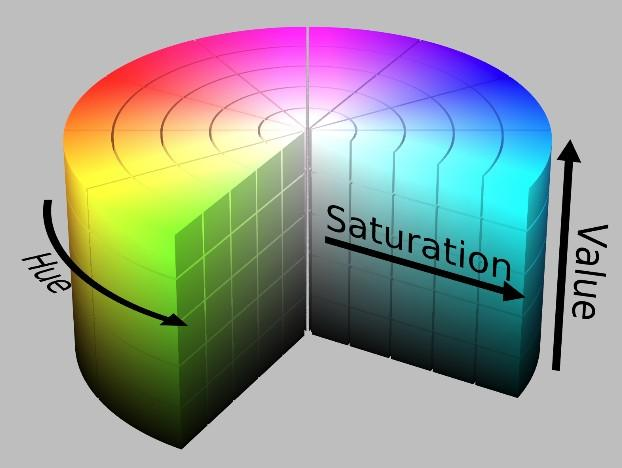

# 第5章 OpenCV入门

终于到了能看见东西的一章。前面几章我们讲了相机怎么成像、图像里的每个像素是什么意思，也讲了数组和矩阵，但一直没真正动手处理过一张图。这一章开始，屏幕上就会有东西跳出来了。

这一章的新名词不算少，但好消息是：**每一个名词后面都跟着一段能直接跑的代码**。建议边跑边看，遇到看不懂的先把代码抄下来运行一遍，看到窗口弹出来了再回头读原理，会比干读舒服很多。

还有一件事想先说：这一章的代码在 Windows 上也能跑，不装 Ubuntu 也不影响你学完。但后面接 ROS2 的时候还是得回到 Ubuntu，所以早点装会省事一些。

另外，本章出现的每一个函数、常量和终端命令，在 **5.11 速查表**里都有一句话解释和典型写法。看正文时遇到不认识的名字，翻到那边对一下就行，不用记。

<image src="../picture1/20260904191650 CST.png" style="width: 250px" >

## 本章学习目标

完成本章后，你应当能够：

- 说明一张图像在内存里是以什么形式存在的，并解释 OpenCV 为什么用 BGR 而不是 RGB；
- 用 `imread`、`imshow`、`waitKey` 完成读图、显示和保存，并避开三个最常见的新手坑；
- 用切片取出 ROI，理解 `.copy()` 在什么时候是必须的；
- 说清楚 HSV 和 LAB 各自适合解决什么问题，并用 `inRange` 做出一张颜色掩码；
- 用腐蚀、膨胀、开运算和闭运算清理掩码中的噪点；
- 用 `findContours` 从掩码中找出目标，并计算它的外接矩形和中心点；
- 打开摄像头，写出一个稳定运行的实时处理循环；
- 读懂我们真机上 `triple_edge_align.py` 的前半部分，知道它每一步在做什么。

本章只使用 **Python**，也不涉及 ROS2。我们先把 OpenCV 本身跑通，等进阶篇讲 `cv_bridge` 的时候再把它接进 ROS2 节点里。

---

## 5.1 图像在计算机里到底是什么

第3章我们讲过，相机传感器把光信号变成了电信号，再变成一组数字。那这组数字到了程序里长什么样呢？

答案很朴素：**就是第4章讲的那个数组**。

一张 480×640 的彩色图，在 OpenCV 里就是一个形状为 `(480, 640, 3)` 的 NumPy 数组：

```text
        列 (width = 640)
        ────────────────────→ x
      ┌─────────────────────┐
   行 │  ●                  │     每个 ● 是一个像素
  (h) │      ●              │     每个像素有 3 个数字
  480 │              ●      │
      │                     │
      └─────────────────────┘
      ↓
      y

  一个像素点展开来看：

        img[y][x]  =  [ B , G , R ]
                        │   │   │
                        │   │   └── 红色分量  0~255
                        │   └────── 绿色分量  0~255
                        └────────── 蓝色分量  0~255
```

三件事值得记一下：

1. **索引顺序是 `[y][x]`，先行后列**。这和我们平时说"横坐标纵坐标"是反过来的，刚开始很容易写错。记法是：数组是一行一行存的，所以先选行（y），再选这一行里的第几个（x）。
2. **数据类型是 `uint8`**，取值 0~255。0 是全黑，255 是最亮。超出范围会溢出（255 + 1 会变成 0，不是 256），后面做减法的时候会踩这个坑，5.4 节会专门说。
3. **通道顺序是 BGR，不是 RGB**。

第三条是 OpenCV 最有名的历史遗留问题。当年写库的时候某些相机厂商的数据就是按 BGR 排的，于是就这么定下来了，一直沿用到现在。它带来的实际后果是：

> 如果你用 OpenCV 读图、用 matplotlib 显示，红色和蓝色会互换。看到人脸变成蓝色不要慌，不是相机坏了，是通道顺序的问题。

| 库 | 通道顺序 |
| --- | --- |
| OpenCV (`cv2`) | **BGR** |
| matplotlib、PIL、大部分深度学习框架 | RGB |
| ROS2 的 `sensor_msgs/Image` | 由 `encoding` 字段声明，常见 `bgr8` |

跨库传图像的时候记得转一下：

```python
img_rgb = cv2.cvtColor(img_bgr, cv2.COLOR_BGR2RGB)
```

灰度图则简单一些，形状是 `(480, 640)`，没有第三个维度，每个像素就是一个 0~255 的亮度值。

---

## 5.2 装上 OpenCV，跑通第一个程序

### 5.2.1 安装

在 Ubuntu 22.04 上：

```bash
# 如果还没有 pip
sudo apt update
sudo apt install python3-pip

# 安装 OpenCV 和 NumPy
pip3 install opencv-python numpy
```

验证一下装好了没有：

```bash
python3 -c "import cv2; print(cv2.__version__)"
```

能打印出版本号（比如 `4.9.0`）就说明成功了。

> 如果你后面装了 ROS2 Humble，系统里可能会同时存在 ROS 自带的 `cv2` 和 pip 装的 `cv2`。目前不用管，等真的冲突了（表现是 `import cv2` 报错或者版本对不上）再回头处理，进阶篇会讲。

### 5.2.2 第一个程序

找一张图片放在脚本旁边，命名为 `test.jpg`，然后：

```python
import cv2

# 读图
img = cv2.imread('test.jpg')

# 打印形状，确认读成功了
print(img.shape)        # 例如 (480, 640, 3)

# 显示
cv2.imshow('my first window', img)

# 等待按键，参数 0 表示一直等
cv2.waitKey(0)

# 关掉所有窗口
cv2.destroyAllWindows()
```

跑起来应该会弹出一个窗口，按任意键关闭。

再加一句保存：

```python
cv2.imwrite('output.jpg', img)
```

就这样，读、显、存三件套就齐了。

### 5.2.3 三个几乎人人都会踩的坑

这三个坑我们组每年都会有人踩，提前说一下，能省你半小时。

| 现象 | 原因 | 怎么办 |
| --- | --- | --- |
| `img.shape` 报错 `NoneType has no attribute shape` | 路径不对，`imread` 找不到文件时**不报错**，而是返回 `None` | 读完立刻检查：`if img is None: print("读不到图"); exit()` |
| 窗口弹出来是灰的 / 一片空白 / 直接卡死 | 忘了写 `cv2.waitKey()` | `imshow` 之后必须跟 `waitKey`，窗口才会真正刷新 |
| 颜色不对，红蓝互换 | BGR vs RGB | 见 5.1 节，用 `cvtColor` 转一下 |

第一个坑尤其阴险，因为它不在 `imread` 那一行报错，而是在后面某一行才炸，容易找错地方。养成习惯：

```python
img = cv2.imread('test.jpg')
if img is None:
    print("图没读到，检查一下路径")
    exit()
```

关于路径还有一点：相对路径是相对于**你运行脚本时所在的目录**，不是脚本文件所在的目录。在 VS Code 里直接点运行按钮的时候，工作目录经常不是你以为的那个。调试的时候可以先打印一下：

```python
import os
print(os.getcwd())
```

---

## 5.3 图像的基本操作

### 5.3.1 看看这张图的基本信息

```python
h, w, c = img.shape
print(f"高 {h}, 宽 {w}, 通道数 {c}")
print(img.dtype)        # uint8
```

### 5.3.2 ROI：只处理我关心的那一块

ROI 是 Region of Interest，感兴趣区域。既然图像就是数组，那取一块区域就是数组切片：

```python
roi = img[50:450, 50:590]
```

这行的意思是：取 y 从 50 到 450、x 从 50 到 590 的那一块。注意还是**先 y 后 x**。

这不是什么高级技巧，但在真机上非常有用。我们今年的边缘对齐程序开头就有这么一行：

```python
roi = frame[50:450, 50:590].copy()
```

为什么要裁掉四周这一圈？因为相机装在机器人上，画面边缘经常拍到场地外的东西——观众席、别队的机器人、地板反光。这些东西对我们要找的目标没有帮助，只会带来干扰。**与其写复杂的算法去排除干扰，不如一开始就别把干扰读进来**，这个思路在整个视觉开发里都很好用。

顺便还有个额外好处：处理 400×540 比处理 480×640 少了三成的像素，帧率会高一点。

### 5.3.3 `.copy()` 是干什么的

上面那行末尾有个 `.copy()`，这个不能省，原因值得单独说一下。

NumPy 的切片返回的是**视图（view）**，不是副本。视图和原数组共享同一块内存：

```text
不加 .copy()：

   frame  ┌───────────────────┐
          │                   │
          │   ┌─────────┐     │
          │   │  roi    │     │   roi 只是一个"窗口"
          │   └─────────┘     │   改 roi 就是在改 frame
          └───────────────────┘


加了 .copy()：

   frame  ┌───────────────────┐      roi  ┌─────────┐
          │                   │           │         │
          │   ┌─────────┐     │           │  独立   │
          │   │         │     │           │  的一份 │
          │   └─────────┘     │           └─────────┘
          └───────────────────┘
```

所以：

- 如果你只是**读**这块区域（比如统计颜色），不加 `.copy()` 没问题，还省一次内存拷贝；
- 如果你要在这块区域上**画东西**（画框、画线、写字），又不想影响原图，就必须加 `.copy()`。

真机代码里之所以加，是因为后面要往 `roi` 上画一堆调试信息。

### 5.3.4 缩放与通道拆分

```python
# 缩放到指定尺寸
small = cv2.resize(img, (320, 240))

# 按比例缩放
half = cv2.resize(img, None, fx=0.5, fy=0.5)

# 拆分三个通道
b, g, r = cv2.split(img)

# 单独取一个通道（更快，推荐）
blue_channel  = img[:, :, 0]
green_channel = img[:, :, 1]
red_channel   = img[:, :, 2]
```

`cv2.split` 会真的把数据拆成三份，而直接切片是视图，不复制数据。只要一个通道的时候用切片就好。

> 到这里可以先停一下：找张图，试试把它裁一半、缩小一倍、只显示蓝色通道，看看效果。有直观感受之后再往下看会轻松很多。

---

## 5.4 颜色空间：为什么调颜色不用 RGB

### 5.4.1 RGB 的麻烦

假设我们要找画面里的红色方块。最直觉的想法是：R 通道大、G 和 B 通道小，那就是红色。

写出来大概是这样：

```python
mask = cv2.inRange(img, (0, 0, 100), (80, 80, 255))   # (B_min,G_min,R_min), (B_max,G_max,R_max)
```

然后你会发现：在室内灯下调好的参数，拿到赛场上就废了。为什么？

因为 RGB 里，**"颜色"和"亮度"是搅在一起的**。同一块红布：

```text
      强光下          正常光          阴影里
   R=250 G=120 B=110  R=180 G=50 B=45  R=90 G=20 B=18
        │                 │                │
        └─────────────────┴────────────────┘
              都是"红色"，但三个数字全变了
```

一旦光照变了，三个分量会一起变。你没法用一组固定的阈值框住"红色"这个概念。

这就是为什么要换个坐标系来描述颜色。

### 5.4.2 HSV：把颜色和亮度拆开

HSV 是最常用的替代方案，三个分量分别是：

| 分量 | 全称 | 含义 | OpenCV 取值范围 |
| --- | --- | --- | --- |
| H | Hue，色相 | 是什么颜色（红、黄、绿、蓝…） | 0 ~ 179 |
| S | Saturation，饱和度 | 颜色有多"浓"，越低越接近灰 | 0 ~ 255 |
| V | Value，明度 | 有多亮 | 0 ~ 255 |

可以把它想成一个圆柱：

 

```text
                V (亮度)
                ↑
                │        ┌───────────────┐
                │       ╱                 ╲
                │      │    H 沿圆周转     │   ← 转一圈回到红色
                │      │    S 从中心向外    │
                │       ╲                 ╱
                │        └───────────────┘
                │
                └──────────────────────────→
```

好处很明显：光变暗了，主要影响 V，H 基本不动。所以我们可以**把 H 卡得比较紧，把 S 和 V 放得比较宽**，这样对光照的适应性就好多了。

常见颜色的 H 大致范围（仅供起点，实际一定要自己调）：

| 颜色 | H 范围 |
| --- | --- |
| 红 | 0~10 **和** 156~179（跨了一圈） |
| 橙 | 11~25 |
| 黄 | 26~34 |
| 绿 | 35~77 |
| 青 | 78~99 |
| 蓝 | 100~124 |
| 紫 | 125~155 |

注意红色那一行：**红色在 H 上是跨越 0 的**，所以要做两次 `inRange` 再合并：

```python
hsv = cv2.cvtColor(img, cv2.COLOR_BGR2HSV)

lower1 = (0,   80, 60)
upper1 = (10, 255, 255)
lower2 = (156, 80, 60)
upper2 = (179, 255, 255)

mask1 = cv2.inRange(hsv, lower1, upper1)
mask2 = cv2.inRange(hsv, lower2, upper2)
mask = cv2.bitwise_or(mask1, mask2)
```

这是找红色时最常见的错误之一，只写一半会漏掉一大堆像素。

### 5.4.3 别手调参数，写个滑条工具

新手最容易做的事情是：改一个数字、保存、运行、看效果、再改一个数字……一晚上过去了。

OpenCV 自带滑动条，花十行代码就能做一个实时调参的小工具，效率完全不一样：

```python
import cv2

def nothing(x):
    pass

cv2.namedWindow('Config')
cv2.createTrackbar('H_min', 'Config',   0, 179, nothing)
cv2.createTrackbar('H_max', 'Config', 179, 179, nothing)
cv2.createTrackbar('S_min', 'Config',   0, 255, nothing)
cv2.createTrackbar('V_min', 'Config',   0, 255, nothing)

img = cv2.imread('test.jpg')
hsv = cv2.cvtColor(img, cv2.COLOR_BGR2HSV)

while True:
    h_min = cv2.getTrackbarPos('H_min', 'Config')
    h_max = cv2.getTrackbarPos('H_max', 'Config')
    s_min = cv2.getTrackbarPos('S_min', 'Config')
    v_min = cv2.getTrackbarPos('V_min', 'Config')

    mask = cv2.inRange(hsv, (h_min, s_min, v_min), (h_max, 255, 255))
    cv2.imshow('mask', mask)

    if cv2.waitKey(1) & 0xFF == ord('q'):
        break

cv2.destroyAllWindows()
```

`createTrackbar` 的五个参数依次是：滑条名、所在窗口名、初始值、最大值、回调函数。回调函数我们用不上，但接口要求必须给一个，所以写了个什么都不做的 `nothing`。

调好之后把数字记下来写进代码里就行。这个工具建议存一份，以后每次换场地、换灯光都要用。

### 5.4.4 真机上我们其实用了 LAB

讲到这里要坦白一件事：我们今年的对齐程序里，**没有用 HSV，用的是 LAB**。

先别急着觉得前面白学了。HSV 是最好的入门工具，思路也是通的，理解了 HSV 再看 LAB 会很快。LAB 的三个分量是：

| 分量 | 含义 | 说明 |
| --- | --- | --- |
| L | Lightness，亮度 | 和颜色完全分离 |
| a | 绿 ← → 红 | 值越大越偏红，越小越偏绿 |
| b | 蓝 ← → 黄 | 值越大越偏黄，越小越偏蓝 |


关键在于：我们今年要区分的是**红色目标和蓝色目标**（比赛分红蓝方）。这两个颜色刚好落在 LAB 的两根轴上——红色看 a 通道，蓝色看 b 通道，**一个通道一个阈值就搞定了**，比 HSV 的三个分量还简单。

看真机代码：

```python
lab = cv2.cvtColor(roi, cv2.COLOR_BGR2LAB)
l, a, b_chan = cv2.split(lab)

if mode == 0:                                      # 蓝色模式
    color_mask = cv2.inRange(b_chan, 0, b_thresh)  # b 通道偏小 = 偏蓝
else:                                              # 红色模式
    mask_a = cv2.inRange(a, r_thresh, 255)         # a 通道偏大 = 偏红
```

而且 LAB 没有 HSV 那个"红色跨越 0"的问题，红色在 a 通道上就是老老实实的一头。

那什么时候用哪个？给个粗糙的建议：

| 场景 | 推荐 |
| --- | --- |
| 刚入门，想直观理解颜色 | HSV |
| 要区分很多种颜色（红黄绿蓝各一个） | HSV |
| 只要分红/蓝（或红/绿、蓝/黄）两类 | LAB，更简单更稳 |
| 光照变化很剧烈 | LAB 通常更稳一些 |

### 5.4.5 双保险：再加一个 R-B 差值

真机代码里红色模式还多做了一件事：

```python
b_bgr = roi[:, :, 0].astype(np.int16)
r_bgr = roi[:, :, 2].astype(np.int16)
diff_rb = cv2.subtract(r_bgr, b_bgr)
mask_rb = cv2.inRange(diff_rb, 45, 255)
color_mask = cv2.bitwise_and(mask_a, mask_rb)
```

翻译成人话：**"红色分量要比蓝色分量至少大 45"**。然后用 `bitwise_and` 和前面 a 通道的结果取交集——两个条件都满足才算数。

为什么要加这一道？因为赛场上有些东西（比如某些暖色的木质结构、橙色的警戒线）在 a 通道上也偏红，但它们的 R 和 B 差得不多。加上这个条件就能筛掉一批。

这里有个细节请一定注意：

```python
.astype(np.int16)
```

还记得 5.1 节说的 `uint8` 只能存 0~255 吗？如果不转成 `int16`，当 R=10、B=200 的时候，这个 -190 是存不下的，而且两种减法的错法还不一样：

| 写法 | uint8 下 10 - 200 的结果 | 行为 |
| --- | --- | --- |
| `r - b`（NumPy 的减号） | 66 | **回绕**，从 0 绕回 255 那头 |
| `cv2.subtract(r, b)` | 0 | **饱和**，负数一律截成 0 |

回绕会让"蓝得不能再蓝"的像素算出一个很大的正数，直接被误判成红色，这是最坑的一种。饱和不至于误判，但所有负数都被压成 0，你也就看不出"到底比蓝色小多少"了。

所以**做可能出现负数的运算之前，先把数据类型扩大**。转成 `int16` 之后，`cv2.subtract` 就能老老实实给出 -190。这是个很容易忘但后果很难查的坑。

> 一个更通用的思路：单个条件不够可靠的时候，与其把这个条件调得越来越极端，不如加一个**互相独立**的条件取交集。多个弱条件的组合往往比一个强条件更稳。

---

## 5.5 掩码：从彩色图到黑白图

前面反复出现的 `inRange`，输出的东西叫**掩码（Mask）**。它是一张单通道图，只有两种值：

```text
   原图（彩色）              掩码（二值）

  ┌─────────────┐         ┌─────────────┐
  │   ▓▓▓▓      │         │   █████     │   255 = 白 = 符合条件
  │  ▓▓▓▓▓▓     │   ──→   │  ███████    │
  │   ▓▓▓▓      │         │   █████     │     0 = 黑 = 不符合
  │             │         │             │
  └─────────────┘         └─────────────┘
```

掩码是整个传统视觉流程的中间产物。后面的形态学、轮廓查找，全都是在掩码上做的，跟原来的颜色再也没关系了。

三个常用的掩码运算：

```python
cv2.bitwise_and(m1, m2)   # 交集：两个都是白才是白
cv2.bitwise_or(m1, m2)    # 并集：有一个是白就是白
cv2.bitwise_not(m)        # 取反：黑白互换
```

对应到实际语义就是"而且"、"或者"、"不是"，5.4.5 的双条件用的就是 `and`，5.4.2 的红色两段用的就是 `or`。

---

## 5.6 形态学：把掩码擦干净

刚做出来的掩码通常很脏：目标内部有小黑洞，背景里有零星白点。这时候需要形态学操作。

### 5.6.1 四个基本操作

形态学的核心是一个叫**核（kernel）**的小方块，它在图像上滑动，按规则改写像素。

```python
kernel = np.ones((5, 5), np.uint8)      # 一个 5×5 的核
```

| 操作 | 效果 | 用来干什么 |
| --- | --- | --- |
| 腐蚀 Erode | 白色区域变小 | 去掉细小的白点 |
| 膨胀 Dilate | 白色区域变大 | 填补小洞、连接断开的部分 |
| **开运算 Open** | 先腐蚀后膨胀 | **去掉背景噪点**，目标大小基本不变 |
| **闭运算 Close** | 先膨胀后腐蚀 | **填掉目标内部的洞**，目标大小基本不变 |

画出来是这样：

```text
  原掩码            开运算后           闭运算后
 ┌────────┐        ┌────────┐        ┌────────┐
 │ █████ ·│        │ █████  │        │ █████  │
 │ ██ ██  │   →    │ ██ ██  │   →    │ █████  │
 │ █████ ·│        │ █████  │        │ █████  │
 └────────┘        └────────┘        └────────┘
   有噪点           噪点没了          洞被填上了
   有洞
```

开和闭之所以好用，是因为它们是"先缩再胀"或"先胀再缩"，**一来一回抵消了尺寸变化**，只留下清理效果。小噪点在腐蚀阶段就消失了，膨胀也救不回来；小洞在膨胀阶段被填上了，腐蚀也挖不回来。

代码：

```python
mask = cv2.morphologyEx(mask, cv2.MORPH_OPEN,  np.ones((5,5), np.uint8))
mask = cv2.morphologyEx(mask, cv2.MORPH_CLOSE, np.ones((7,7), np.uint8))
```

### 5.6.2 顺序和核大小怎么选

真机代码是这样的，注意顺序：

```python
color_mask = cv2.morphologyEx(color_mask, cv2.MORPH_CLOSE, np.ones((7,7), np.uint8))
color_mask = cv2.morphologyEx(color_mask, cv2.MORPH_OPEN,  np.ones((5,5), np.uint8))
```

**先闭后开**，闭的核比开的核大。这个搭配的逻辑是：

1. 先用大一点的闭运算，把目标内部因为反光造成的空洞补上，让色块变成一个完整的整体；
2. 再用小一点的开运算，把背景里剩下的碎点清掉。

如果反过来先开后闭，可能会先把目标边缘啃掉一圈，再补回来的时候形状就变了。

核大小没有标准答案，需要看着效果调。经验上：

- 核太小 → 噪点清不干净；
- 核太大 → 目标的细节被抹平，小目标可能整个消失，而且计算变慢。

建议还是挂在滑条上调，比改代码快得多。

### 5.6.3 一个进阶技巧：在时间上也做"交集"

前面讲的都是在**一帧图像内部**做清理。真机代码里还有一段，是在**多帧之间**做清理：

```python
mask_history = deque(maxlen=3)

# ... 循环里 ...
mask_history.append(color_mask)
if len(mask_history) == 3:
    smoothed_mask = cv2.bitwise_and(mask_history[0], mask_history[1])
    color_mask = cv2.bitwise_and(smoothed_mask, mask_history[2])
```

它保存最近三帧的掩码，然后取三帧的交集：**只有连续三帧都被判定为目标的像素，才真的算目标**。

这招对付的是"闪烁"——某个像素因为噪声，这一帧是白的、下一帧是黑的。这种像素过不了三帧交集这一关。

代价是**引入了延迟**：目标真的出现之后，要等三帧才会被完整识别出来。所以这个数字不能太大，3 帧在 120fps 下大约是 25 毫秒，还能接受。

> 这个"多帧确认"的思路第1章讲数据流的时候提过一次（"滤波与多帧确认模块排除抖动和偶然误检"），这里就是它最朴素的一种实现。

---

## 5.7 轮廓：从一片白色到"一个物体"

掩码擦干净了，但程序还是不知道"目标在哪"——它只有一堆白像素。把白像素组织成一个个独立的物体，靠的是轮廓查找。

### 5.7.1 找轮廓

```python
contours, _ = cv2.findContours(mask, cv2.RETR_EXTERNAL, cv2.CHAIN_APPROX_SIMPLE)
```

返回的 `contours` 是一个列表，每个元素是一个轮廓（一堆点的坐标）。

两个参数解释一下：

| 参数 | 含义 |
| --- | --- |
| `RETR_EXTERNAL` | 只要最外层轮廓，忽略里面套的洞。我们找目标一般用这个 |
| `CHAIN_APPROX_SIMPLE` | 压缩存储，直线段只存两个端点。省内存，一般都用它 |

> `findContours` 会修改传进去的图像。老版本 OpenCV 尤其明显，如果后面还要用这张掩码，传 `mask.copy()` 进去比较保险。

### 5.7.2 面积过滤：先扔掉明显不对的

找到的轮廓里通常有一堆很小的碎片。最简单有效的过滤就是看面积：

```python
if contours:
    max_c = max(contours, key=cv2.contourArea)     # 取面积最大的那个
    if cv2.contourArea(max_c) > 3000:              # 面积够大才认
        # 处理它
```

真机代码就是这么写的，阈值是 3000 像素。这个数字怎么来的？是根据"目标出现在合理距离时，它在画面里大概占多少像素"估出来的，再实测调整。

这里其实做了一个很强的假设：**画面里只有一个目标，取最大的那个就对了**。这个假设在我们今年的场景下成立（对齐的时候面前只会有一个 KFS），但换个场景就不一定了。如果要同时处理多个目标，就得遍历所有轮廓，逐个判断。

### 5.7.3 外接矩形与中心点

拿到轮廓之后，最常用的是求它的正外接矩形：

```python
x, y, w, h = cv2.boundingRect(max_c)
```

```text
        x
        ↓
    y → ┌──────────────┐
        │   ╭────╮     │  h
        │  ╱      ╲    │
        │ ╰────────╯   │
        └──────────────┘
              w

    左上角 (x, y)，宽 w，高 h
```

有了矩形，中心点就是：

```python
cx = x + w // 2
cy = y + h // 2
```

**这个 `cx` 就是这一章的终点**——我们终于把"画面里有个红色方块"变成了一个具体的数字。

顺便提一下 `cv2.minAreaRect`，它求的是**带旋转角度**的最小外接矩形。目标是斜的时候它更贴合，还能直接给出倾斜角。我们今年在别的模块用到了它，这一章先不展开。

### 5.7.4 长宽比和填充率：判断"这个形状对不对"

面积过滤只能筛掉太小的东西。要判断"这个白块像不像我要找的目标"，还可以看形状。两个便宜又好用的指标：

```python
aspect_ratio = float(w) / h                          # 长宽比
extent = cv2.contourArea(max_c) / (w * h)            # 填充率
```

- **长宽比**：正方形接近 1，细长条会远离 1；
- **填充率**：轮廓面积占外接矩形面积的比例。实心方块接近 1，不规则的形状会明显小于 1。

```text
   实心方块              细长条            不规则形状
 ┌─────────┐         ┌───────────┐      ┌─────────┐
 │█████████│         │███████████│      │  ███    │
 │█████████│         └───────────┘      │█████ ██ │
 │█████████│                            │ ██   █  │
 └─────────┘                            └─────────┘
 比 ≈ 1.0             比 ≈ 5.0           比 ≈ 1.0
 填充率 ≈ 1.0         填充率 ≈ 1.0       填充率 ≈ 0.5
```

真机代码用这两个指标做了一件挺聪明的事——判断目标**有没有被画面边缘截断**：

```python
if 0.75 <= aspect_ratio <= 1.30 and extent > 0.70:
    control_mode = "FINE"      # 方方正正，说明整个目标都在画面里
else:
    control_mode = "COARSE"    # 变形了，说明只拍到一部分
```

我们要找的 KFS 方块正对相机时应该是接近正方形的。如果它被画面边缘切掉了一块，剩下的部分就会变成长方形，长宽比立刻超出 0.75~1.30 这个区间。程序据此切换到"粗调模式"，先大幅移动把目标整个纳入画面，再切回精调。

> 这是个很值得学的思路：**用一个廉价的几何指标，去推断一个"程序本来看不见"的状态**。程序看不到画面之外有什么，但它能从形状变没变形推断出"我可能只看到了一半"。

---

## 5.8 打开摄像头：实时处理循环

前面都是处理单张图片。接上摄像头之后，无非是把同样的处理放进一个循环里。

### 5.8.1 最小骨架

```python
import cv2

cap = cv2.VideoCapture(0)

while True:
    ret, frame = cap.read()
    if not ret:
        break

    # ==== 在这里处理 frame ====

    cv2.imshow('camera', frame)
    if cv2.waitKey(1) & 0xFF == ord('q'):
        break

cap.release()
cv2.destroyAllWindows()
```

几个要点：

- `cap.read()` 返回两个值，`ret` 是布尔量表示这一帧读到没有。**一定要检查**，相机掉线的时候 `frame` 会是 `None`，不检查就会在后面炸掉。
- `waitKey(1)` 表示等 1 毫秒，不按键就继续下一帧。这里不能写 `waitKey(0)`，否则每一帧都会停下来等你按键。
- `& 0xFF` 是为了兼容某些平台上 `waitKey` 返回值高位有杂数据的问题，加上比较保险。
- **`cap.release()` 不要省**。不释放的话，程序退出后相机可能还被占着，下次打开会失败。如果真的忘了（比如程序崩溃退出），拔插一下 USB 就好。

### 5.8.2 相机索引怎么找

`VideoCapture(0)` 里的 0 是设备索引。在 Ubuntu 上可以这样看有哪些相机：

```bash
ls /dev/video*
```

会列出 `/dev/video0`、`/dev/video1` 之类。这里有个坑：**一个物理相机经常会占用两个甚至更多设备号**（一个出图像，一个出元数据），所以 `video1` 不一定是第二个相机。

更可靠的方法是：

```bash
v4l2-ctl --list-devices
```

它会按设备分组显示，一目了然。真机代码里写的是 `CAM_INDEX = 4`，就是这么查出来的。

> 更麻烦的是：设备号会随插拔顺序变化，今天是 4，明天重启可能就是 6 了。正式部署的时候要用 udev 规则给相机绑一个固定的名字。这个属于部署范畴，进阶篇再讲，现在手动改数字就行。

### 5.8.3 先锁住相机参数，再调算法参数

这一节可能是整章最有实用价值的部分。

绝大多数 USB 相机默认开着**自动曝光**和**自动白平衡**。这意味着相机会自己判断"画面偏亮还是偏暗"、"环境光偏黄还是偏蓝"，然后自动调整。

对拍照来说这很好。对我们来说这是灾难：

```text
   机器人往前开一点，画面里多了一块白墙
                  ↓
         相机觉得"太亮了"，自动降低曝光
                  ↓
            整个画面变暗了
                  ↓
      你辛辛苦苦调好的颜色阈值全部失效
```

你会看到一个非常抓狂的现象：程序在原地跑得好好的，机器人一动就识别不到了。这时候如果你去调阈值，那是在跟相机的自动算法打架，永远调不好。

**正确的做法是先把相机的自动功能全部关掉、参数锁死，然后再调算法参数。**

真机代码在最开头就做了这件事：

```python
CAM_INDEX = 4
init_cmd = (
    f"v4l2-ctl -d /dev/video{CAM_INDEX} -c "
    f"auto_exposure=1,"                  # 1 = 手动模式（这个值有点反直觉）
    f"exposure_time_absolute=100,"       # 固定曝光时间
    f"white_balance_automatic=0,"        # 关闭自动白平衡
    f"white_balance_temperature=5500,"   # 固定色温
    f"hue=0,"
    f"gain=100,"
    f"saturation=70"
)
os.system(init_cmd)
```

注意 `auto_exposure=1` 表示的是**手动**模式，`3` 才是自动，这个命名确实很反人类，UVC 协议规定的，记住就好。

想知道你的相机支持哪些参数：

```bash
v4l2-ctl -d /dev/video4 --list-ctrls
```

它会列出所有可调项和当前值、取值范围。

顺便，第3章的 3.9.5 节有更完整的相机调参顺序，可以对照着看。

### 5.8.4 分辨率、格式和帧率

```python
cap.set(cv2.CAP_PROP_FRAME_WIDTH, 640)
cap.set(cv2.CAP_PROP_FRAME_HEIGHT, 480)
cap.set(cv2.CAP_PROP_FOURCC, cv2.VideoWriter_fourcc(*'MJPG'))
cap.set(cv2.CAP_PROP_FPS, 120)
```

第三行值得说一下。USB 相机常见两种输出格式：

| 格式 | 说明 | 帧率 |
| --- | --- | --- |
| YUYV | 未压缩 | 低。640×480 通常只能到 30fps |
| MJPG | 每帧 JPEG 压缩 | 高。同样分辨率能到 60~120fps |

USB 带宽是有限的，不压缩的话数据量太大，帧率就上不去。所以如果你发现帧率死活上不去，先检查是不是没设 MJPG。

代价是 MJPG 有压缩失真，颜色边缘会有一点噪声。对我们做色块识别的精度来说完全可以接受。

> `cap.set` 是"请求"，不是"命令"。相机不支持的话它会默默给你一个最接近的值，不报错。设完之后建议用 `cap.get(cv2.CAP_PROP_FRAME_WIDTH)` 打印出来确认一下。

### 5.8.5 测一下真实帧率

```python
import time

prev_time = 0
while True:
    # ... 处理 ...
    fps = 1 / (time.time() - prev_time + 1e-6)
    prev_time = time.time()
    cv2.putText(roi, f"FPS: {int(fps)}", (10, 380), 1, 1, (255,255,255), 1)
```

那个 `+ 1e-6` 是防止两次时间戳完全相同时除以零。

把 FPS 显示在画面上是个好习惯。你会很直观地看到：加了一个操作之后帧率掉了多少。有时候一行不起眼的代码能让帧率从 100 掉到 20。

---

## 5.9 综合实战：找到色块并输出中心点

把前面的东西串起来。下面这个脚本是完整可运行的，大约 60 行，做的事情是：**打开摄像头 → 找到画面里最大的红色块 → 画出来 → 打印它的中心点相对画面中心偏了多少**。

```python
import cv2
import numpy as np

def nothing(x):
    pass

cap = cv2.VideoCapture(0)
cap.set(cv2.CAP_PROP_FRAME_WIDTH, 640)
cap.set(cv2.CAP_PROP_FRAME_HEIGHT, 480)

cv2.namedWindow('Config')
cv2.createTrackbar('Red_Thresh', 'Config', 145, 255, nothing)
cv2.createTrackbar('Min_Area',   'Config',  30, 200, nothing)   # 单位：百像素

TARGET_X = 320          # 画面几何中心

while True:
    ret, frame = cap.read()
    if not ret:
        break

    # --- 1. 取 ROI，去掉边缘干扰 ---
    roi = frame[50:450, 50:590].copy()
    roi_offset_x = 50                    # 记住偏移量，后面要用

    # --- 2. 转 LAB，用 a 通道找红色 ---
    lab = cv2.cvtColor(roi, cv2.COLOR_BGR2LAB)
    l, a, b_chan = cv2.split(lab)

    r_thresh = cv2.getTrackbarPos('Red_Thresh', 'Config')
    mask = cv2.inRange(a, r_thresh, 255)

    # --- 3. 形态学清理：先闭后开 ---
    mask = cv2.morphologyEx(mask, cv2.MORPH_CLOSE, np.ones((7,7), np.uint8))
    mask = cv2.morphologyEx(mask, cv2.MORPH_OPEN,  np.ones((5,5), np.uint8))

    # --- 4. 找轮廓，取最大的 ---
    contours, _ = cv2.findContours(mask, cv2.RETR_EXTERNAL, cv2.CHAIN_APPROX_SIMPLE)
    min_area = cv2.getTrackbarPos('Min_Area', 'Config') * 100

    if contours:
        max_c = max(contours, key=cv2.contourArea)
        if cv2.contourArea(max_c) > min_area:
            x, y, w, h = cv2.boundingRect(max_c)
            cx = x + w // 2

            # --- 5. 换算回原图坐标，再算偏差 ---
            cx_in_frame = cx + roi_offset_x
            dx = cx_in_frame - TARGET_X

            cv2.rectangle(roi, (x, y), (x+w, y+h), (0, 255, 0), 2)
            cv2.line(roi, (cx, 0), (cx, roi.shape[0]), (255, 255, 0), 2)
            cv2.putText(roi, f"dx = {dx}", (10, 30), 1, 1.5, (255, 0, 255), 2)
        else:
            cv2.putText(roi, "target too small", (10, 30), 1, 1.5, (0, 0, 255), 2)
    else:
        cv2.putText(roi, "no target", (10, 30), 1, 1.5, (0, 0, 255), 2)

    cv2.imshow('result', roi)
    cv2.imshow('mask', mask)

    if cv2.waitKey(1) & 0xFF == ord('q'):
        break

cap.release()
cv2.destroyAllWindows()
```

### 5.9.1 一个容易忽略的细节：坐标系

第 5 步那两行请特别注意：

```python
cx_in_frame = cx + roi_offset_x
dx = cx_in_frame - TARGET_X
```

`boundingRect` 给出的坐标是**相对 ROI 的**，不是相对原图的。ROI 是从原图 x=50 的位置切下来的，所以要加回 50 才能得到原图坐标。

真机代码用的是等价的另一种写法：

```python
raw_dx = cx_large - (TARGET_X - 50)
```

它没有把 `cx` 换算回原图，而是把目标位置 320 换算到了 ROI 坐标系里（320 - 50 = 270）。两种写法结果一样，选一个你觉得更清楚的就行——重点是**你得意识到这里有两个坐标系**。

> 忘记做坐标变换是视觉开发里最高频的 bug 之一，而且它通常不会报错，只会让机器人稳定地偏一点点，很难查。第3.4章讲位姿变换的时候会看到这个问题的完整版：相机坐标系 → 机器人坐标系 → 场地坐标系，每一层都要换算。ROI 这个偏移量，可以看成是它最简单的入门版。

### 5.9.2 和真机代码的差距

上面这 60 行已经能跑，也能用了。但和我们真正上场的 `triple_edge_align.py` 相比，还差了这些东西：

| 真机多做的事 | 解决什么问题 | 讲在哪 |
| --- | --- | --- |
| 开机用 `v4l2-ctl` 锁死曝光和白平衡 | 机器人一动就识别不到 | 5.8.3 ✓ |
| MJPG + 120fps | 帧率太低，控制跟不上 | 5.8.4 ✓ |
| CLAHE 对比度增强 | 暗处细节不够 | 本章没讲，见下 |
| a 通道 + R-B 差值双条件 | 暖色背景误检 | 5.4.5 ✓ |
| 三帧掩码取交集 | 像素级闪烁 | 5.6.3 ✓ |
| 长宽比 + 填充率判断截断 | 目标只拍到一半 | 5.7.4 ✓ |
| 10 帧 dx 滑动平均 | 中心点抖动 | 下一章 |
| 线性减速 + 死区 | 怎么把 dx 变成速度 | 下一章 |
| 模式切换时清空历史队列 | 切换瞬间的控制滞后 | 下一章 |

唯一没提到的是 CLAHE：

```python
clahe = cv2.createCLAHE(clipLimit=3.0, tileGridSize=(8,8))
l_enhanced = clahe.apply(l)
```

它是一种局部对比度增强，把图像分成 8×8 的小块，每块单独做直方图均衡。作用是在明暗差异大的场景里把暗部细节拉出来。注意它只作用在 **L 通道**（亮度）上，不动 a 和 b，所以增强了对比度又不改变颜色——这正是用 LAB 的又一个好处。

细心的同学可能已经发现了：真机代码里算出了 `l_enhanced`，但后面没用上它。这是一段调试时留下的代码，最后的方案没有用到的屎山部分。真实的工程代码就是长这样的，会有实验的痕迹。看到这种地方不用怀疑自己，也别急着照抄，先搞清楚它到底有没有参与最终结果。

### 5.9.3 然后呢

我们现在手上有一个数字 `dx`：目标中心相对画面中心偏了多少像素。

它离"机器人自己对准目标"还差最后一步——**把 `dx` 变成底盘的速度指令**。这是控制的活儿，涉及死区、减速曲线、滤波，我们放在下一章讲。真机代码 5~7 段做的就是这件事，可以先扫一眼有个印象。

另一条路是把 `dx` 这个**像素坐标**变成**三维空间坐标**——知道目标在现实世界里离机器人多远、在哪个方向。那需要相机内参、标定和 `solvePnP`，也在后面的章节。

---

## 5.10 常见问题排查表

| 现象 | 可能原因 | 怎么查 |
| --- | --- | --- |
| `imread` 之后 `NoneType` 报错 | 路径不对 | 打印 `os.getcwd()`，用绝对路径试试 |
| 窗口空白或卡死 | 忘了 `waitKey` | 检查 `imshow` 后面有没有 `waitKey` |
| 颜色红蓝互换 | BGR / RGB | `cvtColor` 转换 |
| `VideoCapture` 打不开相机 | 索引错 / 被占用 / 权限 | `v4l2-ctl --list-devices`；关掉别的占用程序；把用户加进 `video` 组 |
| 帧率很低（30 以下） | 没设 MJPG，或处理太重 | 设 FOURCC 为 MJPG；把 FPS 打在画面上逐段排查 |
| 原地识别正常，机器人一动就丢 | 自动曝光 / 自动白平衡 | 用 `v4l2-ctl` 锁死，见 5.8.3 |
| 掩码全黑 | 阈值太严，或颜色空间搞错 | 挂滑条实时调；先把 `imshow` 掩码看一眼 |
| 掩码全白 | 阈值太松 | 同上 |
| 找红色只找到一半 | HSV 下红色跨越 H=0 | 做两次 `inRange` 再 `bitwise_or` |
| 减法结果不对（巨大的正数，或者全是 0） | `uint8` 回绕 / 饱和 | 先 `.astype(np.int16)`，见 5.4.5 |
| 目标框疯狂闪烁 | 单帧噪声 | 加形态学；加多帧交集；提高面积阈值 |
| 识别到了，但机器人总是偏一点 | 坐标系没换算 | 检查 ROI 偏移量，见 5.9.1 |

---

## 5.11 关键词与函数速查表

这一节是查的，不是背的。正文里遇到不认识的名字翻回来对一下就行，用得多了自然就记住了。

### 5.11.1 读写与显示

| 函数 | 一句话说明 | 典型写法 |
| --- | --- | --- |
| `cv2.imread` | 从文件读一张图，**读不到不报错，返回 `None`** | `img = cv2.imread('a.jpg')` |
| `cv2.imwrite` | 把图保存成文件，后缀决定格式 | `cv2.imwrite('out.jpg', img)` |
| `cv2.imshow` | 显示图像，第一个参数是窗口名 | `cv2.imshow('win', img)` |
| `cv2.waitKey` | 等待按键，**没有它窗口不会刷新** | `cv2.waitKey(0)` 一直等；`cv2.waitKey(1)` 等 1ms |
| `cv2.destroyAllWindows` | 关掉所有 OpenCV 窗口 | `cv2.destroyAllWindows()` |
| `cv2.namedWindow` | 提前创建一个窗口（要挂滑条时必须先建） | `cv2.namedWindow('Config')` |

### 5.11.2 滑动条（调参工具）

| 函数 | 一句话说明 | 典型写法 |
| --- | --- | --- |
| `cv2.createTrackbar` | 创建一根滑条。参数依次是：滑条名、窗口名、初始值、最大值、回调函数 | `cv2.createTrackbar('H_min','Config',0,179,nothing)` |
| `cv2.getTrackbarPos` | 读当前滑条的值，放在循环里每帧读一次 | `v = cv2.getTrackbarPos('H_min','Config')` |

> 滑条的值只能是**非负整数**。想调小数（比如 0.5），就把范围设成 0~100 再自己除以 100。

### 5.11.3 颜色空间与掩码

| 函数 / 常量 | 一句话说明 | 典型写法 |
| --- | --- | --- |
| `cv2.cvtColor` | 颜色空间转换，第二个参数是转换代码 | `hsv = cv2.cvtColor(img, cv2.COLOR_BGR2HSV)` |
| `cv2.COLOR_BGR2HSV` | 转 HSV（色相/饱和度/明度） | — |
| `cv2.COLOR_BGR2LAB` | 转 LAB（亮度/红绿轴/蓝黄轴） | — |
| `cv2.COLOR_BGR2GRAY` | 转灰度，结果是单通道 | — |
| `cv2.COLOR_BGR2RGB` | 转 RGB，给 matplotlib 之类用 | — |
| `cv2.split` | 把多通道图拆成几个单通道图 | `l, a, b = cv2.split(lab)` |
| `cv2.merge` | 把几个单通道图合回去 | `img = cv2.merge([b, g, r])` |
| `cv2.inRange` | 落在上下限之间的像素给 255，其余给 0，输出**掩码** | `mask = cv2.inRange(hsv, lo, hi)` |
| `cv2.bitwise_and` | 掩码取交集（"而且"） | `m = cv2.bitwise_and(m1, m2)` |
| `cv2.bitwise_or` | 掩码取并集（"或者"） | `m = cv2.bitwise_or(m1, m2)` |
| `cv2.bitwise_not` | 掩码黑白互换（"不是"） | `m = cv2.bitwise_not(m1)` |
| `cv2.subtract` | 逐像素相减，uint8 下负数会被截成 0 | `d = cv2.subtract(r, b)` |
| `cv2.createCLAHE` | 创建局部对比度增强器 | `clahe = cv2.createCLAHE(clipLimit=3.0, tileGridSize=(8,8))` |
| `clahe.apply` | 把增强应用到某个单通道图上 | `l2 = clahe.apply(l)` |

### 5.11.4 形态学

| 函数 / 常量 | 一句话说明 | 典型写法 |
| --- | --- | --- |
| `cv2.morphologyEx` | 形态学操作总入口，第二个参数决定做哪种 | `cv2.morphologyEx(mask, cv2.MORPH_OPEN, k)` |
| `cv2.MORPH_OPEN` | 开运算 = 先腐蚀后膨胀，**去背景噪点** | — |
| `cv2.MORPH_CLOSE` | 闭运算 = 先膨胀后腐蚀，**填目标空洞** | — |
| `cv2.erode` | 单独做腐蚀，白色区域变小 | `cv2.erode(mask, k)` |
| `cv2.dilate` | 单独做膨胀，白色区域变大 | `cv2.dilate(mask, k)` |
| `cv2.getStructuringElement` | 生成非方形的核（椭圆、十字） | `cv2.getStructuringElement(cv2.MORPH_ELLIPSE, (5,5))` |
| `np.ones((5,5), np.uint8)` | 最常用的 5×5 方形核 | 直接当 kernel 传进去 |

### 5.11.5 轮廓与几何

| 函数 / 常量 | 一句话说明 | 典型写法 |
| --- | --- | --- |
| `cv2.findContours` | 从掩码里找出一个个连通的物体，**返回两个值** | `contours, _ = cv2.findContours(mask, m, a)` |
| `cv2.RETR_EXTERNAL` | 只要最外层轮廓，忽略内部的洞 | — |
| `cv2.CHAIN_APPROX_SIMPLE` | 压缩存储，直线只存两端点 | — |
| `cv2.contourArea` | 算一个轮廓的面积（像素个数） | `cv2.contourArea(c)` |
| `cv2.boundingRect` | 正外接矩形，返回 `x, y, w, h` | `x,y,w,h = cv2.boundingRect(c)` |
| `cv2.minAreaRect` | 带旋转角的最小外接矩形，返回 `((cx,cy),(w,h),角度)` | `rect = cv2.minAreaRect(c)` |
| `cv2.drawContours` | 把轮廓本身画出来（调试很好用） | `cv2.drawContours(img, contours, -1, (0,255,0), 2)` |
| `cv2.arcLength` | 轮廓周长 | `cv2.arcLength(c, True)` |
| `cv2.approxPolyDP` | 把轮廓近似成多边形，可用来数边数 | `cv2.approxPolyDP(c, eps, True)` |

### 5.11.6 在图上画东西

**所有颜色参数都是 BGR 顺序的三元组**，比如 `(0, 255, 0)` 是绿色，不是红色。

| 函数 | 一句话说明 | 典型写法 |
| --- | --- | --- |
| `cv2.rectangle` | 画矩形，给**左上角**和**右下角**两个点 | `cv2.rectangle(img, (x,y), (x+w,y+h), (0,255,0), 2)` |
| `cv2.line` | 画线段，给起点和终点 | `cv2.line(img, (cx,0), (cx,480), (255,255,0), 2)` |
| `cv2.circle` | 画圆，给圆心和半径 | `cv2.circle(img, (cx,cy), 5, (0,0,255), -1)` |
| `cv2.putText` | 写字，参数依次是：图、文字、左下角坐标、字体、缩放、颜色、粗细 | `cv2.putText(img, 'dx=10', (10,30), 1, 1.2, (255,0,255), 2)` |

> 两个共同点：这些函数都是**直接改传进去的那张图**，不返回新图；最后那个 `thickness` 参数填 **-1 就是实心填充**。
>
> 还有，`putText` **不能显示中文**，写中文会变成一堆问号。调试信息老老实实写英文。

### 5.11.7 摄像头

| 函数 / 常量 | 一句话说明 | 典型写法 |
| --- | --- | --- |
| `cv2.VideoCapture` | 打开相机（传索引）或视频文件（传路径） | `cap = cv2.VideoCapture(0)` |
| `cap.isOpened()` | 检查有没有打开成功 | `if not cap.isOpened(): ...` |
| `cap.read()` | 读一帧，返回 `(是否成功, 图像)` | `ret, frame = cap.read()` |
| `cap.set()` | 设置参数，**是"请求"不是"命令"**，不支持会静默失败 | `cap.set(cv2.CAP_PROP_FPS, 120)` |
| `cap.get()` | 读回实际生效的参数，用来确认 `set` 有没有成功 | `cap.get(cv2.CAP_PROP_FRAME_WIDTH)` |
| `cap.release()` | 释放相机，**不写下次可能打不开** | `cap.release()` |
| `cv2.CAP_PROP_FRAME_WIDTH` / `_HEIGHT` | 分辨率 | — |
| `cv2.CAP_PROP_FPS` | 帧率 | — |
| `cv2.CAP_PROP_FOURCC` | 视频编码格式 | — |
| `cv2.VideoWriter_fourcc` | 生成编码代号，**注意那个 `*` 不能少** | `cv2.VideoWriter_fourcc(*'MJPG')` |

### 5.11.8 NumPy 与 Python 侧

| 写法 | 一句话说明 |
| --- | --- |
| `img.shape` | 图像尺寸。彩色是 `(高, 宽, 3)`，灰度是 `(高, 宽)` |
| `img.dtype` | 数据类型，OpenCV 图像一般是 `uint8`（0~255） |
| `img[y1:y2, x1:x2]` | 切片取 ROI，**先 y 后 x**；结果是视图，不是副本 |
| `img[:, :, 0]` | 取第 0 个通道（BGR 的 B） |
| `.copy()` | 真正复制一份，要在上面画东西就必须加 |
| `.astype(np.int16)` | 转换数据类型，做可能出负数的运算前先转 |
| `np.ones((5,5), np.uint8)` | 生成全 1 数组，形态学的核 |
| `np.zeros((480,640,3), np.uint8)` | 生成全黑图，做测试底图很方便 |
| `np.clip(x, lo, hi)` | 把数值限制在区间内，超出就取边界 |
| `max(contours, key=cv2.contourArea)` | 从列表里挑面积最大的那个轮廓 |
| `deque(maxlen=10)` | 定长队列，满了自动挤掉最旧的，做滑动窗口用（`from collections import deque`） |
| `time.time()` | 当前时间戳（秒，小数），用来算 FPS |
| `os.system("...")` | 在 Python 里执行一条终端命令 |
| `ord('q')` | 取字符的 ASCII 码，配合 `waitKey` 判断按键 |
| `& 0xFF` | 只保留低 8 位，`waitKey` 判断按键时的兼容写法 |
| `f"FPS: {int(fps)}"` | f-string，把变量塞进字符串里 |

### 5.11.9 终端命令

| 命令 | 一句话说明 |
| --- | --- |
| `pip3 install opencv-python numpy` | 安装 OpenCV 和 NumPy |
| `python3 -c "import cv2; print(cv2.__version__)"` | 验证装好没有 |
| `ls /dev/video*` | 看系统里有哪些视频设备（一个相机常占多个号） |
| `v4l2-ctl --list-devices` | 按物理设备分组列出相机，**比上一条可靠** |
| `v4l2-ctl -d /dev/video4 --list-ctrls` | 列出这个相机支持哪些参数、当前值和范围 |
| `v4l2-ctl -d /dev/video4 -c auto_exposure=1` | 设置参数。`-c` 后面可以用逗号连着写多个 |
| `sudo apt install v4l-utils` | 如果没有 `v4l2-ctl` 命令，装这个包 |

> 提醒一下：`auto_exposure=1` 是**手动**曝光，`3` 才是自动。这个命名是 UVC 协议定的，反直觉，记住就好。

---

## 本章练习

1. 读一张图，把它的三个通道分别显示出来，看看哪个通道里目标最突出。
2. 把 5.4.3 的滑条工具补全成一个完整的 HSV 调参器（H/S/V 各有上下限，共 6 个滑条），存起来备用。
3. 拿一个红色物体和一个蓝色物体，分别用 HSV 和 LAB 各做一次分割，比较哪个更好调。
4. 在 5.9 的代码里，把闭运算和开运算的顺序调换，观察效果差别，并解释为什么。
5. 把 5.6.3 的三帧交集加进 5.9 的代码，然后故意在弱光下运行，对比加之前和加之后的稳定性。
6. 给 5.9 的代码加上长宽比和填充率判断，当目标被画面边缘截断时在屏幕上打印警告。
7. 进阶：把 `cv2.boundingRect` 换成 `cv2.minAreaRect`，把倾斜角也显示出来，想一想这个角度可以拿来做什么。

---

## 本章小结

这一章我们走完了一条完整的传统视觉流水线：

```text
   彩色图像
      ↓  cvtColor          换到一个颜色和亮度分离的空间（HSV / LAB）
   颜色空间
      ↓  inRange           把"我要的颜色"变成黑白掩码
   二值掩码
      ↓  morphologyEx      擦掉噪点，补上空洞
   干净掩码
      ↓  findContours      把白像素组织成一个个物体
    轮廓列表
      ↓  面积 / 形状过滤    扔掉不像目标的
    目标轮廓
      ↓  boundingRect      算出外接矩形
     中心点 cx
      ↓
      dx = cx - 画面中心    ← 这一章的终点，也是控制的起点
```

这条链路没有用到任何深度学习，全靠颜色和几何。它的优点是**快、可控、出了问题能一步步查**；缺点是对光照和背景比较敏感，需要现场调参。我们今年的精对齐模块用的就是它，在赛场上跑得很稳。

另外有两个思路，希望比具体的函数更值得你带走：

- **能在源头解决的，不要在算法里解决**。锁死相机曝光比调一百次阈值管用；裁掉 ROI 比写复杂的干扰排除管用。
- **多个弱条件的交集，往往比一个强条件更可靠**。a 通道 + R-B 差值、三帧交集、面积 + 长宽比 + 填充率，都是这个思路。

下一章我们接着 `dx` 往下走，讲怎么把这个偏差变成机器人的动作。

最后再说一次：函数名记不住是完全正常的，5.11 的速查表就是给你翻的，写代码的时候摊在旁边对着看就行。

---

## 参考资料

- [OpenCV 官方 Python 教程](https://docs.opencv.org/4.x/d6/d00/tutorial_py_root.html)
- [OpenCV 官方文档：颜色空间转换](https://docs.opencv.org/4.x/de/d25/imgproc_color_conversions.html)
- [OpenCV 官方文档：形态学操作](https://docs.opencv.org/4.x/d9/d61/tutorial_py_morphological_ops.html)
- [OpenCV 官方文档：轮廓](https://docs.opencv.org/4.x/d4/d73/tutorial_py_contours_begin.html)
- 本章真机案例：[GAFA-Artlnnov.RC2026](https://github.com/HGZQ1/GAFA-Artlnnov.RC2026) 中的 `triple_edge_align.py`
- 相机硬件参数与调参顺序：本教材 3.0 节、3.9.5 节
- 坐标系与位姿变换：本教材 3.4 节
