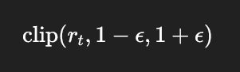
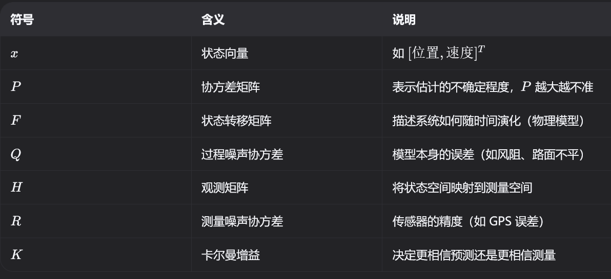

# 算法/处理方式


# 数据平滑与信号处理

## 1\.1线性插值

> 在两个已知点之间，按比例"均匀地过渡"
> 
> 

假设推理每 20ms 产生一个关节目标：

```Plain Text
时刻 0ms:   推理得到目标 = 0.3 rad
时刻 20ms:  推理得到目标 = 0.5 rad
```

200Hz 发布是每 5ms 一次，那中间的 5ms、10ms、15ms 发什么

|时刻|alpha|发送值|说明|
|---|---|---|---|
|0ms|0/20 = 0\.0|0\.3 \+ 0\.0×\(0\.5\-0\.3\) = **0\.30**|用旧目标|
|5ms|5/20 = 0\.25|0\.3 \+ 0\.25×\(0\.5\-0\.3\) = **0\.35**|25%过渡|
|10ms|10/20 = 0\.5|0\.3 \+ 0\.5×\(0\.5\-0\.3\) = **0\.40**|50%过渡|
|15ms|15/20 = 0\.75|0\.3 \+ 0\.75×\(0\.5\-0\.3\) = **0\.45**|75%过渡|
|20ms|20/20 = 1\.0|0\.3 \+ 1\.0×\(0\.5\-0\.3\) = **0\.50**|到达新目标|

```Plain Text
关节位置
0.5 ─ ─ ─ ─ ─ ─ ─ ─ ─ ─ ─ ●  (新推理结果)
0.4 ─ ─ ─ ─ ─ ● ─ ─ ─ ─ ─     
0.3 ● ─ ─ ─ ─ ─ ─ ─ ─ ─ ─     (旧推理结果)
    0ms   5ms  10ms  15ms  20ms
```

对应代码

```C++
// alpha = 距上次推理过了多久 / 一个推理周期(20ms)
const double alpha = std::clamp(dt_ms / 20.0, 0.0, 1.0);

// 在 prev 和 target 之间按比例过渡
js_pos = target_prev + alpha × (target - target_prev);
```

如果不插值

如果 `kPublishInterp = false`，就是 sample\-and\-hold：在新推理到来前，一直重复发旧值：

```Plain Text
关节位置
0.5 ─ ─ ─ ─ ─ ─ ─ ─ ─ ─ ─ ●  (突然跳变)
0.3 ● ─ ─ ─ ─ ─ ─ ─ ─ ─ ─ │
    0ms   5ms  10ms  15ms  20ms
```

电机看到的是**阶梯状**变化，每 20ms 跳一次。


## 1\.2EMA低通滤波

> 新输出 = **一部分新输入** \+ **一大部分旧输出**，让变化变"迟钝"，从而滤掉高频毛刺。
> 
> 

公式

```Plain Text
output = α × input + (1 - α) × prev_output
```

- **α 越大**（接近1）→ 越信任新输入 → 响应快，滤波弱

- **α 越小**（接近0）→ 越信任旧输出 → 响应慢，滤波强

为什么叫"低通"？

- **高频信号**（毛刺、噪声）→ 变化太快，每次被 `(1-α)` 衰减 → **被滤掉**

- **低频信号**（真正的趋势）→ 变化慢，能"传递"过去 → **保留**

**EMA 本质上等价于一个一阶 IIR 低通滤波器**，是工程中最常用的滤波方法之一，因为它只需一行代码、一个历史变量，就能实现有效的平滑。


## 1\.3去零飘

传感器静止时，理论上读数应该是 0，但实际会有一个**小的固定偏移**：

```Plain Text
IMU 角速度:  真实=0, 传感器读数=0.03 rad/s 
电机位置:    真实=0, 编码器读数=0.005 rad   
```

这个偏移叫**零飘（bias/drift）**，原因：温度变化、制造误差、电路噪声。

**如果不处理**：机器人站着不动，策略以为它在转/在动，于是输出补偿动作 → 原地抖动。

处理：

```Plain Text
① 估计零飘：静止时跟踪"传感器读数的平均值"
② 减掉零飘：实际读数 - 估计值 = 真实值
```

代码实现（IMU 角速度为例）

```C++
// α = kImuGyroBiasAlpha = 0.001（非常小的 α，慢速跟踪）

// ① 估计零飘（仅在机器人静止、RL未启动时才更新）
if (!rl_active_) {
    bias += 0.001 × (raw - bias);    // EMA，α极小，缓慢逼近均值
}

// ② 减掉零飘
corrected = raw - bias;
```

为什么用 EMA 估计零飘？

本质上就是 **α 极小的 EMA = 慢速平均器**：

```Plain Text
α = 0.001 时，相当于对最近 ~1000 个样本做加权平均

时刻  传感器读数  bias估计值  去零飘后
1     0.031      0.001      0.030
2     0.029      0.001      0.028
3     0.032      0.002      0.030
...
1000  0.030      0.030      0.000  ← 收敛！bias ≈ 真实零飘
```

|α 值|效果|
|---|---|
|0\.001（极小）|很慢才能收敛，但非常稳定，不会跟踪到真实运动|
|0\.01（小）|几秒收敛，适合静态标定|
|0\.5（大）|很快但会把真实运动也当成零飘 → **错误**|

与低通滤波（LPF）的区别

||去零飘|低通滤波（LPF）|
|---|---|---|
|目标|去掉**直流偏移**（常数误差）|去掉**高频噪声**（毛刺）|
|公式|`bias += α×(raw-bias)`, `out=raw-bias`|`out = α×raw + (1-α)×prev`|
|α|极小（0\.001\~0\.005）|中等（0\.2\~0\.5）|
|类比|校准天平的零点|加减震弹簧|


## 1\.4限幅 Clamp

限幅的作用是：

> **强制一个变量不能超过规定的最大值和最小值。**
> 
> 

例如 RL 策略突然输出：

```Plain Text
目标关节位置 = 4.7 rad
```

但机器人这个关节允许：

```Plain Text
[-1.5, 1.5] rad
```

那么：

```Plain Text
target = std::clamp(target, -1.5, 1.5);
```

结果：

```Plain Text
原始：

4.7 rad

      ↓ clamp

1.5 rad
```

数学上：

$y=min⁡(max⁡(x,xmin),xmax)$


## 1\.5变化率限制 Rate Limiter

变化率限制不是限制：

```Plain Text
值有多大
```

而是限制：

```Plain Text
值变化得有多快
```

例如：

```Plain Text
上一周期：

target = 0.2 rad

这一周期 RL 突然输出：

target = 1.5 rad
```

即使：

```Plain Text
1.5 rad
```

没有超过关节限位，它也可能变化得太猛。

假设规定：

```Plain Text
每个控制周期最多变化 0.05 rad
```

那么：

```Plain Text
RL 输出：

0.2 → 1.5

经过 Rate Limiter：

0.20
 ↓
0.25
 ↓
0.30
 ↓
0.35
 ↓
...
 ↓
1.50
```


这个变化率除了应用在这里，比如ppo本质也是每次更新策略时，不要让新策略和旧策略差得太远，从而提高训练稳定性

PPO\-Clip 的目标函数是


其中



就是把 ratio 限制在一个范围内，所以你乍看这个式子很复杂，其实道理很简单，就是把你的ratio范围限制在clip处理的范围内


## 1\.6死区 Dead Zone

这个也是机器人控制里特别常见的，如果输入非常小，就直接认为它是 0：

```Plain Text
if (std::abs(value) < deadzone)
{
    value = 0.0;
}
```


典型用途：

```Plain Text
遥控器摇杆
速度指令
力传感器
电流传感器
小幅控制误差
```


## 1\.7异常值 / 毛刺剔除

虽然有EMA，但是：**EMA ≠ 异常值检测。**

假设正常数据：

```Plain Text
1.01
1.03
0.99
1.02
```

突然：

```Plain Text
57.3
```

EMA 虽然能减弱它，但这个错误数据依然会进入系统。

所以通常先做：

```Plain Text
Raw Data
    ↓
异常值检查
    ↓
滤波
```


## 1\.8滤波的代价

相位延迟，例如EMA， 它会滞后约 `(1-α)/α` 个周期，RL 的观测一般不重滤——训练时 domain randomization 已经加过观测噪声，部署时滤太狠反而造成分布不匹配（狗子变得"反应迟钝"到策略没见过的程度）


# 时间与数据有效性

我狗子imu和电机的信号大致是这么搞的：

两组数据分别从topic获取，然后复制到栈上分开加锁，然后主进程调用的时候直接加一个双锁，双锁期间数据不变，拷贝好后双锁解锁，两个空间再解锁，（单独加锁的频率和数据频率一样，200hz）

## 2\.1时间门控

用一个时间条件来“卡”住某个动作是否允许执行/是否有效，指"时间差超过阈值就丢弃/不用"，是一种容错保护，不是同步手段


## 2\.2同步写法：快照式同步（scoped\_lock 多锁）


```Plain Text
ImuState imu_snapshot;
MotorRaw motor_snapshot;
{
    std::scoped_lock lock(imu_mutex_, motor_mutex_);   // 同时锁两把
    imu_snapshot  = latest_imu_raw_;                   // 整体拷走
    motor_snapshot = latest_motor_raw_;
}
```

这套同步做了什么：保证取走的是"一组一致的数据"——不会出现读到 IMU 的一半被回调改写、和 Motor 凑成半新半旧的情况。`std::scoped_lock` 同时锁多把 mutex 还顺带避免了死锁（它内部用 deadlock\-avoidance 算法）。


## **2\.3 不同频率的数据，怎么"凑成一组"**


假设现实：IMU 500Hz、电机 200Hz、推理 50Hz。组观测的那一瞬，各条流的"最新值"是这样错开的：


```Plain Text
IMU   ──┬───┬───┬───┬───┬───┬───┬──    500Hz
电机  ─────┬───────┬───────┬───────     200Hz（示意）
              ↑
        组观测的这一瞬：IMU 最新 1ms，电机最新 4ms
        —— 两个"最新"根本不是同一瞬间
```


所以"凑一组"要有层层递进的三条检查：


```C++
bool BuildObservation(Obs& obs) {
    ImuState imu;  MotorRaw motor;
    double imu_age, motor_age;
    {
        std::scoped_lock lock(imu_mutex_, motor_mutex_);
        imu   = latest_imu_raw_;   motor = latest_motor_raw_;
        imu_age   = NowSec() - imu_stamp_;
        motor_age = NowSec() - motor_stamp_;
    }
    // ① 各自新鲜（2.1 的门控）
    if (imu_age > kMaxImuAge || motor_age > kMaxMotorAge) return false;

    // ② 彼此错位不大：一条流堵了、另一条还新鲜，拼起来就是"缝合怪"
    if (std::abs(imu_age - motor_age) > kMaxSkew) return false;   // 比如 5ms

    // ③（可选）要求更高的场合：把电机值沿时间插值到 IMU 的时刻（第 1 章线性插值）
    obs = Pack(imu, AlignTo(motor, /*对齐到*/ imu_stamp_));
    return true;
}
```


**① 各自门控**：任何一条过期，整组作废

\-**② 错位检查（skew）**：IMU 1ms 新、电机 40ms 新，两条各自都在阈值内，但拼出来的状态物理上从未存在过。**组内年龄差**比单查各自年龄更能暴露"单边堵车"；

**③ 插值对齐**：控制场景一般"最新值 \+ ①②"就够；做状态估计 / 滤波融合时，才需要把不同源严格插值到同一时刻。


# 多线程与数据同步


前两章的滤波、插值、时间门控，都发生在"一条数据流"上。但部署代码不是一个 \`while\` 循环——它是好几条**不同频率的线程**在同时跑：这边通信回调刚写入最新的 IMU 数据，那边推理线程正在组观测，发布线程又在等下一个 5ms 到点。

多线程是性能刚需，但只要两个线程同时碰同一块内存，就引出本章的核心问题：**怎么让它们不打架**。


## **3\.1为什么必须多线程**


先看把所有事塞进一个循环会发生什么：

```C++
while (true) {
    收传感器();   // 要等数据到
    推理();       // 一次 5~10ms，GPU 偶尔抖一下就是 30ms
    发布目标();   // 每 5ms 该发一次
    写日志();     // 磁盘卡一下可能几十 ms
}
```


- 推理一卡，200Hz 发布直接断档 → 电机目标 30ms 不更新 → 狗子抽一下；

- 写日志把磁盘卡住，控制断档 → 又抽一下；

- 你在收传感器时没法同时推理，在推理时没法收数据 → 数据堆积或丢帧。

结论一句话：**频率不同的任务、可能阻塞的任务，必须拆到不同线程里**。


部署代码的典型线程分工：

|线程|频率|职责|特点|
|---|---|---|---|
|通信回调|数据到达即触发（500Hz\~1kHz）|收 IMU / 电机数据，写入共享区|必须快进快出|
|推理|50Hz（20ms）|组观测 → 网络前向 → 得到目标角|重计算，耗时有波动|
|发布|200Hz（5ms）|插值 \+ 限幅 \+ 下发|周期必须稳|
|日志 / 参数服务|低频|录数据、响应外部请求|卡了也无所谓|


整体是一条流水线：


```Plain Text
┌────────────┐ latest_imu_   ┌────────────┐ latest_target_   ┌────────────┐
│ 通信回调线程 │ ─(mutex)──→ │  推理线程    │ ──(mutex)────→  │  发布线程    │ ──→ 电机
│ IMU + 电机  │              │  50 Hz      │                 │  200 Hz     │
└────────────┘ latest_motor_ └────────────┘                 └────────────┘
                 数据从左往右流，每一站之间都是一块共享内存
```


数据从左流到右，每一站之间是一块**共享内存**。于是问题来了：两个线程同时读写这块内存，会怎样？


> 顺带一提：回调（callback）本质上也是线程。ROS2 的订阅回调跑在 executor 线程里，两个不同的订阅可能跑在不同线程——这正是代码里 `imu_mutex_` 和 `motor_mutex_` 存在的原因。
> 
> 


## **3\.2 数据竞态：多线程的头号杀手**


**数据竞态（data race）**：两个线程同时访问同一块内存，至少一个是写 → 结果取决于操作系统的调度顺序。


```C++
struct ImuState {
    double gyro[3];    // 24 字节
    double accel[3];   // 24 字节
};                     // 一共 48 字节

// 回调线程：整体写入
latest_imu_raw_ = new_data;

// 推理线程：整体读取
ImuState s = latest_imu_raw_;
```


关键在于：**写 48 字节不是一条指令**。CPU 要分好多次搬运，写完 gyro 还没写 accel 的瞬间，推理线程恰好来读，就会读到"陀螺仪是新的、加速度计是旧的"——半新半旧的数据。


轻则：观测里混进一个不一致的值 → 策略输出偶尔抖一下；

重则：C\+\+ 标准规定数据竞态是**未定义行为（UB）**——编译器优化、乱序执行都可能在毫不知情的情况下把程序搞崩。


## **3\.3 互斥锁 mutex：最基本的同步工具**


mutex（互斥锁）= 一把厕所门锁：第一个到的线程锁门，其他线程在门口排队，出来一个进一个。


C\+\+ 里不要手动 `lock()/unlock()`（忘了 unlock 就死锁了），一律用 RAII 包装，构造时加锁、离开作用域时自动解锁：


|工具|特点|什么时候用|
|---|---|---|
|`std::lock_guard`|最简单，不可中途解锁|默认选择|
|`std::unique_lock`|可以中途 unlock、可移动、可配合条件变量|需要灵活控制时|

\| \`std::scoped\_lock\` \| 一次锁**多把**，内部自动避免死锁 \| 快照式同步（同时锁 imu \+ motor） \|


#### **锁的两条纪律**


**纪律一：粒度最小——锁内只做拷贝，不做计算。**


```C++
// 坏：把整个推理都锁上 —— 回调线程全被堵死，数据收不进来
{
    std::scoped_lock lock(imu_mutex_, motor_mutex_);
    RunInference();          // 几毫秒的重计算占着锁！
}

// 好：锁内拷贝（微秒级），锁外计算
ImuState imu_snapshot;
MotorState motor_snapshot;
{
    std::scoped_lock lock(imu_mutex_, motor_mutex_);
    imu_snapshot = latest_imu_raw_;
    motor_snapshot = latest_motor_raw_;
}
RunInference(imu_snapshot, motor_snapshot);
```


这就是第 2 章"快照式同步"的完整含义：**快照 = 用最小的锁粒度，换一份一致的数据**。锁是"过路费"，临界区越长，堵的车越多。


**纪律二：锁内不做可能阻塞的事。** 打印日志、写文件、\`sleep\`、再等另一把锁——这些放进临界区，等于把高速公路收费站修成了单车道。


## **3\.4 死锁：谁都别想走**


两个线程以**相反的顺序**抢两把锁，就会互相等到天荒地老：


```Plain Text
线程 A                          线程 B
lock(imu_mutex_)    ✓
                   lock(motor_mutex_)   ✓
lock(motor_mutex_)  …等待B
                   lock(imu_mutex_)     …等待A
                   ← 两个都在等对方手里的锁：死锁
```


死锁要同时满足四个条件才会发生：**互斥、持有并等待、不可剥夺、循环等待**。打破任何一个就破功，工程上最常用的两招：


1\. **固定加锁顺序**：全项目规定"永远先锁 imu 再锁 motor"，循环等待就不可能出现；

2\. **std::scoped\_lock 一次拿全**：它内部用的是"拿不到就先放手重试"的策略（deadlock\-avoidance 算法），从根上绕开死锁——这也是快照式同步选它而不是手动连开两把 \`lock\_guard\` 的原因。


## **3\.5 "最新值"模式 vs "队列"模式**


线程之间传数据，有两种基本形态，选错形态是很多设计问题的根源。


||最新值模式（snapshot）|队列模式（queue）|
|---|---|---|
|数据结构|单个变量 \+ mutex|队列 / 环形缓冲|
|消费者拿什么|只拿最新的一份|从队头逐条取|
|旧数据|直接被覆盖丢弃|排队等着被处理|
|积压风险|没有|有（得配丢帧策略）|
|适用场景|控制回路：观测、目标|视觉帧处理、指令解析、日志|


为什么控制链路用最新值：控制在乎的是"**现在**"。300ms 前的观测不但没用，还有害——喂给策略等于凭空加大了延迟（策略以为世界停在过去）。所以推理线程永远只读最新快照，发布线程也永远只关心最新目标，旧的一律作废。


视觉恰好相反：每一帧都承载独立信息，丢了就少一次检测机会，所以要排队慢慢处理。


**RL 类比**（你们应该已经猜到了）：


\- 最新值模式 ≈ **on\-policy**：数据过期就没了价值，直接扔，永远用"当前策略当前状态"的数据；

\- 队列模式 ≈ **off\-policy \+ replay buffer**：旧数据也有信息量，先存起来，慢慢消化。


PPO 是前者，SAC 是后者


## **3\.6 std::atomic：小数据的免锁方案**


一个 `bool` 开关、一个计数器，为它上锁太亏（一次加锁解锁几十纳秒起步，还可能排队）。这就是 `std::atomic` 的地盘：


```C++
std::atomic<bool> rl_active_{false};

rl_active_.store(true);              // 写
if (rl_active_.load()) { ... }       // 读
```


原子的含义就是"不可分割"：别的线程永远不会看到"写了一半"的值。


两条使用边界：


1\. **atomic 只保证这一个变量自身**。如果你有"时间戳 \+ 数据"两个 atomic 分开写，读的线程仍可能读到"新时间戳配旧数据"——**一组必须配套的数据，还是要 mutex 快照**；

2. 内存序（memory\_order）入门阶段不用纠结：默认的 `seq_cst`（顺序一致）永远是对的；性能敏感的简单 flag 用 `relaxed` 也够，知道有这回事即可。

选型口诀：**单个、独立、小的值 → atomic；一组要一致的数据 → mutex 快照。**


## **3\.7 优先级反转与实时调度**


1997 年，火星探路者（Mars Pathfinder）着陆几天后开始反复重启，NASA 远程排查了好几天才找到原因——**优先级反转**：


```Plain Text
低优先级线程（气象数据）：持有一把共享数据的锁
高优先级线程（总线管理）：等这把锁           ← 被卡住
中优先级线程（通信）：    不碰锁，但抢占了低优先级
                        ← 高优先级被中优先级"间接"卡死
```


高优先级理应"谁也拦不住"，却因为等一把锁被中优先级挡在门外——优先级被反转了。解法是**优先级继承**：低优先级线程持有锁期间，临时"继承"等锁者的优先级，压过中优先级，尽快把锁放出来。VxWorks 打开一个开关就修好了。


对我们部署代码的启示：


- 给发布/推理线程设置实时调度策略（Linux 下 `pthread_setschedparam` 用 `SCHED_FIFO` \+ 优先级），让控制永远压过日志、网络等杂务；

- 可以把实时线程绑到隔离的 CPU 核（CPU 亲和性），不被系统其他进程干扰；

\- **权力越大责任越大**：一个写错的 \`SCHED\_FIFO\` 死循环线程可以把整台机器锁死到连 SSH 都登不上去——实时线程里绝不能有忙等和不确定的阻塞。


# 系统安全与容错

## 4\.1看门狗

**看门狗就是专门盯着程序/系统有没有“死掉”的机制。**
如果程序长时间没有证明“我还活着”，看门狗就认为程序出问题了，然后执行重启、复位或恢复操作

假设机器人主程序正常情况下会一直循环：

```Plain Text
while (true)
{
    // 读取传感器
    read_sensor();

    // 计算控制
    control();

    // 控制电机
    send_motor_cmd();

    // 告诉看门狗：我还活着
    feed_watchdog();
}
```

但是程序突然卡死：

```Plain Text
程序正常
   ↓
喂狗
   ↓
程序卡死 / 死循环 / 阻塞
   ↓
不再喂狗
   ↓
1 秒
   ↓
2 秒
   ↓
Watchdog Timeout
   ↓
重启程序 / 重启设备 / MCU Reset
```


## **4\.2 主状态机**


先解决一个工程问题：怎么管理"机器人在什么模式"？


新手写法是一堆 bool：`rl_active_`、`standing_`、`damping_`、`error_`……四个 bool 有 16 种组合，其中一半是根本不该存在的状态（又阻尼又站立？）。bool 之间没有互斥约束，早晚组合出怪物。


正解是**状态机**：任意时刻只在**一个**状态，切换只能走定义过的边。

```Plain Text
上电默认
          │
          ▼
      ┌──────┐  遥控:站立   ┌──────┐  遥控:启动RL   ┌──────┐
      │ DAMP │ ──────────→ │ STAND│ ──────────→  │  RL  │
      └──────┘ ←────────── └──────┘ ←──────────  └──────┘
          ▲     遥控:趴下          缓动退出(遥控:停止)
          │
          └─── 任何状态下：急停 / 倾倒 / 失联 / NaN / 电机故障 ───┘
```


每个状态对应的电机命令：

|状态|发给电机什么|物理效果|
|---|---|---|
|DAMP（阻尼）|kp=0、kd=大，目标 = 当前位置|软趴下，关节像有阻尼的铰链|
|STAND（站立）|PD 跟踪默认站姿|站起来待命|
|RL（策略）|策略输出（经插值/限幅）|正常运动控制|


代码骨架：

```C++
enum class RobotState { DAMP, STAND, RL };

RobotState state_ = RobotState::DAMP;   // 上电默认 = 最安全的那个状态

void UpdateState() {
    switch (state_) {
        case RobotState::DAMP:
            if (rc_cmd_stand && all_ok_) TransitionTo(RobotState::STAND);
            break;

        case RobotState::STAND:
            if (!all_ok_)                 TransitionTo(RobotState::DAMP);
            else if (rc_cmd_rl)           TransitionTo(RobotState::RL);
            break;

        case RobotState::RL:
            if (!all_ok_ || fallen_)      TransitionTo(RobotState::DAMP);
            else if (!rc_cmd_rl)          TransitionTo(RobotState::STAND);
            break;
    }
}
```


三条设计要点：


1\. **默认状态是最安全的那个**。上电即 DAMP——不是"上电待命"，是"上电就已经趴好了"；

2. `all_ok_` 是所有检测项的总和（本章后面的看门狗、姿态保护、失联检测……全都是在往这个 bool 里加条件）；

3\. 所有错误路径**殊途同归**：不管从哪个状态、因为什么原因出错，都回到 DAMP。错误处理不需要花样，需要的是统一。

代码里的 `rl_active_` 本质上就是一个两态版（RL / 非 RL）的迷你状态机。


## **4\.3 姿态保护**


狗子被绊倒、踩空、被外力掀翻时，策略经常不仅不能自救，还会在异常姿态下疯狂输出（它从没在训练里见过自己横躺着——虽然域随机化能缓解一些，但不能指望）。所以需要一层独立于策略的判断。

用的量策略观测里就有——**重力投影**（IMU 姿态解算出的重力方向在机体坐标系的向量）：


```Plain Text
直立时 ≈ (0, 0, -1)   → xy 分量模长 ≈ 0
横躺时 ≈ (±1, 0, 0)   → xy 分量模长 ≈ 1
```


```C++
const double tilt = std::hypot(gravity_proj[0], gravity_proj[1]);

if (tilt > kFallThreshold) {     // 0.75 ≈ 倾角约 49°
    fallen_ = true;              // → 状态机据此切 DAMP
}
```

在检测线程里面按照一定频率接受imu信号并计算是否倾倒，若是直接发送信息由主进程进行处理

（当然，后面狗子如果有倾倒恢复这些不用管他）


# 状态估计


## 5\.1卡尔曼滤波中的“一阶”和“二阶”

在实际工程中，经常会听到：

```Plain Text
一阶卡尔曼滤波
二阶卡尔曼滤波
```

这里的“阶”通常可以理解为：

> **我们使用多少层运动状态来描述系统。**
> 
> 

例如研究一个物体的位置：

**一阶卡尔曼**

最简单的情况，只关心位置：

$x_k= \begin{bmatrix} p_k \end{bmatrix}$

其中 p 表示位置。

假设认为：

> 下一时刻的位置 ≈ 上一时刻的位置
> 
> 

那么：

$p_k=p_{k-1}+w_k$

写成卡尔曼滤波的形式：

$x_k=Fx_{k-1}+w_k$

其中：

$F= \begin{bmatrix} 1 \end{bmatrix}$

如果传感器直接测量位置：

$z_k=p_k+v_k$

那么：

H=\[1\]

也就是：

```Plain Text
状态：
x = [位置]

预测：
下一时刻位置 ≈ 当前的位置
```

这种模型非常简单。

如果传感器的数据本身变化比较慢，例如：

```Plain Text
温度
压力
高度
某个缓慢变化的传感器值
```

就可以使用这种简单模型。


**二阶卡尔曼：同时估计位置和速度**

如果物体正在运动，仅仅知道“当前位置”通常不够。

例如：

```Plain Text
t = 0s   位置 = 0m
t = 1s   位置 = 1m
```

如果知道物体速度是：

v=1m/s

那么我们就可以预测：

t=2s

物体大概会出现在：

p=2m

因此可以把状态定义为：

$x= \begin{bmatrix} p\\ v \end{bmatrix}$

也就是：

```Plain Text
状态 = [位置, 速度]
```

假设物体做匀速运动：

$p_k=p_{k-1}+v_{k-1}\Delta t$

$
v_k=v_{k-1}$

写成矩阵：

$\begin{bmatrix} p_k\\ v_k \end{bmatrix} = \begin{bmatrix} 1 & \Delta t\\ 0 & 1 \end{bmatrix} \begin{bmatrix} p_{k-1}\\ v_{k-1} \end{bmatrix}$

所以：

$
F= \begin{bmatrix} 1 & \Delta t\\ 0 & 1 \end{bmatrix}$

这就是非常经典的**匀速模型（Constant Velocity Model）**。


## 5\.2卡尔曼滤波

卡尔曼滤波是一个递归过程，主要包含两个步骤：

**预测阶段 \(Predict\)**

根据上一时刻的状态和系统的物理规律（运动模型），推算出当前时刻的状态。

- **输入**：上一时刻的最优估计 $\hat{x}_{k-1}$

- **输出**：当前时刻的先验估计$ \hat{x}_{k|k-1}$（即“猜”出来的值）。

- **特点**：随着时间推移，由于模型误差的存在，我们的“不确定性”会增加。

**更新阶段 \(Update\)**

利用当前时刻传感器的实际观测值，对预测值进行修正。

- **输入**：传感器的测量值$ z_k$。

- **输出**：当前时刻的后验估计$ \hat{x}_{k|k}$（即“修正”后的值）。

- **特点**：引入了新信息，不确定性通常会降低。

---

假设系统是线性的，且噪声服从高斯分布。



五大公式

第一步：预测

1. **状态预测**：$\hat{x}_{k|k-1} = F_k \hat{x}_{k-1|k-1} + B_k u_k
$

$F_k
$:状态转移矩阵

$B_ku_k
$:外部指令

$\hat{x}_{k-1|k-1}$：上一时刻的最优结论

$\hat{x}_{k|k-1}
$：先验估计


2. **协方差预测**（不确定性传播）： $P_{k|k-1} = F_k P_{k-1|k-1} F_k^T + Q_k
$

$ P_{k-1|k-1}$：上一时刻对结论的不确定性

$F_k P_{k-1|k-1} F_k^T$：不确定性会随着模型传递

$Q_k
$:过程噪声

$P_{k|k-1}$:先验协方差


第二步：更新

3. **计算卡尔曼增益**：$K_k = P_{k|k-1} H_k^T (H_k P_{k|k-1} H_k^T + R_k)^{-1}
$

    - 如果 R 很小（传感器准），K 变大，更多信任测量；如果 P 很小（预测准），K 变小，更多信任预测，K是一个**权重系数**

    $P_{k|k-1}
$：预测的不确定性。如果 P 很大，说明估计的差的很远

    $R_k$: 传感器测量噪声

    $H_k
$: 观测矩阵，把状态空间映射到测量空间

    

4. **状态更新**：

    $\hat{x}_{k|k}=\hat{x}_{k|k-1}+K_k(z_k
-H_k\hat{x}_{k|k-1})$

    $z_k
-H_k\hat{x}_{k|k-1}

$称为**新息（Innovation）**，即测量值与预测值的差。

    $z_k$：传感器实际读到的数据

    $H_k\hat{x}_{k|k-1}$：将估计的值通过**观测矩阵**转成传感器的维度

    $K_k
$×** 残差**：根据信任度 K，决定要修正多少

    

5. **协方差更新**： 

$P_{k|k}=(I-K_kH_k)P_{k|k-1}$

I:单位矩阵

$(I-K_kH_k)
$:这是一个小于 1 的系数（因为 KK*K* 和 HH*H* 都是正数相关的）

$P_{k|k}$:这是**后验协方差**，即修正后的不确定性


所以总体流程就是：

所以就是1预测，2计算预测的准确性，3算加传感器信息的权重，4根据3的权重和传感器数据更新预测，5算更新后的预测的准确性


## 5\.3扩展卡尔曼

标准的卡尔曼滤波有一个致命的限制：**它假设系统是线性的**

但是实际上更多的情况是非线性的

**EKF 的核心思想就是：既然整体是非线性的，那我们就在每一个瞬间把它“近似”成线性的，用到的就是泰勒展开与雅可比矩阵**

在 EKF 中，我们用雅可比矩阵$ F_j $和$H_j 
$来代替标准 KF 中的线性矩阵F和H 


第一步：预测 \(Predict\)

1. **状态预测**： $\hat{x}_{k|k-1} = f(\hat{x}_{k-1|k-1}, u_k) $

    - **KF**: （线性乘法）$\hat{x} = F \hat{x} + B u$

    - **EKF**: $\hat{x} = f(\dots)$（直接代入**非线性函数**计算）

2. **协方差预测**： $ P_{k|k-1} = F_j P_{k-1|k-1} F_j^T + Q_k $

    - **KF**: 使用固定的线性矩阵 F 。

    - **EKF**: 使用**雅可比矩阵 **$F_j$。$F_j$是非线性函数 f 对状态 *x* 求偏导得到的矩阵。


第二步：更新 \(Update\)

3. **计算卡尔曼增益**： $K_k = P_{k|k-1} H_j^T (H_j P_{k|k-1} H_j^T + R_k)^{-1}$

    - **KF**: 使用固定的观测矩阵 H。

    - **EKF**: 使用**雅可比矩阵 **$H_j$。$H_j$是非线性观测函数 h 对状态 x 求偏导得到的矩阵。


4. **状态更新**： $\hat{x}_{k|k} = \hat{x}_{k|k-1} + K_k (z_k - h(\hat{x}_{k|k-1}))$

    - **KF**: $z - H \hat{x}$

    - **EKF**:$z - h(\hat{x})$（同样代入**非线性函数**计算预测的测量值）

5. **协方差更新**： $P_{k|k} = (I - K_k H_j) P_{k|k-1} $

    - 这里依然使用雅可比矩阵 $H_j$。


## 5\.4雅可比矩阵

**雅可比矩阵**可以理解成：

> 多变量函数的“导数矩阵”。
> 
> 

普通导数是针对一个变量的，比如：

$y = x^2 
$

它的导数是：

$\frac{dy}{dx} = 2x$

表示：`x` 变化一点，`y` 大概变化多少。

但是在 EKF 里，状态通常不是一个数，而是一组数，比如机器人状态：

$x = \begin{bmatrix} 位置x \\ 位置y \\ 角度\theta \end{bmatrix} $

函数输出也可能是一组数，所以就需要一个矩阵来描述“每个输入变量对每个输出变量的影响”，这个矩阵就是**雅可比矩阵**。


**在 EKF 里它干什么？**

EKF 面对的是非线性函数：

$x_k = f(x_{k-1}, u_k) $

但是卡尔曼滤波的协方差传播需要线性矩阵：

$P = FPF^T + Q $

所以 EKF 就在当前状态附近，把非线性函数近似成线性的。

也就是：

$F_k = \frac{\partial f}{\partial x} $

这个 `F_k` 就是状态转移函数 `f` 的雅可比矩阵。

观测函数也是一样：

$z_k = h(x_k) $

对应的雅可比矩阵是：

$H_k = \frac{\partial h}{\partial x} $


```Plain Text
F_k：状态转移函数 f 的雅可比矩阵
H_k：观测函数 h 的雅可比矩阵
```

它们的作用就是：**让非线性系统在当前点附近临时变成一个线性系统，从而继续套用卡尔曼滤波的公式。**


