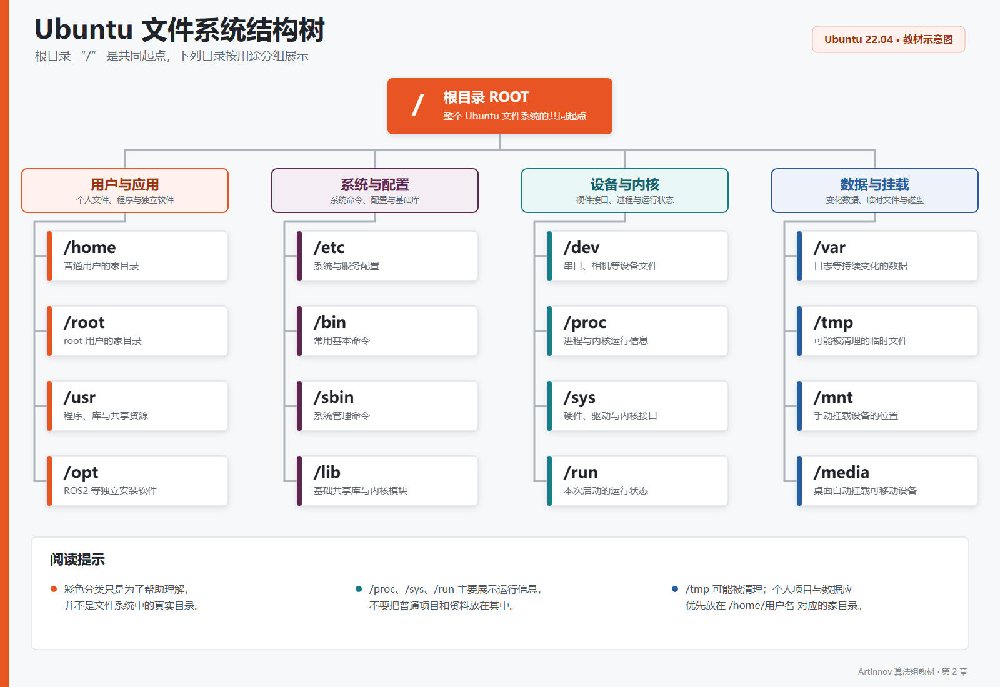

# 第2章 开发环境搭建 

**开始头疼喽宝宝们。**

 

上一章我们讲解了什么是上位机、下位机，也知道了算法组主要负责的就是上位机。
本章主要来讲解进行上位机开发前的准备工作和算法组开发需要的操作系统ubuntu、ROS2、Git等等。

机器人程序并不是只要“代码写对了”就能运行。操作系统版本、编译器、Python 依赖、设备权限和网络配置中的任何一项不一致，都可能让同一份代码在不同电脑上表现出完全不同的结果。

因此，开发环境不是正式开发之前随便应付的一道准备工作，而是机器人系统的一部分。本章将从一台尚未安装 Linux 的计算机开始，搭建能够学习 ROS2、编译 RC2026 工程并连接真机设备的 Ubuntu 开发环境。

> 本章统一使用**原生 Ubuntu 22.04 LTS**，不讲解虚拟机和 WSL。Windows 只用于制作 Ubuntu 启动盘。RC2026 项目采用 ROS2 Humble，它的官方目标平台就是 Ubuntu 22.04；不要因为 Ubuntu 24.04 或 26.04 数字更大，就擅自更换系统版本。

## 2.1.1 本教材的环境基线

本教材与 RC2026 项目采用以下环境：

| 项目 | 统一版本或选择 | 说明 |
| --- | --- | --- |
| 操作系统 | Ubuntu 22.04 LTS 64 位 | 代号 Jammy Jellyfish |
| ROS | ROS2 Humble Hawksbill | 与 Ubuntu 22.04 配套的长期支持版本 |
| 终端 Shell | Bash | Ubuntu 默认 Shell |
| Python | Python 3.10 | Ubuntu 22.04 自带版本 |
| C/C++ 编译器 | Ubuntu 22.04 仓库提供的 GCC/G++ | 不自行替换系统编译器 |
| 构建工具 | CMake、colcon | 分别用于 C/C++ 与 ROS2 工作空间构建 |
| 主要语言 | Python、C++ | 对应项目中的算法节点和底层模块 |
| 项目平台 | x86_64/amd64 | RC2026 真机使用 AMD 小主机 |

ROS2 的发行版与 Ubuntu 版本通常是一一对应的。对新生而言，最重要的原则是：

> **先按照项目确定 ROS2 版本，再选择它支持的 Ubuntu 版本。**

截至本章编写时，ROS2 Humble 的官方支持周期到 2027 年 5 月。RC2026 项目已经基于 Humble 开发和验证，因此本教材继续使用这套组合。未来项目整体迁移时，应由团队统一升级，而不是由每位成员自行选择版本。**注:后继的算法组需注意，换系统版本时需要考虑ROS版本支持以及当前生态，不然就等着啥开源啥资料都没有全部自己纯手搓吧**
## 本章学习目标 
- 了解什么是Ubuntu系统，ROS2 
- 尝试使用ubuntu系统并在系统上下载ROS2和vscode 
- 掌握 Git 的基本版本管理和团队协作流程

## 2.1.2 什么是Ubuntu操作系统 
**英文名：Ubuntu** 

中文名：乌班图 


**[Ubuntu](https://baike.baidu.com/item/Ubuntu/155795)是Linux的一个发行版系统**，我们平时电脑用的windows、手机上的ios/Android这些都是属于操作系统，如果计算机没有操作系统，那它将会连开机画面都看不到。而我们现在使用的ubuntu是什么呢，它是Linux阵营里面最出名的发行版（Linux是发动机内核，而Ubuntu是一台装好方向盘的整车，可以立刻就使用）；平常大家在电影电视剧看到的黑客或者技术大能，他们使用的系统大多也是Linux内核，除了ubuntu，其他发行版还有Arch,Mint,Kail等等。

**这个就是我们需要安装在上位机设备里面的一个操作系统了。**
## 2.1.3 为什么使用Ubuntu 
- Ubuntu是一个Debian系分支的第一大系统，是当前用户量最大的linux发行版。因此，遇到任何问题一般都能够在用户社区askubuntu中得到解答。它的安装也非常的方便，并且在更新到20.04后，ubuntu的桌面美观性也有提升。

- Linux下开发C++程序相比Windows有无与伦比的优势，可以方便的配置各种第三方库和依赖。常言道python好用是因为有大量开箱即用的第三方库，可以轻松通过pip安装，而Linux下通过yum/apt/pacman等包安装软件管理的软件包，实际上就是C/C++隐藏的库安装/管理利器！apt是Debian系发行版用于管理第三方库的一个软件，负责管理系统中安装的各类软件包，开发包，依赖库。可以通过apt轻松地安装各种软件（可执行文件）、开发库（头文件headers，.so动态链接库等。如果你曾经在Visual Studio中为项目配置繁杂的头文件、链接库路径等依赖，你一定会爱上Linux下用cmake管理c++环境的开发方式。

- Linux的内核和上层系统都比Windows更加精简，故在运行时占用的各类资源都要小于Windows。在不打开任何应用的情况下，笔者的电脑在运行Windows11时占用的内存为4.2G，cpu占用率在10-20%左右，而运行Ubuntu20.04LTS的时候，只使用了2.2G的内存，cpu占用率只有10%不到。这样，在运行我们的视觉算法程序时，可以更充分地利用系统资源，最大程度压榨电脑的性能。（甚至可以在测试结束后实际运行时关闭图形界面，只保留终端！这样，系统内核作为唯一需要运行的基础程序，大概能将cpu占用率缩小到1-5%）。对于小车运行时cpu占用率拉满的情况下是比较友好的。

- Linux对于深度学习的支持比Widnows更加友好，经常有sh脚本能够一键配置开发环境。此外Linux对一些设备驱动的支持也更完善，我们可以选择挂载自己需要的驱动和IO，并且精简属于自己的内核，增加实时性补丁等。
- Ubuntu相对于windows，更适合程序员/极客/开发者进行各种开发，说白了ubuntu就是个毛坯房（windows是精装房），你想要什么装修自己动手，相对于自由度更高，对系统的掌控性更高；**且最重要的一点是我们开发时需要的ROS2最优的适配系统就是Ubuntu。** 

## 2.1.4 如何安装ubuntu 
自己看[这](#%20广美视觉组培训之一：双系统安装及ubuntu深度学习环境配置（windows.md/)（我已经不想帮任何一个人安装ubuntu了，我今年已经装了十次以上了，什么叫一台电脑我装了三次这系统）

 

本教材统一使用原生 Ubuntu 22.04 LTS，不讲解 WSL2 和虚拟机。算法组开发机可以安装 Ubuntu 双系统，真机上位机则建议使用独立硬盘或专用设备安装 Ubuntu。原生系统能够直接访问相机、串口、雷达、网络和 GPU，也最接近最终部署环境。**这个必须要学会！！！**
## 2.1.5 第一次启动

安装完成并重新启动后。打开终端的快捷键是：

```text
Ctrl + Alt + T
```

先确认系统版本和处理器架构(在终端输入以下)：

```bash
lsb_release -a
uname -m
```

期望看到：

- Ubuntu 版本为 `22.04`；
- 代号为 `jammy`；
- 架构为 `x86_64`。

如果版本不符，应当在安装 ROS2 和其他依赖之前解决。不要抱着“先装一下试试”的想法继续堆叠错误环境。
完成后你就可以慢慢探索这个系统了。

**“Linux的设计哲学是‘一切皆文件’。它将许多 I/O 设备，如网络接口、USB 设备、相机、键盘和鼠标，统一表示为可以访问的文件或接口。”** 这句话概括了 Linux 的一个核心特点。比如，串口转接器可能显示为 `/dev/ttyUSB0`，相机可能显示为 `/dev/video0`，读取鼠标设备文件 `/dev/input/mouse0` 就可以获得鼠标传入的移动数据。程序通常通过**打开、读取、写入和关闭**这些接口与设备交互。这样可以简化操作系统，也简化开发操作。

windows操作系统就像把资源藏起来，仅在有限的范围内限制你的操作；而linux则是把所有资源摊开给你任意进行操作，所以用多了你会爱上这个系统的喵。
自由度be like: 

 

## 2.1.6 目录和文件 
刚刚跟同学们说了“Linux设计哲学是一切皆文件”，接下来就介绍一下Ubuntu的文件结构吧。 

Linux系统的文件结构不像win那样分C盘D盘，而是像一棵大树一样。所有文件均挂载在唯一的根目录（root）`/`下，无论你挂多少个硬盘都挂载在根目录的文件夹下,根目录是整个系统文件的起始点，所有目录都是从根目录衍生出来，就像一棵树的树干上生长的树枝和叶子。Linux不按“硬件”分盘，按“功能”归类。 

| 目录 | 目录名 | 作用 |
| --- | --- | --- |
| `/` | 根目录 | 整个文件系统的起点，所有目录都从这里开始 |
| `/home` | 用户主目录 | 存储普通用户的家目录，例如 `/home/student` |
| `/root` | root 用户目录 | 最高权限用户 root 的家目录，普通用户一般不能访问 |
| `/bin` | 基本命令目录 | 存放 `ls`、`cp`、`mv` 等系统基本命令 |
| `/sbin` | 系统管理命令目录 | 存放主要用于系统管理的命令 |
| `/lib` | 系统库目录 | 存放基础共享库和内核模块 |
| `/usr` | 用户程序目录 | 存放大多数系统程序、库文件和共享资源 |
| `/opt` | 可选软件目录 | 存放独立安装的大型软件，ROS2 默认位于 `/opt/ros/humble` |
| `/etc` | 系统配置目录 | 存放系统和服务配置，例如 udev 设备规则，修改相机规则就可在这修改，以及内核参数，用户信息，IP映射 |
| `/dev` | 设备文件目录 | 将硬件表示为文件，例如串口 `/dev/ttyUSB0`、相机 `/dev/video0`，调用USB口与下位机进行信息交换就需要用到 |
| `/var` | 可变数据目录 | 存放运行中不断变化的数据，例如系统日志 |
| `/tmp` | 临时文件目录 | 存放临时文件，系统可能在重启时清理其中内容 |
| `/mnt` | 临时挂载目录 | 手动挂载硬盘、U 盘等存储设备时常用 |
| `/media` | 可移动设备目录 | 桌面环境自动挂载 U 盘等可移动存储设备的位置 |
| `/run` | 运行时数据目录 | 存放系统启动后产生的进程和服务运行状态 |
| `/proc` | 进程信息目录 | 提供正在运行的进程和内核状态信息的虚拟文件系统 |
| `/sys` | 系统设备信息目录 | 提供硬件设备、驱动和内核信息的虚拟文件系统 | 

[](picture1/ubuntu文件系统结构树.svg)

如果找不到就点显示隐藏文件即可。
在开发过程中了解和熟知文件和设备的文件路径是非常重要的事，在开发过程中我们时常需要利用到计算机内的文件（不管是设备还是代码还是资源），调用的文件路径写错了就会导致无法使用某个设备或是文件。

### 绝对路径和相对路径 
这两个词会在开发的过程中经常用到，简单来说，“路径”就是指某某文件的存放位置，例如你要找一张图片，图片存放在`/home/视觉组教程/picture/图片.jpg`这些就是文件路径，说的就是这张图片存放在/home目录下的“视觉组教程”文件夹里面，也可以特指的是整个文件系统里的该图片文件，计算机就会根据你提供的这个路径来找到这个图片。

**绝对路径**：就是从根目录开始算起的路径，也叫完整路径。（/home/视觉组教程/picture/图片.jpg）<-这个就是绝对路径

**相对路径**：就是相对于当前工作目录计算的路径。假设终端当前位于“视觉组教程”文件夹，需要访问其中的图片，可以写成 **`./picture/图片.jpg`**。需要注意，Shell 只关心当前工作目录，并不知道你在编辑器中打开了哪个文件；程序中的相对路径同样取决于程序启动时的工作目录。

说白了，以 `/` 开头的是绝对路径，不以 `/` 开头的通常是相对路径。相对路径书写方便，但工作目录变化后可能失效；在 ROS2 项目中，还会使用配置文件、环境变量和功能包资源路径，不能一律认为相对路径更好。

相信大家在刚刚注意到了，在写相对路径时我前面加了个“.” 

**“.”表示的就是当前目录**，告诉计算机从终端当前所在的目录开始计算，可以用“./”表示，一般用于在当前文件夹下查找、定位或执行程序。

**“..”表示的就是上一层目录**，告诉计算机从“视觉组教程”这个目录的上一级目录”/home“开始计算，可以用“../”表示，一般用于跨文件夹查找定位。

第一次看见也不必觉得困难，在实际开发时写多了就会了。

## 2.1.7 终端命令行 
讲完了 Ubuntu 大概的知识，不得不来给同学们介绍一下**终端命令行**了。在 Linux 上进行开发经常会使用命令行，有些程序甚至只提供命令行接口（也就是没有我们平时使用的软件那样的图形UI界面）。我们即将学习的 ROS2 核心功能主要通过命令行启动和检查，同时也有 RViz2、rqt 等图形工具。在很多时候，直接在命令行中输入命令，会比进行数不清的鼠标点击更快、更容易重复。

**终端（Terminal）** 就是那个黑色窗口，也是影视作品中低客的黑调敲指令时经常出现的界面。终端本身主要负责接收键盘输入和显示输出；**Shell** 则是在终端中解释并执行命令的程序，Ubuntu 默认使用的 Shell 是 Bash。相信大家在刚刚安装 Ubuntu 时已经使用过它了。

 

你可以在终端里面通过输入命令来操作电脑，可以用来通过命令启动机器人，修改文件，修改环境，和远程操作机器人调试（SSH）
接下来就开始来学习一下命令行的使用吧喵。

### 2.1.7.1 使用终端

打开终端后，可能会看到类似这样的提示符：

```text
student@r2-upper:~/Projects$
```

其中：

- `student` 是当前用户名；
- `r2-upper` 是计算机名；
- `~/Projects` 是当前所在目录；
- `$` 表示当前是普通用户。

教材或网络教程有时会在命令前写 `$`，它只是提示符，**不需要跟着命令一起输入**。

几个常用快捷键：

| 快捷键 | 作用 |
| --- | --- |
| `Tab` | 自动补全命令或路径 |
| `↑`、`↓` | 浏览之前执行过的命令 |
| `Ctrl+C` | 停止当前正在运行的程序 |
| `Ctrl+L` | 清空终端画面 |
| `Ctrl+Shift+C` | 复制终端中的文本 |
| `Ctrl+Shift+V` | 向终端粘贴文本 |

### 2.1.7.2 常用命令

不需要一开始就背下所有 Linux 命令，先掌握下面这些最常用的命令即可：

| 命令 | 作用 | 示例 |
| --- | --- | --- |
| `pwd` | 显示当前所在目录 | `pwd` |
| `ls` | 查看目录中的文件 | `ls` |
| `ls -al` | 查看详细信息和隐藏文件 | `ls -al` |
| `cd` | 切换目录 | `cd ~/Projects` |
| `cd ..` | 返回上一级目录 | `cd ..` |
| `cd ~` | 返回当前用户家目录 | `cd ~` |
| `mkdir` | 创建目录 | `mkdir logs` |
| `touch` | 创建空文件 | `touch test.txt` |
| `cp` | 复制文件 | `cp a.txt b.txt` |
| `mv` | 移动文件或重命名 | `mv old.txt new.txt` |
| `rm -i` | 确认后删除文件 | `rm -i test.txt` |
| `cat` | 显示较短的文本文件 | `cat README.md` |
| `nano` | 在终端中编辑文本 | `nano test.txt` |
| `clear` | 清空终端画面 | `clear` |

通过一个小练习认识这些命令：

```bash
mkdir -p ~/rc_course/cli_demo
cd ~/rc_course/cli_demo
pwd

touch status.txt
ls -al
nano status.txt
cat status.txt

cp status.txt status_backup.txt
mv status_backup.txt robot_status.txt
ls
``` 

在 Nano 中：

- 按 `Ctrl+O` 保存；
- 按 `Enter` 确认文件名；
- 按 `Ctrl+X` 退出。

在上面的命令中你们会注意到`mkdir`、`ls`后面会有`-p  -al`这些叫做**命令选项**，相当于告诉杠前面的命令`mkdir`或`ls`要执行他们的哪个具体功能，可以通过在命令后加`--help`查看可用的功能，`mkdir --help`就可以看到官方文档对-p的详细英文解释了。

删除练习文件：

```bash
rm -i robot_status.txt
```

`rm` 删除的文件通常不会进入桌面回收站。删除前应先使用 `pwd` 和 `ls` 确认当前目录与目标文件，不要直接执行来源不明的递归删除命令。

### 2.1.7.3 apt、sudo 

Ubuntu 使用 `apt` 管理软件包：

```bash
sudo apt update
apt search cmake
sudo apt install cmake
sudo apt remove cmake
```

- `apt update`：刷新软件包列表；
- `apt search`：搜索软件；
- `apt install`：安装软件；
- `apt remove`：卸载软件；
- `sudo`：临时使用管理员权限执行命令。

输入 `sudo` 密码时，终端不会显示星号或圆点，这是正常现象。普通项目的编译和运行不应该使用 `sudo`。


### 2.1.7.4 查看帮助与安全习惯

忘记命令用法时，可以查看帮助：

```bash
ls --help
man ls
```

在 `man` 页面中按方向键滚动，按 `q` 退出。

使用终端时应养成以下习惯：

1. 使用 `Tab` 补全路径，减少拼写错误。
2. 删除或移动文件前先执行 `pwd` 和 `ls`。
3. 不执行自己看不懂的 `sudo` 命令。
4. 路径中包含空格时使用引号，例如 `cd "my project"`。
5. 出现报错时保留完整命令和完整错误信息。

#### 本节练习

1. 在家目录中创建 `rc_course` 文件夹并进入该目录。
2. 创建一个名为 `hello.txt` 的文件。
3. 使用 Nano 写入一行文字，再使用 `cat` 查看。
4. 将它复制为 `hello_backup.txt`。
5. 将备份文件重命名为 `hello_robot.txt`。
6. 使用 `pwd` 写出当前目录的绝对路径。
7. 使用 `rm -i` 删除练习文件。

完成后，只要能够说清楚“我现在在哪个目录、这里有什么文件、命令将操作哪个目标”，就已经具备继续学习 Ubuntu 和 ROS2 的基础了。

面对这么多的命令无需慌张，熟能生巧，用多了就自然会了，不必刻意记住。

更多命令可以查看[这个](https://www.runoob.com/linux/linux-command-manual.html)。


## 2.2 ROS2简述 


[**ROS**](https://www.bilibili.com/video/BV1tE4m1d7Ug?spm_id_from=333.788.videopod.sections&vd_source=87cfe25a7284224376571df9d2b6504a) （Robot Operating System）即“机器人操作系统”，ROS包含大量搭建机器人所需的软件和工具，可以说它是机器人搭建的一个工具包。 
在ROS诞生之前，人们搭建一个机器人往往需要从零开始进行搭建，众多机器人公司把八成的精力和时间花费在了建造机器人的通讯机制和基础工具上，而即使是同一个组织，开发机器人也是会从零开始建造机器人的通讯工具和系统，花大量时间重复造轮子是每个公司都有的通病，因为每个机器人的通讯和基础都不一样，而又没通用的软件库。 

而ROS就是在这样的环境下诞生的，**ROS本质上就是用于快速搭建机器人的软件库（主要是通讯）和工具集**，它的诞生大大减少了开发过程中前期的繁琐重复步骤，从而使工程师可以将更多时间投入到机器人的优化和升级。（ROS2是ROS的升级版，ROS1基本已经淘汰） 

**不重复造车轮**也是现在机器人以及工程开发的核心，转而将更多的时间花在机器人的决策以及其他算法的优化上。

以下是ROS2发行版本及对应的Ubuntu版本：

| 发行版本 | 对应Ubuntu版本 |
| --- | --- |
| Foxy Fitzroy（已停止支持） | Ubuntu 20.04 LTS |
| Galactic Geochelone（已停止支持） | Ubuntu 20.04 LTS |
| Humble Hawksbill（LTS，本教材使用） | Ubuntu 22.04 LTS |
| Iron Irwini（已停止支持） | Ubuntu 22.04 LTS |
| Jazzy Jalisco（LTS） | Ubuntu 24.04 LTS |
| Kilted Kaiju（非LTS） | Ubuntu 24.04 LTS |
| Lyrical Luth（LTS） | Ubuntu 26.04 LTS |
| Rolling Ridley（滚动开发版） | 不固定，随官方当前开发目标变化 |

> 说明：ROS2 发行版与 Ubuntu 版本不是随意组合的。学习本教材时请安装 **Ubuntu 22.04 LTS + ROS2 Humble**；即使某个 ROS2 版本在其他 Ubuntu 版本上可以从源码编译，也不代表它是官方二进制包支持的组合。Foxy、Galactic 和 Iron 已经停止维护，新项目不建议选择。当前Humble版是生态最完善，支持最久的版本。 

在开始ROS2的学习之前希望你已经掌握python或C++的面向对象编程，ROS2支持的python版本最稳定和适配是3.10版本，也就是Ubuntu22.04自带的。不知道的在终端输入`python`或者`python3`可查看自带的版本。 

### 在开发中ROS2的作用 
在实际的开发中最核心的有四点：

- **核心通讯机制**：在上面讲了造机器人基础的基础是通讯工具。同一个上位机里，模块与模块之间需要相互通信，节点与节点，硬件与硬件之间也要相互通信，通信在机器人搭建中是非常重要的，在运行的过程中需要不断的数据信息交换和传递，就像大脑里的神经元一样。ROS2提供了四种通讯机制，分别是：话题通讯（Topic）、服务通信（Service）、参数通信（Parameter）、动作通信（Action）。后面ROS2专门章节会详细讲解。
- **调试工具**：在制作一个机器人时并不是代码写完就万事大吉，能否上场，能否正常工作，都需要经过一步步的调试和修改。ROS2为我们的开发提供了许多可视化工具，如Rviz,rqt等等，可用于三维可视化调试机器人，导航路线，建图情况，行驶抖动，坐标变换，位姿都可以在Rviz看到,可以说是我开发时最经常用的工具了。
- **建模和运动学仿真**：在机器人的开发时，需要进行算法仿真、以及坐标换算。ROS2为我们提供了TF工具和URDF建模，但有必要提醒一句，这种建模不是blender那种，而是靠代码来写的。
- **强大的开源社区和框架**：ROS2不仅提供了丰富的工具，开源社区也提供了丰富的工具和框架，如仿真工具Gazebo、导航框架Nav2(虽然但是，误差挺大) 
  
一句话就是：**ROS2是上位机的神经系统，节点通信、驱动传感器，算法模块化都需要它。**

### ROS2的下载 
自己看[这](https://www.bilibili.com/video/BV1Jz421B7Ey?spm_id_from=333.788.videopod.sections&vd_source=87cfe25a7284224376571df9d2b6504a)，下载桌面版（也就是完整版），下载完成后另开一个终端输入`ros2`即可查看是否安装完成。

注意：每次打开终端后如果需要使用ROS2都需要手动加载ROS2环境```source /opt/ros/humble/setup.bash```，如果嫌麻烦就把它写进Shell的配置文件.bashrc里面，打开终端输入： 
```bash
# 写进.bashrc，开终端自动加载
echo "source /opt/ros/humble/setup.bash" >> ~/.bashrc
source ~/.bashrc
```

### 创建你的第一个节点（本节练习）
下面创建一个每秒输出一次 `Hello, World!` 的 Python 节点。

```bash
# 创建工作空间
mkdir -p ~/ros2_ws/src
cd ~/ros2_ws/src

# 创建一个 Python 包，并添加 ROS2 Python 客户端依赖
ros2 pkg create --build-type ament_python hello_world --dependencies rclpy

# 创建节点文件
cd hello_world
nano hello_world/hello_world_node.py
```

将下面的代码写入 `hello_world/hello_world_node.py`：

```python
import rclpy
from rclpy.node import Node


class HelloWorldNode(Node):
    def __init__(self):
        super().__init__('hello_world')
        self.timer = self.create_timer(1.0, self.say_hello)

    def say_hello(self):
        self.get_logger().info('Hello, World!')


def main(args=None):
    rclpy.init(args=args)
    node = HelloWorldNode()
    rclpy.spin(node)
    node.destroy_node()
    rclpy.shutdown()


if __name__ == '__main__':
    main()
```

打开 `hello_world/setup.py`，在 `entry_points` 中加入节点入口：

```python
entry_points={
    'console_scripts': [
        'hello_world = hello_world.hello_world_node:main',
    ],
},
```

然后在终端编译并运行：

```bash

# 编译
cd ~/ros2_ws
colcon build --packages-select hello_world

# 加载环境
source install/setup.bash

# 运行节点
ros2 run hello_world hello_world
```

运行后，终端会每秒输出一条 `Hello, World!`。按 `Ctrl+C` 可以停止节点。

代码中，`Node` 是 ROS2 节点的基类；`create_timer(1.0, self.say_hello)` 每隔 1 秒调用一次回调函数；`get_logger().info()` 用于输出日志；`rclpy.spin(node)` 让节点持续运行并处理事件。

先带大家感受一下写一个简单的节点是怎么样的，嗯，比直接print("hello world")麻烦一点，这就是ROS2啦。
想学习ROS2可以在B站搜“鱼香ros”，适合零基础入门，但是还是得学python或者C++。

## 2.3 Git

### 2.3.1 Git 是什么

Git 是一个**分布式版本控制系统**。它会记录文件的重要修改，让我们能够查看历史、比较差异、恢复错误，并让多人在同一个项目上协作。Git 在本地即可工作，不需要一直联网。

Git 和 GitHub 不是同一个东西：

- **Git** 是安装在电脑上的版本管理工具；
- **GitHub** 是托管 Git 仓库的网站，也可以进行代码审查和团队协作；
- GitLab、Gitee 等平台也可以托管 Git 仓库。

Git 中最常见的几个概念如下：

| 概念 | 含义 |
| --- | --- |
| 工作区 | 当前正在编辑的项目文件 |
| 暂存区 | 通过 `git add` 选中、准备提交的修改 |
| 本地仓库 | 电脑上 `.git` 目录中保存的提交历史 |
| 远程仓库 | GitHub 等服务器上的仓库 |
| 提交（commit） | 一次有说明的本地版本快照 |
| 分支（branch） | 从一条开发线路分出的独立版本，便于多人并行开发 |

一次典型的变化流程是：

```text
编辑文件 → git add → 暂存区 → git commit → 本地仓库 → git push → 远程仓库
                                      ↑                         ↓
                                      └──── git pull / fetch ────┘
```

其中，`commit` 只保存到本地，`push` 才会把本地提交上传到远程；第一次拿到项目通常使用 `clone`，之后使用 `pull` 同步更新。

Pull Request（简称 PR）是 GitHub 上请求维护者审查并合并某个分支的协作流程，不是 `git pull` 命令。

### 2.3.2 为什么算法组必须使用 Git

- **保留历史**：可以知道谁在什么时候修改了哪一行代码。
- **方便回退**：实验失败时可以回到上一个可运行版本。
- **多人协作**：每个人在自己的分支上开发，完成后再合并，减少互相覆盖代码的情况。
- **便于排查问题**：通过提交记录和差异比较，定位从哪个改动开始出现问题。
- **统一真机与仿真代码**：代码、配置文件和启动脚本可以保持同步。

Git 不是“自动备份按钮”。只有执行 `commit` 才会留下本地历史，只有执行 `push` 才会上传到远程。不要把密码、SSH 私钥、相机标定中的敏感信息、超大数据集和模型权重直接提交到公开仓库。

### 2.3.3 在 Ubuntu 22.04 安装 Git

Ubuntu 22.04 可以直接使用系统软件源安装：

```bash
sudo apt update
sudo apt install -y git
git --version
```

最后一条命令能显示版本号，就说明安装成功。Git 的功能依赖本机的 `git` 程序，VS Code 只是提供了图形化操作界面。

### 2.3.4 Git 初次配置

先设置提交时显示的姓名和邮箱：

```bash
git config --global user.name "你的姓名"
git config --global user.email "你的邮箱"
git config --global init.defaultBranch main
```

检查配置：

```bash
git config --global --list
git config --list --show-origin
```

`user.name` 和 `user.email` 只是写入提交记录的身份信息，不等于 GitHub 登录密码。邮箱可以使用 GitHub 账号中的公开邮箱或 `noreply` 邮箱。`--global` 表示对当前用户的所有仓库生效；进入某个仓库后去掉 `--global`，即可只修改该仓库的配置。

如果已经安装 VS Code，也可以让 Git 在需要编辑提交说明时使用 VS Code：

```bash
git config --global core.editor "code --wait"
```

### 2.3.5 连接 GitHub（推荐使用 SSH）

公开仓库可以直接用 HTTPS 下载；向 GitHub 推送代码时还需要账号的写入权限和身份验证。GitHub 不再接受账户密码直接进行 HTTPS 推送，团队开发建议使用 SSH 密钥。

如果团队统一使用 HTTPS，也可以使用 GitHub Personal Access Token（个人访问令牌）或 VS Code 的浏览器登录完成认证。令牌和密码都不能写进仓库、命令历史或远程地址。

如果系统没有 SSH 客户端，先安装它：

```bash
sudo apt install -y openssh-client
```

先检查是否已有密钥：

```bash
ls -al ~/.ssh
```

如果没有 `id_ed25519` 和 `id_ed25519.pub`，再生成一对密钥：

```bash
ssh-keygen -t ed25519 -C "你的GitHub邮箱"
```

一路按提示操作即可。建议设置一个密钥口令；不要覆盖自己正在使用的旧密钥。启动 SSH 代理并加入私钥：

```bash
eval "$(ssh-agent -s)"
ssh-add ~/.ssh/id_ed25519
```

显示公钥并复制到 GitHub：

```bash
cat ~/.ssh/id_ed25519.pub
```

在 GitHub 网页中进入 **Settings → SSH and GPG keys → New SSH key**，粘贴以 `ssh-ed25519` 开头的整行内容。只复制 `.pub` 公钥文件，**绝对不要公开 `~/.ssh/id_ed25519` 私钥**。最后测试连接：

```bash
ssh -T git@github.com
```

如果仓库最初是用 HTTPS 克隆的，可以改成 SSH 地址：

```bash
git remote set-url origin git@github.com:HGZQ1/GAFA-Artlnnov.RC2026.git
git remote -v
```

### 2.3.6 拉取 RC2026 仓库

`git clone` 用于第一次把远程仓库复制到本地。建议把项目放在家目录下的 `Projects` 中：

```bash
mkdir -p ~/Projects
cd ~/Projects

# HTTPS：公开仓库可直接下载
git clone https://github.com/HGZQ1/GAFA-Artlnnov.RC2026.git

cd GAFA-Artlnnov.RC2026
git status
git remote -v
```

已经配置 SSH 时，也可以使用：

```bash
git clone git@github.com:HGZQ1/GAFA-Artlnnov.RC2026.git
```

本项目包含 Git 子模块。如果需要这些外部依赖，可以在克隆后执行：

```bash
git submodule update --init --recursive
```

仓库地址以 GitHub 项目页面 **Code** 按钮中显示的地址为准，不要照抄过时教程里的旧地址。`git remote -v` 可以检查当前目录连接的是哪个远程仓库。

### 2.3.7 最常用的日常工作流程

#### 开始一天的工作

先确认当前分支和工作区状态。下面假设团队主分支名为 `main`；如果仓库使用 `master` 或 `develop`，请替换为实际名称。

```bash
cd ~/Projects/GAFA-Artlnnov.RC2026
git status
git branch --show-current

# 确保主分支是最新的
git switch main
git pull --ff-only origin main

# 为这次任务创建独立分支
git switch -c feature/your-name-task
```

不要直接在 `main` 分支上开发，也不要未经确认就向主分支推送。

#### 修改、提交并上传

```bash
# 编辑代码并完成必要的测试

# 查看有哪些文件被修改，以及具体差异
git status
git diff

# 只把需要提交的文件放入暂存区
git add path/to/file.py
git add path/to/config.yaml

# 提交前再次检查暂存内容
git diff --staged

# 创建一个清楚描述改动的本地提交
git commit -m "feat: add target detection parameter"

# 第一次把该分支上传，并建立跟踪关系
git push -u origin feature/your-name-task
```

把 `your-name-task` 换成自己的名字和任务，例如 `feature/zhangsan-git`，不要让所有成员使用同一个分支名。

向 `origin` 推送需要对应的写权限；没有权限时不要反复重试，应申请协作者权限，或 Fork 到自己的账号后再创建 Pull Request。

之后在同一个分支上再次提交，只需要：

```bash
git add path/to/changed_file
git commit -m "fix: correct camera frame"
git push
```

`git add`、`git commit`、`git push` 的区别一定要记住：

| 命令 | 作用 | 保存位置 |
| --- | --- | --- |
| `git add` | 选择本次要提交的修改 | 暂存区 |
| `git commit` | 创建一个版本快照 | 本地仓库 |
| `git push` | 将本地提交上传到远程 | GitHub 等远程仓库 |

提交说明应回答“改了什么”，例如 `fix: correct serial timeout`，不要使用 `update`、`修改一下` 这类无法说明内容的文字。`git add .` 会把当前目录下的所有变化都加入暂存区，新手使用前应先查看 `git status`，避免把日志、编译产物或无关文件一起提交。

#### 获取队友的新代码

先确认工作区没有未提交的修改：

```bash
git status
```

如果有自己的修改，先提交；暂时不能提交时可用 `git stash push -m "wip"` 暂存，拉取完成后再用 `git stash pop` 恢复。`fetch` 只下载远程信息，不会修改当前文件：

```bash
git fetch origin
```

同步时要使用团队约定的整合方式。下面给出本教材的示例：

根据当前所在分支选择对应的一段，不要把两段连续执行。

```bash
# 主分支只允许快进，避免自动生成无意义的合并提交
git switch main
git pull --ff-only origin main

# 已存在的工作分支可采用 rebase，保持历史线性
git switch feature/your-name-task
git pull --rebase origin feature/your-name-task

# 如果团队规定使用合并提交，则改用下面这一条（不要和上面同时执行）
# git pull --no-rebase origin feature/your-name-task
```

`pull` 大致等于“`fetch` + 整合到当前分支”。不要在不了解团队约定时省略 `--ff-only`、`--rebase` 或 `--no-rebase`。

### 2.3.8 查看历史和撤销错误

常用查看命令：

| 命令 | 作用 |
| --- | --- |
| `git status` | 查看当前分支和文件状态 |
| `git diff` | 查看尚未暂存的修改 |
| `git diff --staged` | 查看已经暂存的修改 |
| `git log --oneline --graph --decorate -10` | 查看最近 10 条提交和分支关系 |
| `git branch -a` | 查看本地和远程分支 |
| `git remote -v` | 查看远程仓库地址 |

还没有提交时，可以撤销暂存或丢弃某个文件的本地修改：

```bash
# 从暂存区移出文件，但保留文件修改
git restore --staged path/to/file

# 丢弃该文件尚未提交的修改（操作前请确认）
git restore path/to/file
```

已经推送到团队仓库的提交，不要通过 `git reset --hard` 强行改写公共历史。需要撤销时使用：

```bash
git revert abc1234
git push
```

其中 `abc1234` 替换为要撤销的提交号。`revert` 会创建一个新的反向提交，其他成员仍然可以正常同步。

### 2.3.9 ROS2 项目的 `.gitignore`

ROS2 编译会生成 `build`、`install` 和 `log` 等目录，它们可以在任何电脑上重新生成，通常不应提交到仓库。项目根目录可以准备类似的 `.gitignore`：

```gitignore
# ROS2 构建产物
build/
install/
log/

# Python 缓存
__pycache__/
*.py[cod]

# 本机配置和密钥
.env
```

`.vscode/` 是否忽略要由团队统一决定：如果仓库需要共享调试配置，就不要忽略它；如果只是个人设置，可以加入 `.gitignore`。源码、`package.xml`、`setup.py`、启动文件和必要的配置文件应当保留。提交前始终检查 `git status`，确认没有密码、私钥、日志、数据集或不应公开的模型文件。

### 2.3.10 发生冲突时怎么办

当两个人修改了同一个文件的同一位置，Git 可能无法自动合并。拉取后如果出现冲突：

```bash
git status
```

打开冲突文件。冲突位置通常会出现 `<<<<<<<`（当前分支）、`=======`（分隔线）和 `>>>>>>>`（远程提交）三类标记。保留正确内容并删除这些标记，保存文件后暂存解决结果：

```bash
git add path/to/conflicted_file
```

如果本次操作是 merge，继续执行：

```bash
git commit -m "merge: resolve conflict"
```

如果本次操作是 rebase，继续执行：

```bash
git rebase --continue
```

不想继续时，merge 使用 `git merge --abort`，rebase 使用 `git rebase --abort`。完成后再运行 `git push`。遇到冲突不要直接删除对方代码；先和对应成员确认接口、参数和行为，再决定保留哪一部分。

### 2.3.11 在 VS Code 中使用 Git

VS Code 自带 Git 操作界面，但电脑上仍然必须先安装 Git。Ubuntu 22.04 可以安装 VS Code：

```bash
sudo snap install code --classic
code --version
```

打开仓库根目录（本项目是 `GAFA-Artlnnov.RC2026`，不要只打开其中一个 ROS2 子目录）：

```bash
cd ~/Projects/GAFA-Artlnnov.RC2026
code .
```

常用图形化操作如下：

1. 点击左侧**源代码管理**图标，或按 `Ctrl+Shift+G`。
2. 在 **Changes** 中点击文件，查看左右对比差异。
3. 点击文件旁的 `+` 将文件加入暂存区；不需要提交的文件不要暂存。
4. 在上方输入提交说明，点击 **Commit**，这一步只保存到本地。
5. 点击 **Sync Changes** 同步远程；也可以在 `...` 菜单中分别选择 **Pull** 或 **Push**。
6. 点击窗口左下角的分支名称可以切换分支或新建分支。
7. 出现冲突时，打开冲突文件，使用 **Accept Current Change**、**Accept Incoming Change** 或手动编辑，确认结果后再暂存和提交。

VS Code 的按钮和终端命令操作的是同一个 Git 仓库，两种方式可以交替使用。建议新生先用图形界面观察文件状态，同时在集成终端中练习命令（快捷键是 `Ctrl` + 反引号），这样遇到界面无法完成的操作时仍能排查问题。只打开并信任自己了解来源的仓库。

### 2.3.12 本节练习

1. 安装 Git，设置自己的姓名和邮箱，并用 `git config --list --show-origin` 检查配置。
2. 将 RC2026 仓库克隆到 `~/Projects`，查看当前分支、远程地址和最近提交。
3. 创建 `feature/hello-git` 分支，新增一份简短的个人笔记，使用 `git diff` 检查修改。
4. 只暂存这份笔记，提交并查看 `git log`。
5. 如果你已经获得仓库写权限，将分支推送到 GitHub 并创建 Pull Request；没有写权限时不要反复重试，使用 Fork 后再提交 Pull Request，或只保留本地提交。
6. 在 VS Code 的源代码管理面板中重复一次查看差异、暂存、提交和同步流程。

推荐记住这一条最小流程：

```bash
# 先查看状态；确认工作区干净后再同步
git status
git pull --ff-only origin main
git diff
git add README.md
git commit -m "清楚描述本次修改"
git push
```

上面以 `main` 分支和 `README.md` 为例；工作分支请使用前面介绍的 `git pull --rebase`，文件名也要替换成实际修改的文件。

### 2.3.13 常见报错

| 报错或现象 | 常见原因与处理 |
| --- | --- |
| `Author identity unknown` | 尚未配置 `user.name` 和 `user.email`，重新执行初次配置命令。 |
| `Permission denied (publickey)` | SSH 公钥未添加到 GitHub，或远程地址与密钥不匹配；检查 `ssh -T git@github.com` 和 `git remote -v`。 |
| `403` 或 `Write access ... not granted` | 当前账号没有该仓库的写权限；申请协作者权限，或 Fork 后通过 Pull Request 提交。 |
| `non-fast-forward` | 远程分支已有新提交；按团队约定执行 `git pull --ff-only` 或 `git pull --rebase`，处理冲突后再 `git push`，不要直接强制推送。 |
| `not a git repository` | 当前目录不是仓库根目录；进入包含 `.git` 的项目目录后再执行命令。 |
| `src refspec ... does not match any` | 分支名写错，或还没有任何提交；先用 `git branch --show-current` 和 `git log` 检查。 |

## 参考资料

- [Ubuntu Desktop 官方安装教程](https://ubuntu.com/tutorials/install-ubuntu-desktop)
- [Ubuntu 22.04 LTS 官方镜像](https://releases.ubuntu.com/jammy/)
- [ROS2 Humble Ubuntu 安装文档](https://docs.ros.org/en/humble/Installation/Ubuntu-Install-Debs.html)
- [ROS2 发行版与支持周期](https://docs.ros.org/en/humble/Releases.html)
- [ROS 官方 apt 软件源配置项目](https://github.com/ros-infrastructure/ros-apt-source)
- [Intel RealSense Linux 安装说明](https://docs.ros.org/en/ros2_packages/humble/api/librealsense2/doc/installation.html)
- [GAFA-Artlnnov.RC2026 上位机项目](https://github.com/HGZQ1/GAFA-Artlnnov.RC2026)
- [Git 官方 Linux 安装说明](https://git-scm.com/install/linux.html)
- [Pro Git：基础操作](https://git-scm.com/book/en/v2/Git-Basics-Getting-a-Git-Repository)
- [GitHub：使用 SSH 连接](https://docs.github.com/en/authentication/connecting-to-github-with-ssh)
- [VS Code：Git 快速入门](https://code.visualstudio.com/docs/sourcecontrol/quickstart)
