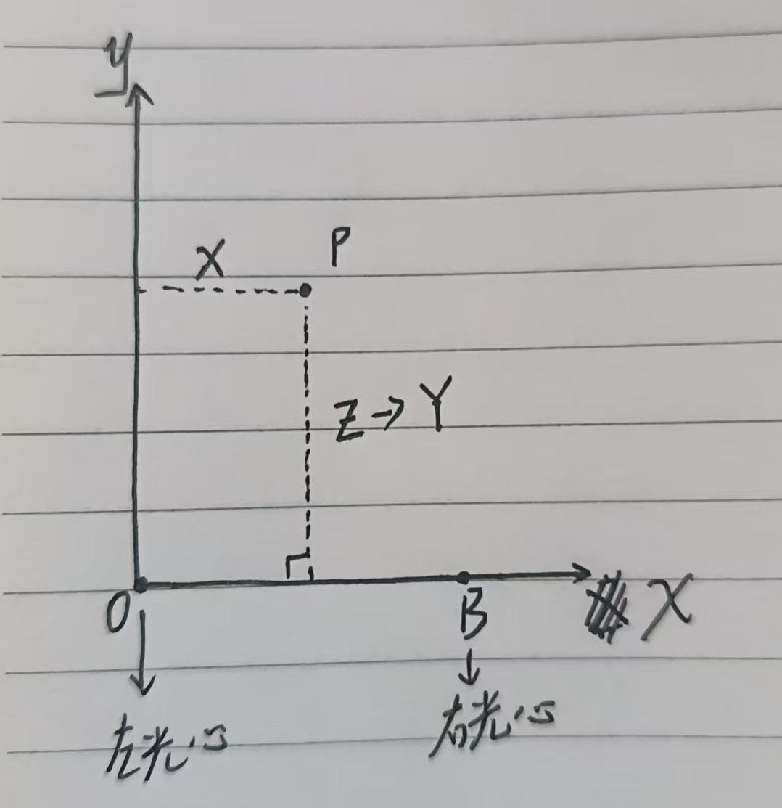

# 三角测量 
为了大家的脑细胞着想，我就假设一个简单的模型。
我们先建立一个坐标系，设左相机的光心为原点o，右相机光心则在（B,0,0）,B就是基线距离。空间中的一点物体P是(X,Y,0)，即P跟两个相机的光心在同一水平面上。
于是我们就可以得到这个简单的三角形几何模型。

  

小孔成像 

 

得到完整模型：

 

根据小孔成像，P在左图成像坐标：x1 = f *(X/Z)

右图由于相机中心右移了B，P相对的横坐标变为了(X-B),所以右图小孔成像横坐标x2= f*((X-B)/Z) 

推导很简单就是相似三角形 

视差d = x1-x2 = fx/Z - (fx-fB)/B = fB/Z 
故可推导出：Z = fB/d 

所以简单判断就是: 视差越大 → 物体越近;  视差越小 → 物体越远